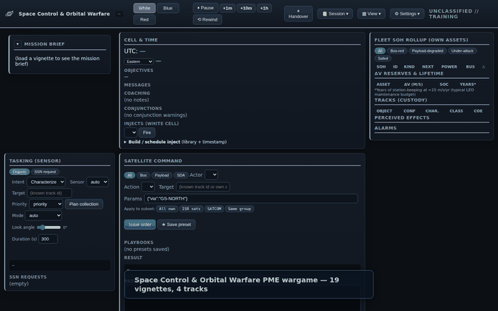

# Space Control & Orbital Warfare Exercise Simulator

A **professional military education (PME) wargaming tool** for space control and orbital warfare.
A White Cell facilitator runs a scenario while **Red** and **Blue** cells command fleets of space
and ground assets, constrained by orbital geometry — you can only command, observe, or attack when
an access window permits.



> 30-second tour. Higher-quality WebM: [`docs/manual/walkthrough.webm`](docs/manual/walkthrough.webm).
> Regenerate with `python3 tools/record_walkthrough.py` (requires a running server +
> Playwright Chromium).

> **Status:** Backend feature-complete through Phase 8. Deterministic engine (P0–P4.5), FastAPI web
> layer (P5), belief scene + 2D map (P5.5), the full **19-vignette library** (P6), capstone
> Vignette 8 + AAR replay (P7), and **LAN multiplayer transport** (P8 — server-authoritative lazy
> clock, per-session locking, session discovery, join-by-URL, multi-monitor pop-outs).
> **419 tests pass.** Stack: **Python + FastAPI/web**.
>
> **New here?** Read the **[training manual](docs/training/INDEX.md)** to install and run, follow
> the **[vignette learning path](docs/training/16-learning-path.md)** from onboarding through the
> mission sets, and keep your **role-scoped manual** open —
> [White Cell](docs/training/12-white-cell-manual.md) ·
> [Blue cell](docs/training/13-blue-cell-manual.md) ·
> [Red cell](docs/training/14-red-cell-manual.md). The training corpus is a co-equal product with
> the code (MSTR-001 §2). All docs are routed by **[`docs/INDEX.md`](docs/INDEX.md)**; project
> conventions and invariants live in `CLAUDE.md`.

## Quick start

```bash
# Runtime dependencies
pip install pydantic numpy sgp4 pyyaml fastapi uvicorn skyfield

# Test dependencies
pip install pytest hypothesis httpx

# Launch the web server (host/port read from spacesim.config.yaml — default 127.0.0.1:8000)
python3 -m spacesim.ui_web

# For LAN multiplayer: bind to all interfaces so other machines can join
uvicorn spacesim.ui_web.server:app --host 0.0.0.0 --reload

# Run the full test suite
python3 -m pytest
```

Open **http://127.0.0.1:8000/** in a browser. Pick a vignette, click **Load**, then **Start**. The
**Mission brief panel** opens automatically — read it before touching anything else.

## What this is

A **White Cell** facilitator picks a scenario from the 19-vignette library, tunes its parameters
(fog-of-war, Red doctrine, ROE, crisis window), and injects events as the scenario unfolds. Red and
Blue cells command fleets of satellites, ground stations, sensors, jammers, and interceptors subject
to hard physics constraints:

- **Commanding** a satellite requires an uplink pass over a ground station.
- **Sensors** can only observe targets during a contact window.
- **Weapons** can only be employed inside a valid engagement window.
- **Cyber** is the exception — it resolves off-pass against the defender's posture.

Time flows in real time. White Cell can **fast-forward, rewind, pause, and undo**. All effects are
tracked in an immutable event log that supports exact replay, branch-compare, and AAR scrub.

## LAN multiplayer

White loads and starts a session → the URL becomes `…/#sess-N`. Open that URL in another tab or
from another machine on the LAN. Choose **Blue** or **Red**. The server-side clock advances at
real-time rate exactly once regardless of how many tabs are open. Every tab sees others' moves
within ~1.5 s. The White **⏸ / ▶** toolbar button pauses and resumes the shared clock for all
connected clients.

**Multi-monitor:** View ▾ → **Pop out ▸** opens any panel (3D globe, 2D map, fleet & telemetry,
order compose, AAR timeline, tracks & objectives) as a separate window that joins the same session.

## The 19-vignette library

| Track | Vignettes |
|---|---|
| **Canonical** (numbered exercises) | 01 LEO ISR Denial, 02 GEO SATCOM Disruption, 03 GNSS Spoofing, 04 RPO Inspection/Shadow, 05 DA-ASAT Crisis, 06 Cyber GS Intrusion, 07 EW Campaign, 08 Multi-Domain Taiwan |
| **Onboarding** | 00 Training: Basics (guided tutorial, both cells, ~30 min) |
| **Red COA** | RC-01 Layered Denial, RC-02 Cyber-First Access Denial, RC-03 Progressive Escalation, RC-04 High-Altitude ASAT, RC-05 Allied Targeting |
| **Mission-set** | MS-01 SIGINT/ELINT Tasking, MS-02 Space Logistics & Resupply, MS-03 SSA Coalition Sharing |
| **Learning** | LRN-01 Orbital Mechanics & Maneuver |
| **Novel** | NOV-01 Dual-Use Rendezvous Ambiguity |

Every vignette carries a **per-cell Mission brief** (situation, mission, friendly forces, threat
picture, ROE, deadline, success criteria, tool tips) that surfaces in the UI at session start.
The 8 canonical vignettes also carry a step-by-step **Tutorial** (View ▾) verified against the
engine.

## Key features

| Feature | Notes |
|---|---|
| **Orbital mechanics** | Kepler + J2 (fictional) and SGP4/TLE (real satellites) behind a `Propagator` interface. White Cell can add any satellite by TLE. |
| **Six access channels** | `command_uplink`, `telemetry_downlink`, `sensor_observation`, `jam_footprint`, `weapon_engagement`, `rpo_proximity` |
| **Five D's of effects** | Deceive / Disrupt / Deny / Degrade / Destroy — cyber is the off-pass exception |
| **Fog-of-war** | Server-enforced; Red/Blue render only their own SDA belief state — never ground truth |
| **Plan-first commanding** | Orders execute at the next valid window; dry-run preview shows "why can't I?" for every blocked action |
| **Gantt / pass timeline** | 1 h–24 h look-ahead/look-back; realistic bar widths (task duration, not full window); up to 4 commands per pass; completed/cancelled orders drop off after 5 min |
| **COE display in Tracks** | When a cell observes a satellite it gets the Classical Orbital Elements frozen at observation time (a, e, i, Ω, ω, ν, T) |
| **Bus & payload SOH** | Power, thermal, ADCS, CDH telemetry graphs with attack-signature overlays (jam→RX power, cyber→FSW errors, kinetic→loss-of-signal); safe-mode / recovery strip |
| **AAR replay** | Full scrub of the event log; branch-compare shows a rewind fork against the main timeline |
| **Deterministic engine** | `(initial_state, eventlog, seed)` → byte-identical state; rewind/undo/branch are exact |
| **High-contrast UI** | Globe ocean `#163b5a`, coastlines `#7aa8d0`, gold terminator curve, orbital tracks `rgba(210,225,245,0.70)` |
| **Red doctrine presets** | `china_integrated`, `russia_ew_first`, `generic` — changes Red AI COA priorities |

## Package layout

```
space-control-sim/
├── README.md                    ← you are here
├── CLAUDE.md                    agent guide: invariants, code map, build/test commands
├── memory.md                    rolling design-decision log
├── spacesim.config.yaml         server host / port / reload
├── spacesim/
│   ├── engine/                  deterministic core — no UI, no network, no wall-clock
│   ├── session/                 SessionManager, CellController (fog), SessionAPI, AAR
│   ├── content/                 19 vignettes (YAML) + inject library
│   ├── ui_web/                  FastAPI server + browser front end (app.js, globe.js, …)
│   └── tests/                   419 pytest tests (incl. determinism + import-guard)
└── docs/
    ├── INDEX.md                 ★ START HERE — master documentation router
    ├── DOCUMENTATION-PLAN.md    information architecture & rationale
    ├── FUTURE-WORK.md           single-source v1.1+ TODO
    ├── build-spec/              ★ the binding v1 spec, 8 modules
    ├── training/                user manual, 16 modules (install → UI → exercises → API → troubleshooting
    │                            + role-scoped per-cell manuals: 12 White / 13 Blue / 14 Red + 15 traceability
    │                            + 16 vignette learning path). Co-equal product with the code (MSTR-001 §2).
    ├── design/                  architecture & design corpus
    ├── research/                doctrine & domain primers (PLA, VKS, USSF, EW, cyber, bus ops)
    ├── vignettes/               scenario library: framework + vignette index
    └── manual/                  generated UI screenshots (tools/render_manual.py)
```

## Design assumptions

| Topic | Decision |
|---|---|
| Primary purpose | Professional military education / wargaming |
| Target users | Semi-technical CAF (and allied) space operators. The UI does the math; operators make decisions. |
| Orbital-mechanics fidelity | Moderate now (Kepler+J2 / SGP4), upgradeable to high-fidelity via the `Propagator` interface |
| Sourcing | Reputable open sources only — no classified material |
| Capability domains | Orbital warfare (RPO/kinetic), EW (jam/spoof/dazzle), SDA/tracking, cyber (link/ground-segment) |
| West vs. non-West | US/USSF + allied (UK, France, NATO) vs. PLA Aerospace Force and VKS |
| Architecture | Single-machine hot-seat **and** LAN multi-tab cooperative (same binary, same UI) |
| Assets | Fictional/generic constellations by default; White Cell can add real satellites via TLE |

## Sourcing note

All doctrinal content is drawn from public documents: USSF *Space Warfighting: A Framework for
Planners* (2025) and *Space Force Doctrine Document 1* (2025); Secure World Foundation *Global
Counterspace Capabilities* (2025/2026); CSIS, Atlantic Council, USCC, and Chatham House analyses;
and reporting on PLA and Russian programs. Specific citations are inline in the research files.
This is an unclassified training aid; named real systems are used only as publicly reported and the
simulator defaults to fictional assets.
