# Training Manual — Space Control & Orbital Warfare Exercise Simulator

A first-time guide to **installing, running, and facilitating** an exercise. No prior setup of
the tool is assumed. The simulator is a single-machine, hot-seat professional military education
(PME) wargame: a **White Cell** facilitator runs a scenario while **Red** and **Blue** cells
command fleets of space and ground assets — constrained by orbital geometry, where you can only
command, observe, or attack when an access window permits.

> **About the screenshots:** the images in this manual are faithful renderings of the web UI's
> panels, generated from real session data by `tools/render_manual.py`. They show exactly what each
> panel reports for the situations described.

---

## Contents
1. [Install](#1-install)
2. [Run it](#2-run-it)
3. [The interface at a glance](#3-the-interface-at-a-glance)
4. [Your first exercise (Vignette 1, step by step)](#4-your-first-exercise)
5. [Guided training vignette (every step, both cells)](#5-guided-training-vignette)
6. [Core concepts & features](#6-core-concepts--features)
7. [The eight vignettes](#7-the-eight-vignettes)
8. [White Cell facilitation](#8-white-cell-facilitation)
9. [HTTP API reference](#9-http-api-reference)
10. [Troubleshooting](#10-troubleshooting)
11. [Glossary](#11-glossary)

---

## 1. Install

**Prerequisites:** Python **3.11 or newer**. (Check with `python3 --version`.)

From the repository root:

```bash
# Runtime dependencies (the engine + web server):
pip install pydantic numpy sgp4 pyyaml fastapi uvicorn

# Optional — only needed to run the test suite:
pip install pytest hypothesis skyfield httpx
```

Verify the install by running the test suite (all should pass):

```bash
python3 -m pytest
```

Everything runs **offline** — the engine uses an analytic Sun model and bundled orbit math, so no
internet connection or ephemeris download is required.

---

## 2. Run it

Start the web server from the repository root:

```bash
uvicorn spacesim.ui_web.server:app
```

Then open **http://127.0.0.1:8000/** in a browser. You should see the dark mission-control layout
with the `UNCLASSIFIED // TRAINING` banner.

> Prefer a script or an air-gapped box with no browser? Every action is also available through the
> in-process Python API and the HTTP API — see [§9](#9-http-api-reference) and the
> *headless walkthrough* at the end of [§4](#4-your-first-exercise).

---

## 3. The interface at a glance

The tool is built around three **cells**, selected with the buttons at the top:

- **White** — the facilitator. Sees **ground truth** (both sides), controls time, fires injects.
- **Blue** / **Red** — the players. Each sees only **its own assets** and whatever its sensors
  have detected (*fog-of-war*).

### The scenario picker

White Cell starts by choosing a scenario from the **vignette library** (eight are bundled):


### White Cell god-view

After **Load** → **Start**, White Cell sees the full picture: every asset on both sides, the
objectives, and the belief map.


### A player cell (fog-of-war)

Switch to **Blue**: the fleet list now shows **only Blue's assets**, and tracks show only what
Blue's sensors have found. Switch to **Red** and you'll see Red's assets — **never** Blue's.


### Viewers — 2D map and 3D globe

Two synchronized viewers render *render-from-custody* (own assets at true positions; other-side
objects only as **tracks** with an uncertainty volume that grows between looks):

- the **3D globe** — drag to **rotate**, **tilt** slider, **zoom** (wheel or `+/-`), **zoom-to** an
  asset, **spin**, and **reset**;
- the **2D belief map** — **zoom**, **pan** (drag), **center** on an asset, and **layer** toggles
  (tracks / grid).

Both viewers draw a low-resolution **country map** (coastlines + country borders, tied to lat/long)
behind the picture so positions read against real geography; toggle it with the **map** control.


### Commanding & White Cell menus

The **command panel** is a menu: choose an **Actor** and the **Action** list filters to that
asset's legal actions, with a pre-filled parameter template (see §5). White Cell tunes the scenario
from the **control panel** (parameter dials, time controls, injects):


---

## 4. Your first exercise

We'll run **Vignette 1 — LEO ISR Denial**. Blue operates an imaging satellite and must deliver
imagery before a landing window; Red wants to deny it without escalating to a kinetic strike.

### Step 1 — Load and start
1. In the picker, choose **LEO ISR Denial**, leave **Seed = 1**, click **Load**, then **Start**.
2. Click **White** to confirm the order of battle: Blue's `ISR-EO-1` and ground stations; Red's
   surface group, a downlink jammer (`JAM-NORTH`), and an (off-by-default) interceptor.

### Step 2 — Become Blue and plan a downlink
1. Click **Blue**. The objectives read `blue.deliver_isr: pending`.
2. In the **Order panel**, set **Actor** = `ISR-EO-1`, **Action** = `downlink`,
   **Params** = `{"via": "GS-NORTH"}`, then click **Issue**.
3. The result shows the order **queued**, its **delivery path** (ground uplink), and **when** it
   will execute — you do not act instantly; the command waits for the next station pass.

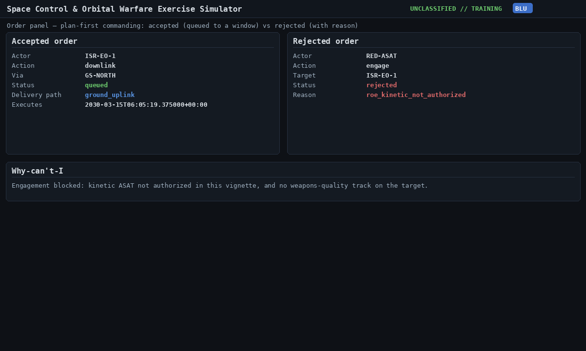

### Step 3 — Advance time to the window
Click **+10m** a few times. When the clock passes the downlink window, the order executes and
`blue.deliver_isr` flips to **MET** — Blue delivered the imagery in time. **Blue wins.**

### Step 4 — Rewind and try the other branch
Because the engine is deterministic, White Cell can **rewind** and explore "what if".

1. Click **Rewind to start**. Delivery is undone; the clock is back at the start.
2. Click **Red**, then issue: **Actor** = `JAM-NORTH`, **Action** = `jam`,
   **Target** = `ISR-EO-1`, **Params** = `{"success_prob": 1.0, "outcome": "deny"}` → **Issue**.
3. Click **Blue** and issue the same downlink as before.
4. Advance time. This time the downlink is **blocked** — Red jammed it. Blue sees a *symptom* on
   `ISR-EO-1` (`deny — source unknown`) but cannot immediately attribute it. **Red wins.**

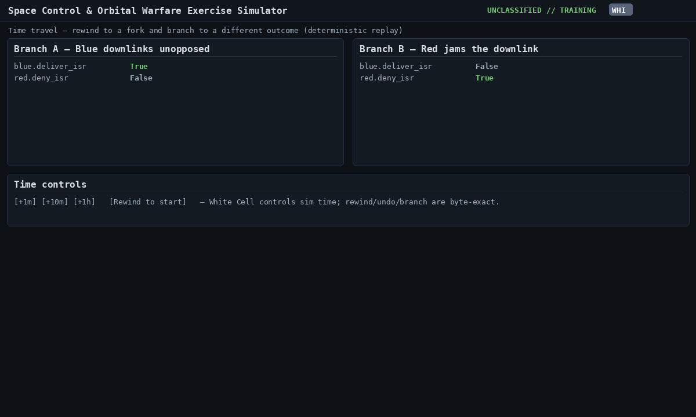

That contrast — same start, opposite outcomes depending on play — is the core teaching mechanic.

### Headless walkthrough (no browser)
The same exercise in Python:

```python
from spacesim.session.inprocess import InProcessSession
from spacesim.engine.orders import Order

api = InProcessSession()
sid = api.load_vignette("leo-isr-denial", seed=1)
api.start(sid)

ack = api.issue_order(sid, "blue",
        Order(cell="blue", actor="ISR-EO-1", action="downlink", params={"via": "GS-NORTH"}))
print(ack.status, ack.delivery_path, ack.earliest_window)

start = api.get_godview(sid).now
api.advance_to(sid, start + 800_000_000)          # advance ~13 min past the window
print(api.objectives(sid))                         # blue.deliver_isr -> True
```

---

## 5. Guided training vignette

The **Training: Basics** scenario (`training-basics`, top of the picker) is a hands-on tutorial
that walks each cell through the core loop. Both sides have a **six-step** sequence below — the
exact actor, action, parameters, *when* to issue, and the expected result. Every step is the real
order the engine executes (these steps are verified by `spacesim/tests/test_training.py`).

**Set up:** pick **Training: Basics**, **Seed = 1**, **Load** → **Start**. The order of battle:
Blue `ISR-EO-1` (LEO imager, modem vulnerability, fuel) with `GS-TRN` ground station and the
`RADAR-TRN` sensor; Red `RED-TGT` (a satellite Blue images), `JAM-TRN` (downlink jammer co-located
with the station), `RED-CYBER`, `RED-RDR`, and `RED-ASAT` (kinetic, off by default).

> In the command panel, **selecting an Actor filters the Action menu to that asset's legal
> actions** and pre-fills the parameter template — see 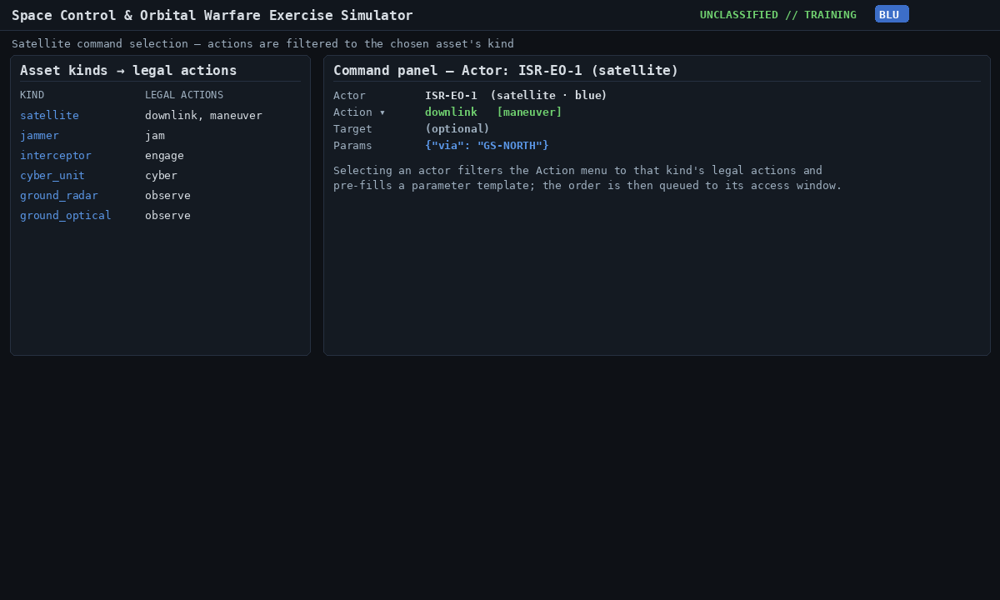

### Blue — maintain custody and deliver imagery

**Step 1 — Review fleet & objectives.** Click **Blue**. Confirm `ISR-EO-1` is nominal and both
objectives read *pending*.

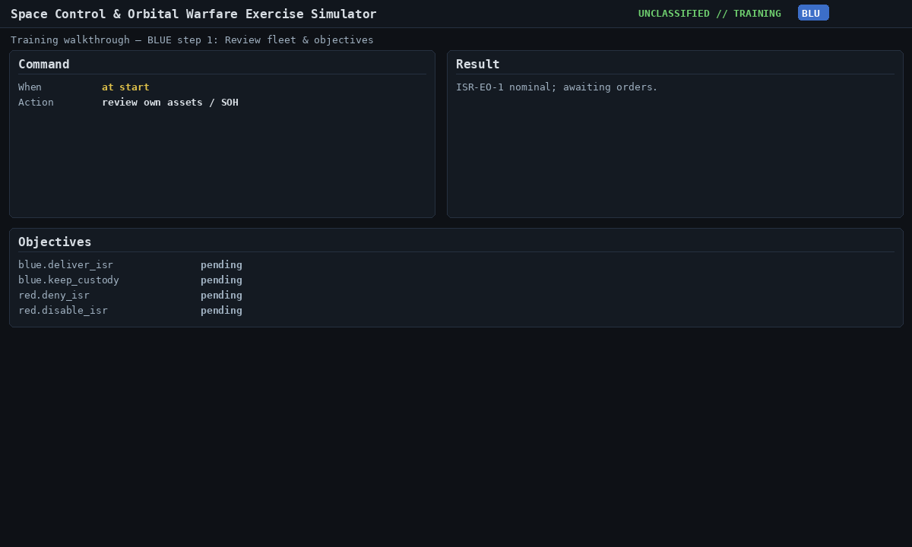

**Step 2 — Task the sensor to build custody.** Actor `RADAR-TRN`, Action `observe`, Target
`RED-TGT`, Params `{"intent":"characterize","classification":"hostile"}`. *When:* issue now; it
collects on RADAR-TRN's early pass. *Result:* a characterized track on RED-TGT — `keep_custody` MET.

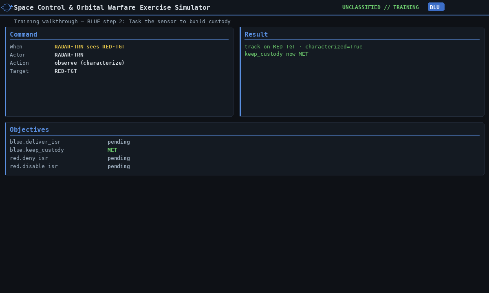

**Step 3 — Plan the imagery downlink.** Actor `ISR-EO-1`, Action `downlink`, Params
`{"via":"GS-TRN"}`. *When:* issue now; it queues to the next `GS-TRN` pass. *Result:* `queued` via
`ground_uplink` with a scheduled execution time.

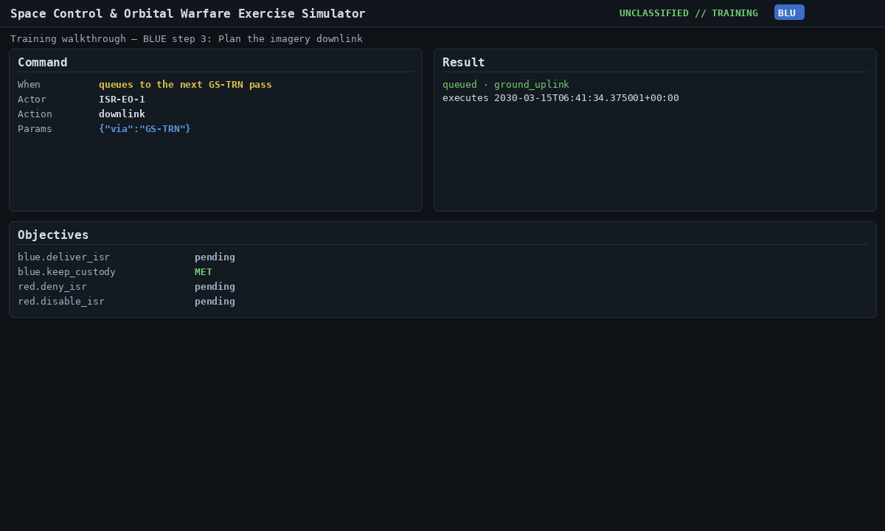

**Step 4 — Advance to the downlink window.** Click **+10m** until the clock passes the window.
*Result:* imagery delivered — `deliver_isr` MET.

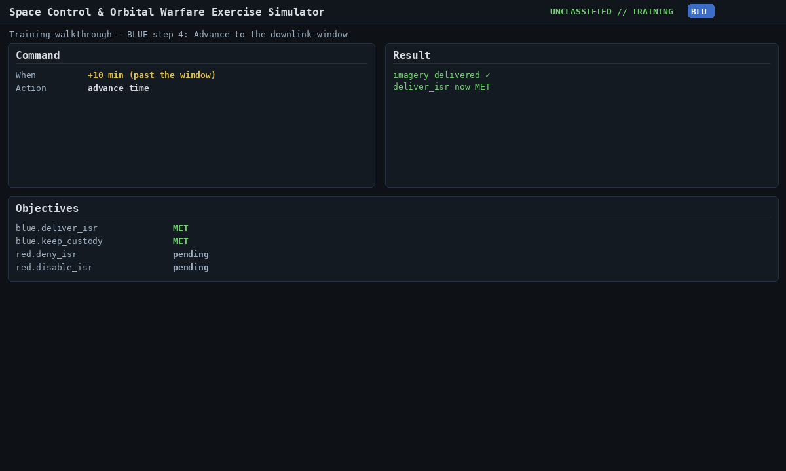

**Step 5 — Maneuver to preserve the orbit.** Actor `ISR-EO-1`, Action `maneuver`, Params
`{"dv":[0,5,0],"via":"GS-TRN"}`. *When:* queues to the next command pass. *Result:* `queued`; the
5 m/s burn is debited from the fuel budget on execution.

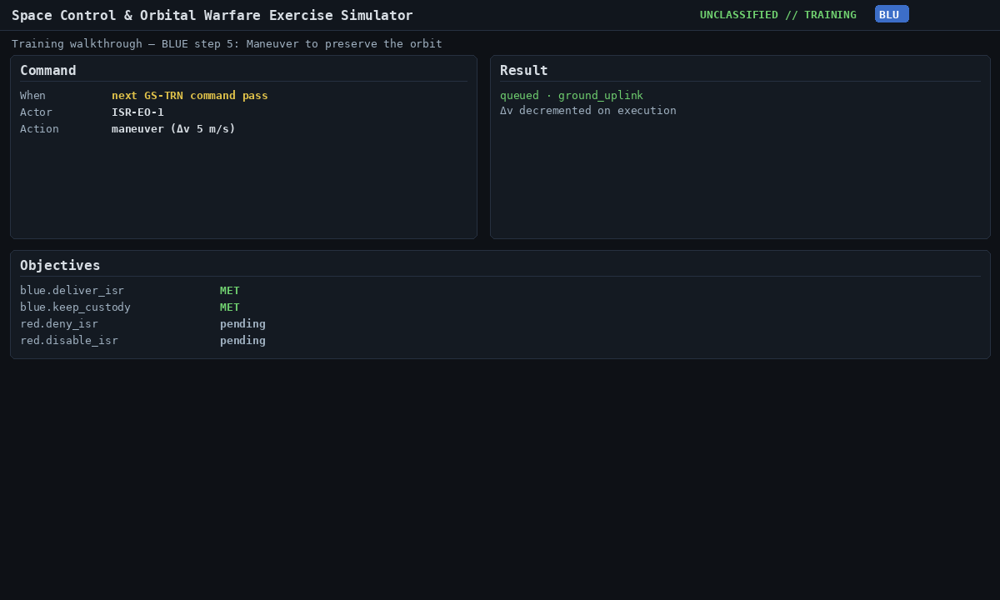

**Step 6 — Confirm the objective.** Review the objectives panel: Blue delivered imagery in time.

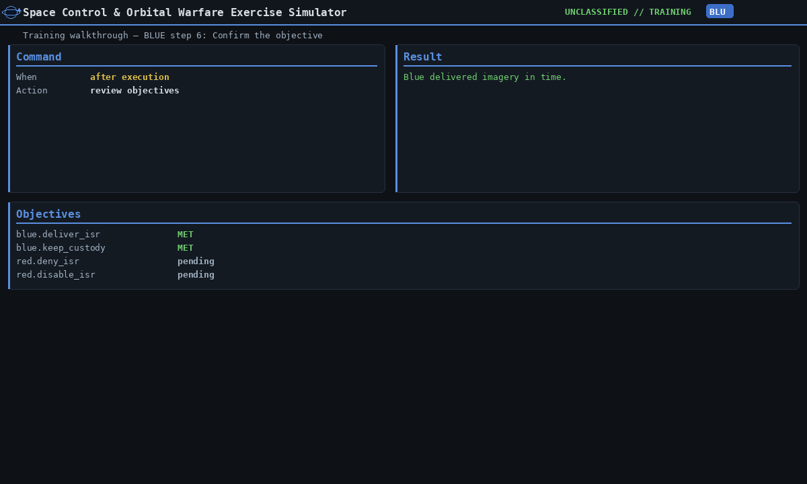

### Red — deny the imagery with reversible effects

Reload **Training: Basics** (or **Rewind**) and click **Red**.

**Step 1 — Review own assets.** Confirm the jammer, cyber unit, radar, and interceptor.

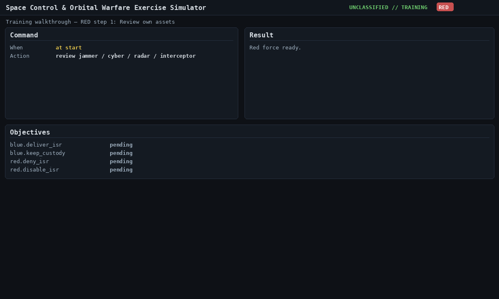

**Step 2 — Find the Blue ISR satellite.** Actor `RED-RDR`, Action `observe`, Target `ISR-EO-1`,
Params `{"intent":"track"}`. *When:* issue now; reports on RED-RDR's early pass. *Result:* custody
on `ISR-EO-1`.

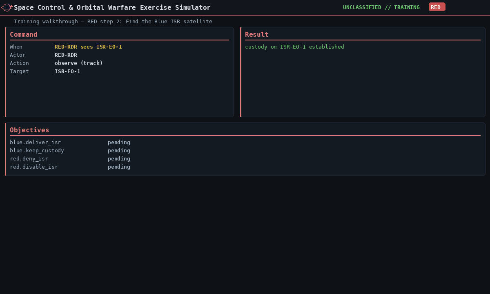

**Step 3 — Jam the downlink.** Actor `JAM-TRN`, Action `jam`, Target `ISR-EO-1`, Params
`{"success_prob":1.0,"outcome":"deny"}`. *When:* queues to the footprint window over the station.
*Result:* the link is denied during that window — a Blue downlink in this window would fail.

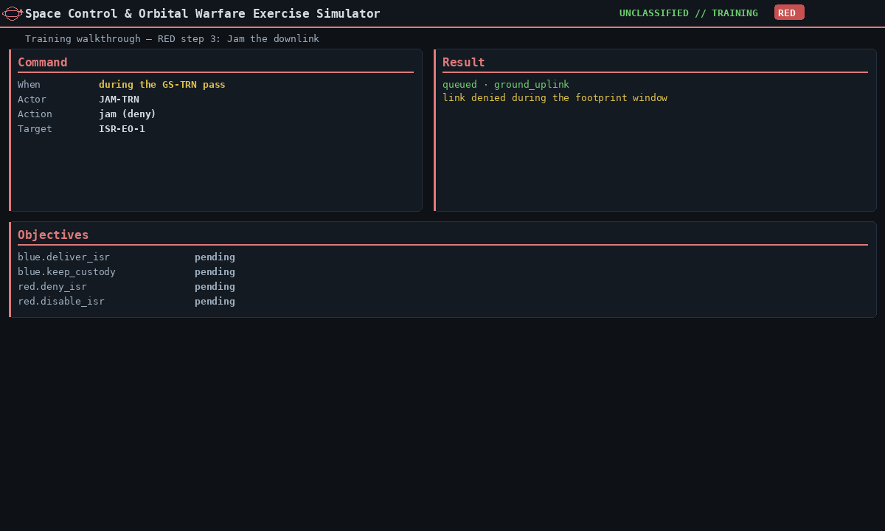

**Step 4 — Cyber the modem (off-pass).** Actor `RED-CYBER`, Action `cyber`, Target `ISR-EO-1`,
Params `{"access_vector":"ground_modem","outcome":"safe_mode","success_prob":1.0}`. *When:* any
time — cyber is **not** window-gated. *Result:* `ISR-EO-1` drops to **safe mode**; `disable_isr` MET.

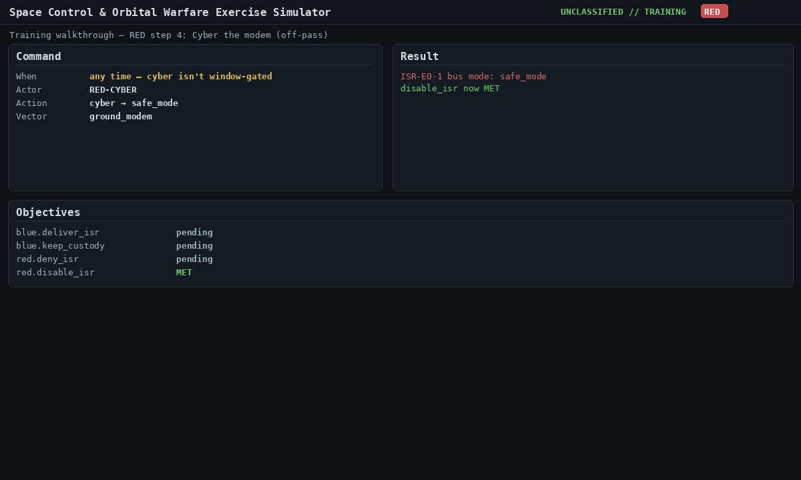

**Step 5 — Attempt a kinetic strike (ROE check).** Actor `RED-ASAT`, Action `engage`, Target
`ISR-EO-1`. *Result:* **REJECTED — `roe_kinetic_not_authorized`.** Kinetic ASAT is off by default;
this teaches escalation restraint (White Cell can enable it with the `red_kinetic_authorized` dial).

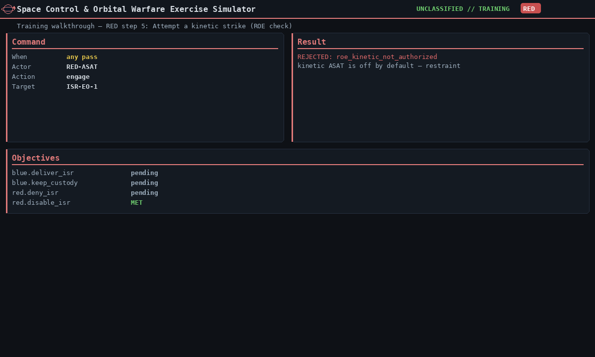

**Step 6 — Advance and assess.** Click **+10m** past the delivery window. With nothing delivered,
`deny_isr` is MET — Red denied the imagery using only reversible effects.

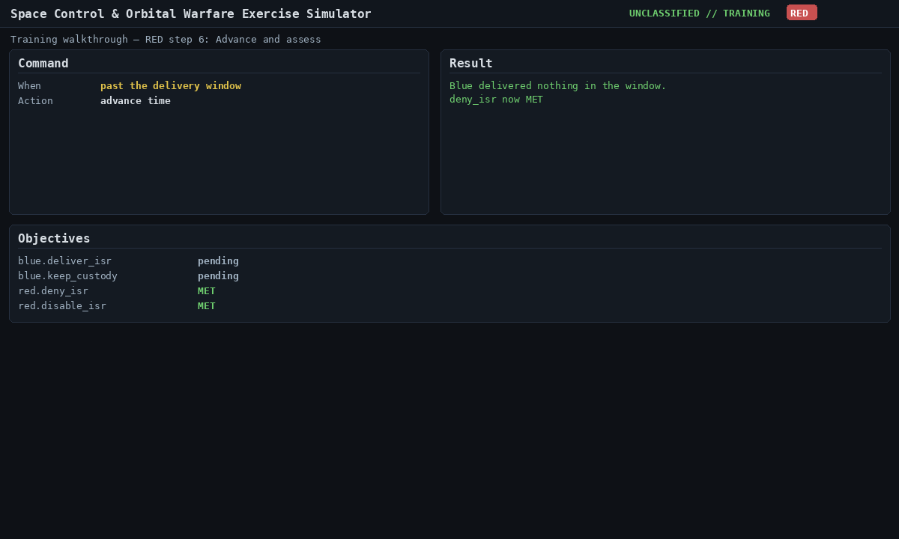

> **Watch it in 3D.** Throughout, the **3D globe** (drag to rotate, **tilt**, **zoom**, **zoom-to**
> an asset) and the **2D belief map** (zoom / pan / center / layer toggles) render only the active
> cell's belief — own assets known, hostile objects as uncertainty volumes.
>
> 

---

## 6. Core concepts & features

### Plan-first commanding & delivery paths
You **plan** a command; the engine schedules it to the earliest valid window. A command can reach
a satellite three ways and the tool picks the soonest: a **ground-station uplink**, an
**inter-satellite link (ISL) relay** via a crosslink-capable peer, or a **stored program**
(pre-loaded to run onboard). ISL can beat a distant ground pass by hours:

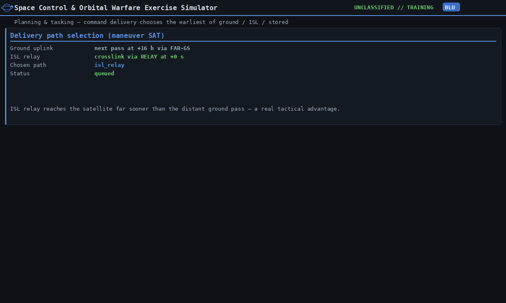

### SDA sensor tasking → custody → unlock
You don't know the sky for free — you **task scarce sensors** to detect, track, and characterize
objects. A good report raises a track's confidence and shrinks its uncertainty; once a track is
**weapons-quality** (characterized + confident), it **unlocks** actions that were blocked:

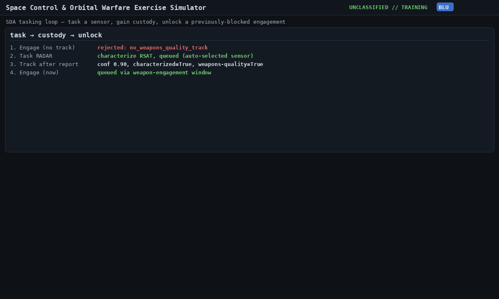

Sensors do **one thing at a time** — task two collections at once and the second is pushed to a
later pass (contention). Custody **decays** between looks; the belief map shows the uncertainty
volume blooming until you re-task:

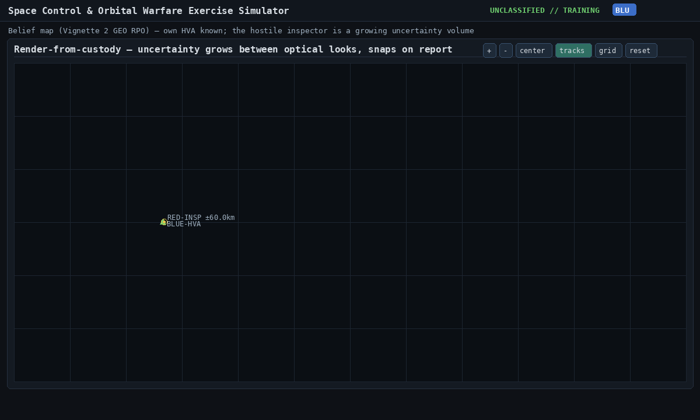

### Bus state-of-health & safe mode
Every satellite has a live **bus** (power/eclipse, attitude, thermal, propulsion, storage, comms),
each limit-checked **green/yellow/red**. The bus **gates the payload**: no power or a safe-mode
event means no mission. A cyber or EW attack can drive a satellite into **safe mode** — and you
often only discover it at the next telemetry contact:

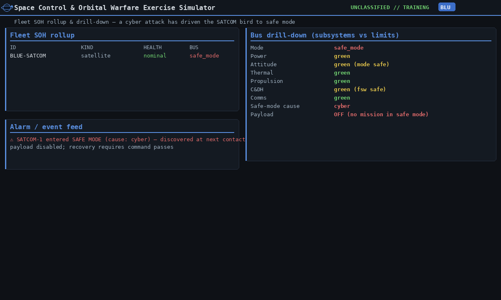

### Safe-mode recovery
Recovery is a **multi-pass procedure**, not a button. If the root cause persists (e.g. an
unpatched modem vulnerability), the satellite is **re-safed** — you must remove the cause (patch
the vulnerability, kill the jammer) before recovery sticks:

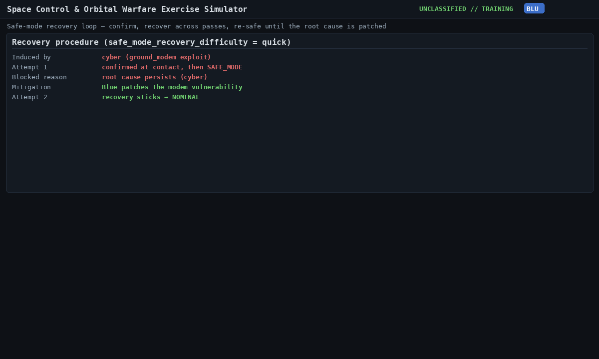

### Diagnosing attacks from telemetry
Click any fleet row to open the **subsystem drill-down**: a parameter list (colored against its
soft/hard limits), a **graph** of each parameter's recent history (realistic baseline + repeatable
seeded noise), and a **symptom log**. The graphs are deliberately honest — they show *physics*, not
a verdict. **The tool never tells you "you are being jammed";** you read the signature and infer the
cause. Each attack vector leaves at least one sign:

| If you see… | Likely cause | Mitigation |
|---|---|---|
| `comms.rx_power_dbm` HIGH, `cn0_dbhz` collapses, `ber` spikes, lock intermittent | EW jamming | re-plan frequency/beam; geolocate the jammer |
| `cdh.fsw_error_count` / `cmd_reject_count` climbing, `cpu_load` high, FSW→safe | Cyber / command-path intrusion | patch the vulnerability; reset FSW |
| `payload.snr_db` drops, `thermal.optics_temp_c` rises during a pass | Directed-energy / dazzle | re-task off the threat geometry |
| A hostile **track closing** on the 2D/3D view (± wheel/Δv if you evade) | RPO / co-orbital | maneuver-to-evade; task SDA to characterize |
| `power.battery_soc` + `bus_voltage_v` sag | eclipse / power fault | shed loads; check the power timeline |
| All telemetry **ceases** (loss of signal) | kinetic kill | — (irreversible) |

Two worked examples — note the cause is **not** named anywhere on screen:

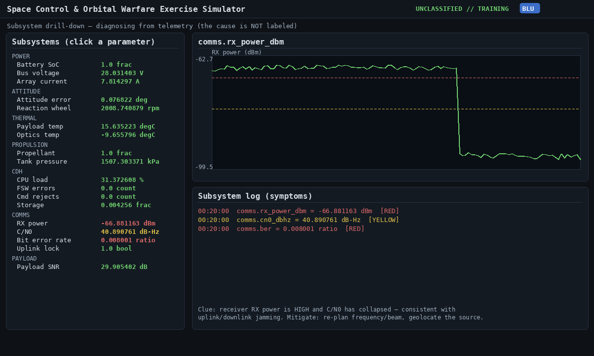
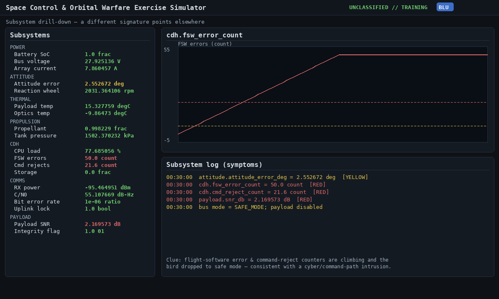

### Cyber — the off-pass exception
Cyber effects are **not** gated by orbital passes: with a modeled access vector they can act any
time, subject to the defender's posture and whether the vulnerability is patched. This is the
SATCOM/Viasat-style lesson and the wildcard in the game.

### Adding real satellites by TLE
White Cell can drop a **real named satellite** into a scenario by pasting its two-line element set
(TLE). It is validated and then propagates with sgp4 alongside the fictional assets:

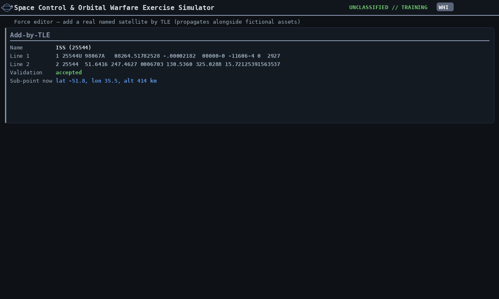

```bash
curl -X POST http://127.0.0.1:8000/api/sessions/<SID>/force/tle -H 'Content-Type: application/json' \
  -d '{"id":"ISS","owner":"blue",
       "line1":"1 25544U 98067A   08264.51782528 -.00002182  00000-0 -11606-4 0  2927",
       "line2":"2 25544  51.6416 247.4627 0006703 130.5360 325.0288 15.72125391563537"}'
```

### Red doctrine & After-Action Review
An AI-Red preset can play a doctrinally-flavored campaign (`russia_ew_first`, `china_integrated`,
`generic`). Afterward, White Cell can **replay** the whole exercise read-only, scrub to any
decision, and **compare two branches** to show how a choice changed the outcome:

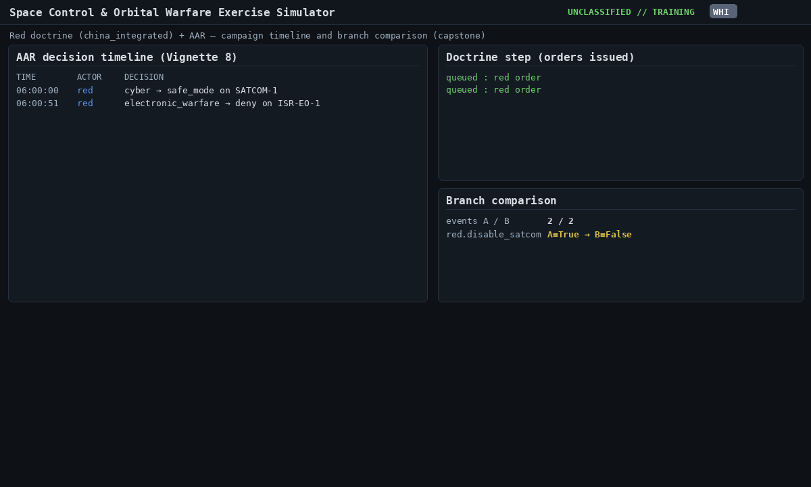

```bash
curl -X POST http://127.0.0.1:8000/api/sessions/<SID>/red_step     # AI-Red issues one round of orders
curl      http://127.0.0.1:8000/api/sessions/<SID>/aar             # decision timeline + final objectives
```

---

## 7. The eight vignettes

| # | Title | Teaches |
|---|---|---|
| 1 | LEO ISR Denial | Pass windows; the collect-vs-downlink split; reversible vs. kinetic effects |
| 2 | GEO RPO Shadowing | Ambiguous RPO intent; custody decay in GEO |
| 3 | GNSS EW Campaign | Local, reversible PNT denial; MEO is kinetically safe |
| 4 | Co-Orbital Threat & Escort | Active defense: escort and maneuver-to-evade |
| 5 | DA-ASAT Crisis | Escalation, debris, attribution, political cost |
| 6 | SATCOM Cyber & Link | Ground/link segment; cyber acts outside passes |
| 7 | SDA Custody Hunt | Custody decay; sensor contention; breaking custody |
| 8 | Multi-Domain Capstone | Integrated campaign across every subsystem |

Each is a YAML data file in `spacesim/content/vignettes/` — copy one to author your own.

---

## 8. White Cell facilitation

**Parameters (dials).** Every vignette exposes typed parameters with safe defaults — force levels,
authorities/ROE (e.g. `red_kinetic_authorized`), Red behavior (`red_doctrine_profile`,
`red_ew_intensity`), environment (`landing_window_start_s`), and fidelity/fog (`fog_of_war`,
`ops_fidelity`, `safe_mode_susceptibility`). Set them at load time:

```python
api.load_vignette("leo-isr-denial", overrides={"red_kinetic_authorized": True})
```

**Time control.** White Cell owns the clock: step forward (`+1m/+10m/+1h`), **rewind** to any
point, **undo** the last actions, and **branch** by continuing differently after a rewind — all
byte-exact thanks to the deterministic core.

**Injects.** Scripted or manual events (`commercial_imagery_leak`, `patch_modem`, …) reveal assets,
patch vulnerabilities, raise political consequences, or message a cell. Fire one with the
**Fire inject…** button or `POST /inject`.

**`ops_fidelity`.** `tactical` collapses each satellite's bus to a single health bar (focus on
space-control decisions); `realistic` (default) shows the SOH parameters; `full_ttc` adds detailed
subsystem telemetry for TT&C-operator training.

---

## 9. HTTP API reference

All UI actions go through these endpoints (base `http://127.0.0.1:8000`). Reads are fog-filtered
per cell, server-side.

| Method & path | Purpose |
|---|---|
| `GET /api/vignettes` | List the scenario library |
| `POST /api/sessions` `{vignette_id, overrides, seed}` | Load a scenario → returns a session id |
| `POST /api/sessions/{sid}/param` `{param_id, value}` | Set a dial (before start) |
| `POST /api/sessions/{sid}/start` | Start the exercise |
| `POST /api/sessions/{sid}/step` `{dt_sim_s}` / `…/advance` `{t}` | Advance time |
| `POST /api/sessions/{sid}/rewind` `{t}` · `…/undo` `{n}` | Time travel |
| `POST /api/sessions/{sid}/inject` `{inject}` | Fire an inject (id or `{effects}`) |
| `POST /api/sessions/{sid}/order` `{cell, actor, action, target, params}` | Issue an order |
| `POST /api/sessions/{sid}/force/tle` `{id, owner, line1, line2}` | Add a real satellite by TLE |
| `POST /api/sessions/{sid}/red_step` | AI-Red issues one doctrine round |
| `GET /api/sessions/{sid}/view/{cell}` | Fog-filtered cell view |
| `GET /api/sessions/{sid}/scene/{cell}` | Belief-render geometry (map/3D) |
| `GET /api/sessions/{sid}/godview` | Ground truth (White only) |
| `GET /api/sessions/{sid}/objectives` · `…/eventlog` | Objective status · event log |
| `GET /api/sessions/{sid}/aar` · `…/aar/objectives?seq=` | AAR report · objectives at a point |

Interactive API docs are auto-served at **http://127.0.0.1:8000/docs** (FastAPI/Swagger).

**Order actions:** `maneuver`, `downlink`, `observe`, `jam`, `engage`, `cyber`. Common params:
`via` (ground station, for uplink/downlink), `dv` (3-vector, maneuver), `intent`
(observe: search/track/characterize/cue), `target`, `outcome`, `success_prob`, `access_vector`
(cyber). Rejected orders return a human-readable `reason`.

---

## 10. Troubleshooting

- **`uvicorn: command not found`** — run `pip install uvicorn`, or start with
  `python3 -m uvicorn spacesim.ui_web.server:app`.
- **`ModuleNotFoundError: spacesim`** — run from the repository root (the folder containing
  `spacesim/`), or `pip install -e .`.
- **An order is rejected** — read the `reason`: `no_window` (no pass in the look-ahead),
  `roe_kinetic_not_authorized` (enable it via the `red_kinetic_authorized` dial),
  `no_weapons_quality_track` (task a sensor first), `insufficient_delta_v`, `not_owner`.
- **Nothing happens after issuing an order** — orders execute at their scheduled **window**;
  advance time (`+10m`) until the clock reaches it.
- **A satellite shows `safe_mode`/red** — it was safed (attack or bus fault); run the recovery
  procedure and remove the root cause.
- **Tests fail to collect** — install the dev extras: `pip install pytest hypothesis skyfield httpx`.

---

## 11. Glossary

- **Access window** — the interval when geometry permits an action on one of the six channels
  (command uplink, telemetry downlink, sensor observation, jam footprint, weapon engagement, RPO
  proximity).
- **Custody / track** — a cell's belief about an object; confidence **decays** between looks.
- **Weapons-quality track** — a track confident and characterized enough to authorize an engagement.
- **Fog-of-war** — a cell sees only its own assets plus what its sensors have detected.
- **Safe mode** — a protective state with the payload off; reversible but costs recovery passes.
- **The five D's** — every offensive effect resolves to *deceive / disrupt / deny / degrade /
  destroy*; the first three are reversible and low-debris, destroy is kinetic and permanent.
- **Cyber exception** — cyber is the one effect not gated by orbital passes.
- **ISL** — inter-satellite (crosslink) relay path for commands.
- **AAR** — After-Action Review: deterministic read-only replay, scrubbing, and branch comparison.
