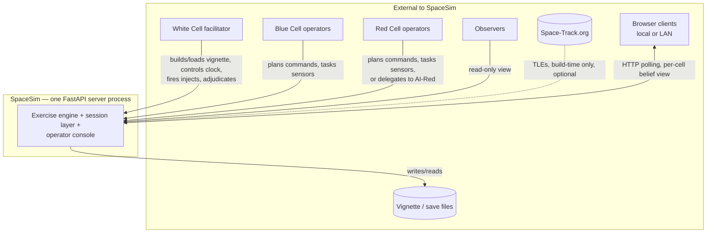
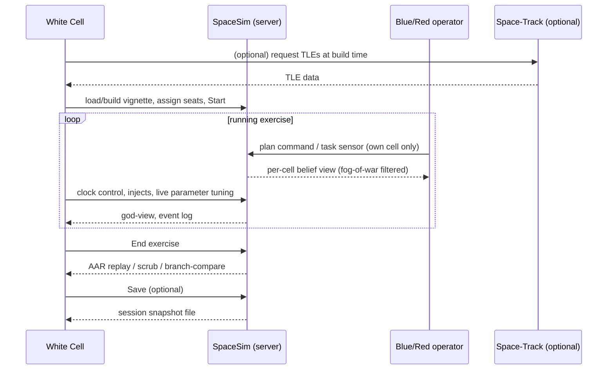

# GDS-02 — System Context

> **Document ID:** GDS-02
> **Version:** 1.0
> **Status:** ✅ Authored — merge gate closed (see "Merge gate" below)
> **Dependencies:** GDS-01
> **Referenced By:** GDS-03
> **Produces:** GDS-03
> **Feature Mapping:** N/A — program-level
> **Related Topics:** [`build-spec/01-context-and-scope.md`](../build-spec/01-context-and-scope.md)
> (merge source), [`build-spec/08-ssn.md`](../build-spec/08-ssn.md) §17,
> [`vignettes/GROUND-INFRASTRUCTURE.md`](../vignettes/GROUND-INFRASTRUCTURE.md),
> [`CLAUDE.md`](../../CLAUDE.md) ("LAN trust model"), [GDS-01](01-concept-of-operations.md)

[↑ Architecture index](INDEX.md) · [Docs index](../INDEX.md)

## Purpose

Draw the boundary between SpaceSim and everything outside it: who and what sits across that
boundary, what crosses it (data, commands, files), and in which direction. This is the system-level
context the rest of the ladder (GDS-03 architecture onward) decomposes internally — this document
stops at the boundary and does not describe what happens inside it.

---

## 1. System boundary

SpaceSim is the **deterministic exercise engine + session layer + operator console**, run as a
single FastAPI server process that one or more browser clients connect to (GDS-01 §4). Everything
inside that boundary — the orbital/access/effects engine, the per-cell fog-of-war filtering, the
in-app scenario builder, the AAR replay, and the **mock Space Surveillance Network (SSN,
`build-spec/08-ssn.md` §17)** — is **in scope** for this document's "system" side. The SSN's
request-and-wait flavor reads like an external sensor-tasking service, but it is fully simulated
inside the same process with no real external system behind it, so it sits inside the boundary,
not across it (resolved; see "Merge gate" below — this was Open Question 1 in the prior revision).
Everything else is **external**: the humans operating it, the files they load/save, the optional
TLE-import network call, and the browsers/machines they connect from.

(GDS-01 §4 "Operational environment", §9 "External systems"; `build-spec/01` §1.4, §3.1.)

## 2. External actors

Restated and elaborated from GDS-01 §2–3 (the intended-users / stakeholders sections), framed here
strictly as *boundary-crossing actors* rather than operational roles:

| Actor | Crosses the boundary as | Direction |
|---|---|---|
| **White Cell facilitator** | Builds/loads vignettes, assigns seats, controls the clock, fires injects, adjudicates, runs AAR | Bidirectional (commands in, god-view + AAR out) |
| **Blue Cell operator** | Plans bus/payload commands, tasks sensors, reads SOH/telemetry | Bidirectional, scoped to Blue's `CellView` |
| **Red Cell operator** | Same as Blue, plus offensive counterspace effects; may be replaced by the in-system **AI-Red** doctrine preset, which is *not* an external actor (it runs inside the session as a scripted decision process — see `training/05` "Red doctrine & AAR") | Bidirectional, scoped to Red's `CellView` |
| **Observer** | Read-only consumer of god-view or a designated cell's view | Outbound only |
| **Space-Track.org** | Supplies real TLEs at scenario-build time only — the only actor that is also an external network service rather than a human | Inbound only, optional, build-time |

No other external actor exists in v1 (confirmed against `build-spec/01` §2 and §3 — there is no
identity provider, no scoring service, no third-party LMS integration in scope).

## 3. External software

Software the system depends on but does not own or ship as part of its own engine logic
(GDS-01 §9; named here as boundary elements, not as an implementation detail — *what* fidelity they
provide, not *how* they are wired in):

| External software | Role at the boundary |
|---|---|
| **Skyfield** | Provides the astronomical/SGP4 propagation math underneath real-TLE force-added satellites, and is the fidelity reference the moderate Kepler+J2 model is validated against (`build-spec/04` §11 risk row "orbits look 'wrong'"). |
| **sgp4** | The TLE propagation algorithm itself, used for any satellite seeded by a real two-line element set. |
| **A standards-compliant web browser** | The only required client software; no native app, no browser plugin. |

These are libraries/runtimes the system's *outputs depend on for correctness*, not actors that
send or receive exercise data — listed for completeness of the boundary picture, distinct from §2.

## 4. Data sources

| Source | What it provides | When it crosses the boundary |
|---|---|---|
| **Space-Track.org** | Real two-line element sets (TLEs) for force-adding named real satellites | Optional, scenario-build time only; never required at runtime (`build-spec/01` Decision D2) |
| **Manual TLE / Keplerian entry** | The fallback data source when Space-Track is unavailable | Scenario-build time, always available offline |
| **Vignette definition files** | Mission, roles needed, starting orbits, parameters/dials, injects, intro briefs | Load time, read from local disk |
| **White Cell live input** | Parameter re-tuning, manual injects, clock control | Continuously during a run |
| **Saved session files** | A prior exercise's complete snapshot (history, order queue, pending events) for resume | Load time, read from local disk |

No source is treated as ground truth by Red or Blue directly — all of the above feed the
deterministic engine, which is itself the sole source of the belief state any cell actually sees
(GDS-01 §1, the custody/fog-of-war invariant).

## 5. User roles

Identical to GDS-01 §2 — restated here only to confirm which roles are boundary-crossing
**system users** (as opposed to, say, AI-Red, which is internal):

- White Cell facilitator (1–2 seats)
- Blue Cell operators (up to 6)
- Red Cell operators (up to 6), optionally substituted by the internal AI-Red preset
- Observers (up to 2)

(See GDS-01 §2 for role responsibilities; this document does not repeat them.)

## 6. Inputs

What crosses the boundary **into** the system:

- Vignette definitions (mission, force lay-down, parameters, injects, intro briefs) — from disk,
  authored via the in-app builder or hand-written.
- TLEs — from Space-Track (optional, build-time) or manual entry.
- Operator actions — planned commands (bus/payload verbs), sensor tasking requests, SSN requests,
  maneuver/jam/cyber/engage orders — issued by Blue/Red operators against their own assets.
- White Cell control inputs — clock control (pause/resume/rewind/branch/time-multiplier), inject
  firing/scheduling, live parameter re-tuning, seat assignment.
- Save files — a previously exported session snapshot, for resume.

## 7. Outputs

What crosses the boundary **out of** the system:

- Per-cell belief views (the rendered scene, fleet SOH, telemetry, alarms) — fog-of-war filtered,
  never ground truth for Blue/Red.
- God-view (ground truth) and the event log — visible to White Cell and observers per their
  designated view.
- AAR replay/scrub/branch-compare output — a read-only historical view of a completed or
  in-progress exercise.
- Save files — a complete, deterministic snapshot of a session, exportable to disk.
- The classification banner and mission-brief panel content — informational output surfaced to all
  roles per GDS-01 §4.

## 8. External interfaces

Described at the level of *what information flows where*, not the wire protocol or schema (those
are GDS-09's concern):

- **Browser ↔ server.** Each browser client (one per human, hot-seat or LAN) exchanges per-cell
  belief-state views and operator commands with the single server process. Multiple clients can be
  connected concurrently; the server is the single source of truth and the single clock owner
  (GDS-01 §8 "LAN cooperative").
- **Server ↔ Space-Track.** A one-directional, build-time-only data pull of TLEs; never invoked
  during a running exercise.
- **Server ↔ local filesystem.** Vignette load, save/resume, and (implicitly) any exported AAR
  data are local file I/O, not a network interface.
- **No interface exists** to any LMS, identity provider, scoring service, or other third-party
  system in v1 (confirmed absence, per GDS-01 §9).

## 9. Major information flows

Three structural properties of these flows, carried from GDS-01 and the load-bearing invariants in
`CLAUDE.md`, shape every arrow above:

1. **Fog-of-war is enforced at the flow's exit point**, not by the sender withholding data — the
   server filters every cell-scoped outbound flow through `CellView`/`SessionAPI` (GDS-01 §4, §10).
2. **The clock is single-owned.** Only the White Cell flow can advance/pause/rewind time; all other
   inbound flows are time-stamped against whatever the current sim time is, never advance it
   themselves.
3. **Inbound flows from Space-Track are the only ones that can be entirely absent** without
   degrading the exercise — every other flow in the diagram is load-bearing for v1 operation.

---

## Open Questions

1. ~~SSN (mock Space Surveillance Network) boundary placement~~ — **resolved.** Confirmed: the
   mock SSN is internal to SpaceSim. `build-spec/08-ssn.md` §17 describes a per-cell `SSNNetwork`
   that operators "request and wait" against, structurally resembling an external sensor-tasking
   service, but no real external system backs it — it runs inside the same process as the rest of
   the engine. §1 above states this directly rather than as an inference. A future GDS level
   (e.g. GDS-03 architecture) may still want to call out SSN as a distinct internal subsystem with
   an external-service *flavor*, but its boundary placement is no longer open.
2. **AI-Red's actor status.** AI-Red plays Red's role using a scripted doctrine preset run inside
   the session (`training/05`). This document treats it as internal, not an external actor (§2),
   because it has no existence outside the system process. If a future document treats AI-Red as
   pluggable/replaceable by an external service (e.g. an LLM-driven Red), that would change this
   classification — not resolved here, since no such design exists today.
3. **Ground-site/sensor data provenance.** `vignettes/GROUND-INFRASTRUCTURE.md` documents
   real-world ground-station coordinates baked into vignette content. Whether these coordinates
   constitute a "data source" distinct from the vignette file itself (§4), or are simply vignette
   content with no separate external provenance, is not settled by any document reviewed. Treated
   here as part of the vignette file (§4), flagged as a borderline case.

---

## Merge gate (closed)

- [x] **Absorbed the relevant content of [`build-spec/01-context-and-scope.md`](../build-spec/01-context-and-scope.md)**
  into this document — §1.1–1.4 (problem statement, purpose, training objectives, non-goals) into
  §1/§6/§9 above; §2 (stakeholders) into §2/§5; §3.1 (in-scope) into §4/§6/§7/§8; Decision D2
  (offline-first, Space-Track build-time-only) into §3/§4/§9.
- [x] **Checked for conflict with the build spec** (binding, wins on conflict per `MSTR-001` §7):
  none found. This document does not state anything about scope, actors, or data flow that
  contradicts `build-spec/01`; where `build-spec/08-ssn.md` introduced a system not mentioned in
  `build-spec/01` (the mock SSN), it was reconciled as an **internal** subsystem (§1, Open Question
  1) rather than treated as a new external system, avoiding any boundary contradiction.
- [x] **Decision recorded:** `build-spec/01-context-and-scope.md` **stays authoritative** — it is
  the binding v1 spec and carries requirement tags (FR-x/NFR-x/etc.) this document does not
  duplicate. `GDS-02` is a **boundary-focused extraction**: it restates only the actor/data-flow/
  interface content relevant to a system-context view, omitting the requirements detail, decision
  log, and acceptance criteria that remain `build-spec/01`'s sole concern. Same resolution pattern
  as GDS-00/GDS-01: no source document is demoted to a pointer.

## Next

`GDS-03` (Architecture) may now begin.
