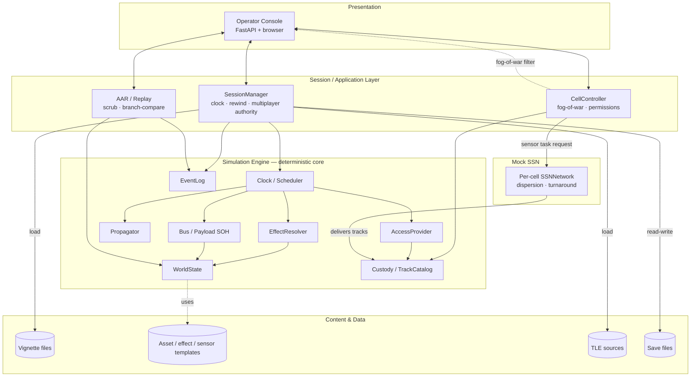
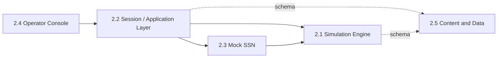

# GDS-03 — Architecture

> **Document ID:** GDS-03
> **Version:** 1.1
> **Status:** ✅ Authored — merge gate closed (see "Merge gate" below)
> **Dependencies:** GDS-02
> **Referenced By:** GDS-04
> **Produces:** GDS-04
> **Feature Mapping:** N/A — program-level
> **Related Topics:** [`design/01-architecture-overview.md`](../design/01-architecture-overview.md)
> (merge source), [`build-spec/03-architecture-and-data.md`](../build-spec/03-architecture-and-data.md)
> §7 (binding v1 architecture summary), [`design/02-tech-stack-recommendation.md`](../design/02-tech-stack-recommendation.md),
> [`CLAUDE.md`](../../CLAUDE.md) ("Load-bearing invariants," "Code map"),
> [GDS-02](02-system-context.md), [`research/encyclopedia/INDEX.md`](../research/encyclopedia/INDEX.md),
> [`reviews/architecture-review.md`](../reviews/architecture-review.md) (reconciled — see "Review
> reconciliation" below)

[↑ Architecture index](INDEX.md) · [Docs index](../INDEX.md)

## Purpose

Decompose SpaceSim — the single system GDS-02 drew a boundary around — into its major internal
subsystems: what each one is for, what it owns, how it talks to its neighbors, and what it
deliberately does not do. This document stops at subsystem granularity; it does not design classes,
methods, or wire-level API shapes (those are GDS-09's concern, and within `docs/design/` are
already covered file-by-file for the as-built system).

---

## 1. Architectural style

SpaceSim is a **layered, single-process application** with one hard internal seam, restated from
`design/01-architecture-overview.md` and confirmed still accurate against the as-built system
(`CLAUDE.md` "Code map"):

1. **Deterministic core** (`spacesim/engine/`) — pure simulation: orbits, access, custody, effects,
   bus/payload state-of-health, the event clock. No UI, no network, no wall-clock reads, no
   uncontrolled randomness (`CLAUDE.md` invariant 1).
2. **Session / application layer** (`spacesim/session/`) — the one seam between the engine and
   everything else. Owns the clock, fog-of-war, multiplayer authority, AAR. This is the layer that
   turns "a deterministic simulation" into "a multi-seat, fog-of-war'd, replayable exercise."
3. **Presentation** (`spacesim/ui_web/`) — a thin client of the session layer over HTTP. Renders
   per-cell belief views; sends operator intents back. Swappable in principle (GDS-00/`design/01`
   originally scoped PyQt as an alternative); shipped as FastAPI + browser (`design/02`
   "Option A").
4. **Content & data** (`spacesim/content/` + on-disk files) — vignettes, asset/effect/sensor
   templates, TLE sources, save files. Data, not code (`CLAUDE.md` invariant 6).

A fifth element, the **mock Space Surveillance Network (SSN)**, sits inside the engine/session
boundary but is called out as its own subsystem (§2.3) because it has an external-service *flavor*
(request-and-wait sensor tasking) even though GDS-02 §1 confirmed it is fully internal — exactly the
follow-up GDS-02's Open Question 1 anticipated.

## 2. Major subsystems

### 2.1 Simulation Engine (deterministic core)

**Purpose.** Be the single, deterministic source of physical and operational truth: orbits,
access, custody, effects, bus/payload health, time. Everything any cell ever sees is derived from
this subsystem, filtered by §2.2.

**Responsibilities.**
- Advance sim time and fire due events in deterministic order (`Clock`/`Scheduler`,
  sub-stepped — never skip past a scheduled event, `CLAUDE.md` invariant 5).
- Propagate orbits (Kepler+J2 fictional, sgp4 for real TLEs) behind a `Propagator` seam
  (research grounding: `research/encyclopedia` R1xx orbital-mechanics tier; `research/04-orbital-mechanics-primer.md`).
- Compute the six access channels (`command_uplink`, `telemetry_downlink`, `sensor_observation`,
  `jam_footprint`, `weapon_engagement`, `rpo_proximity`) behind an `AccessProvider` seam, with
  window caching and graceful degrade-to-no-access for unknown endpoints.
- Resolve orders into the five-D effect categories (deceive/disrupt/deny/degrade/destroy) plus the
  cyber exception (window-independent, resolved against `{access_vector, success_prob, persistence,
  patchable}`), behind an `EffectResolver` seam (research grounding: `research/03-counterspace-taxonomy.md`).
- Maintain custody/`Track` confidence decay and the weapons-quality gate
  (`confidence ≥ threshold AND characterized`).
- Maintain bus/payload state-of-health, safe-mode entry/recovery, and catalog command verbs
  (`buscommands.py`).
- Provide pure, read-time-only telemetry/diagnostic signatures (`telemetry.py`) and verb-preview
  math (`maneuver.py`, `isr.py`, `jam.py`, `engage.py`, `cyber.py`, `sigint.py`,
  `perturbations.py`, `sun.py`) that never mutate state or consume RNG.
- Append every action/event to an ordered, hashable `EventLog`; support `Snapshot`-based rewind.

**Interfaces.** Exposes pure, in-process Python calls only — `Simulation.step()`/`replay()`,
the `Propagator`/`AccessProvider`/`EffectResolver` seams, `Order`/`OrderSystem.issue()` and its
read-only `dry_run()` mirror. No network, no UI imports (enforced by `test_import_guard.py`).

**Inputs.** A `WorldState` built from vignette content; an ordered `EventLog` to replay; orders
submitted by the session layer on behalf of a cell; a seeded RNG (`SeededRng`, the only randomness
source in the engine).

**Outputs.** An updated `WorldState`; new `EventLog` entries; computed access windows, custody
states, effect outcomes, and telemetry samples — all ground truth, unfiltered.

**Dependencies.** Skyfield/sgp4 (propagation math, `design/01` §"Cross-references", GDS-02 §3);
NumPy/pydantic (`design/02-tech-stack-recommendation.md`). No dependency on the session layer,
presentation, or content subsystems' code (only on the data shapes content provides).

**Ownership of data.** Sole owner of `WorldState` (ground truth), `EventLog`, `Track`/custody
state, bus/payload SOH, and the RNG stream. No other subsystem mutates these directly.

**Likely implementation technologies.** Python 3.11+, NumPy, Skyfield/sgp4, pydantic v2 — already
decided and shipped (`CLAUDE.md` "Tech stack," "Code map").

**Out of scope.** Fog-of-war filtering (§2.2 owns this — the engine has no concept of "what Red
is allowed to see"); wall-clock/real-time concerns; persistence file formats (content subsystem
owns the on-disk shape); anything UI-rendering-specific.

---

### 2.2 Session / Application Layer

**Purpose.** Be the one seam between the deterministic engine and everything outside it
(`design/01-architecture-overview.md` "Action for Claude Code"). Turn a single-threaded
deterministic simulation into a multi-seat, fog-of-war'd, pausable/rewindable, multiplayer-capable
exercise.

**Responsibilities.**
- **`SessionManager`** — load/build vignettes into a `WorldState`; own the clock (start/pause/
  resume/rewind/branch); apply White Cell controls (inject firing/scheduling, live parameter
  re-tuning, TLE force-add, save/resume); run the multi-pass safe-mode recovery chain
  (`RecoverySystem`); watch for clock-lag (`_record_catch_up_lag`).
- **Multiplayer authority** (a cross-cutting responsibility of `SessionManager`/`inprocess.py`,
  not a separate subsystem): server-authoritative lazy clock (`_wall_anchor`, `_sim_anchor`,
  `_rate`, `_clock_running`), a per-session `RLock` wrapping every mutation, lazy `catch_up()` on
  every read so the clock advances exactly once regardless of connected-tab count, and session
  discovery (`list_sessions`). This is the seam GDS-01 §8/§4 and `CLAUDE.md` "Multiplayer
  workflow" describe operationally; here it is the mechanism, not the experience.
- **`CellController`** — the fog-of-war boundary (`CLAUDE.md` invariant 3): validates that an
  actor may take an action *now* (ownership, ROE, ops-fidelity dial), and renders each cell's
  `CellView`/`TrackCatalog` from custody, never ground truth, to Red/Blue. White/observer views
  pass through to ground truth by design (GDS-02 §8 "no per-cell auth," the documented LAN trust
  boundary).
- **`SessionAPI`** — the in-process call interface (`get_cell_view`, `submit_activity`,
  `task_sensor`, `set_time`, `inject`, `load/build/save`) that doubles as the HTTP API's backing
  implementation; the future-proofed network seam named in `design/01` and now realized as the
  FastAPI binding in §2.4, not a separate hop.
- **`scene.py`** — pure, read-only render-from-custody belief-scene computation (2D map + 3D
  globe inputs); like `telemetry.py`, never mutates state or consumes RNG, so it is replay-safe.
- **`redai.py`** — AI-Red doctrine presets (`russia_ew_first`, `china_integrated`, `generic`) that
  generate orders on Red's behalf through the same `SessionAPI` path a human Red would use — not
  a privileged internal actor (GDS-02 §2 Open Question 2 still tracks AI-Red's longer-term actor
  status; this document treats it as a session-layer feature, not an external one).
- **`aar.py`** — After-Action Review: replay/scrub to any `EventLog` point, branch-compare,
  `snapshot_at`. Read-only against the engine; never the live session.

**Interfaces.** `SessionAPI` (in-process Python calls today; `design/01`'s one seam for a future
network transport — already realized as HTTP, not deferred, per `build-spec/03-architecture-and-data.md`
§7.2). Consumes the engine's pure interfaces (§2.1); is consumed by the presentation layer (§2.4)
exclusively — no other subsystem calls into the session layer directly.

**Inputs.** Vignette/save files (via content, §2.5); operator intents (commands, sensor tasking,
SSN requests) from presentation; White Cell controls; wall-clock reads (the *only* place in the
whole system permitted to read the wall clock, by design — the engine never does).

**Outputs.** Per-cell `CellView`s (fog-of-war filtered); god-view/event-log access for White Cell
and observers; AAR replay output; save-file snapshots; clock state for multiplayer clients.

**Dependencies.** The Simulation Engine (§2.1) for all physics/state; Content & Data (§2.5) for
vignette/save formats; the mock SSN (§2.3) as a request target for sensor tasking. No dependency
on presentation — the session layer must remain servable by any future client, web or otherwise.

**Ownership of data.** Sole owner of session-scoped state that is *not* `WorldState` itself: the
`RLock`/clock-anchor fields, the seat→asset Role Assignment mapping (GDS-04 §1.10; implemented as
`RoleRegistry`), and the per-cell `CellView` projection logic. Does not own `WorldState` (the engine
does) but is the only subsystem permitted to call into the engine to mutate it. **Save-file
ownership, clarified:** this subsystem owns the *act* of producing a save (serializing the current
session state on demand or at session end); §2.5 Content & Data owns the resulting *on-disk file
format* once written, identically to how it owns vignette file formats. Neither subsystem owns the
other's half of this round trip (clarified per the architecture review — see "Review
reconciliation" below).

**Likely implementation technologies.** Plain Python (no framework) — `SessionManager`,
`CellController`, `SessionAPI` are framework-free by design so they are not coupled to FastAPI
(`design/01` "UI-agnostic" extended one layer up); already shipped (`CLAUDE.md` "Code map").

**Out of scope.** HTTP routing, JSON serialization, browser rendering (§2.4 owns these); orbital/
effect math (§2.1 owns this); vignette YAML parsing detail (§2.5 owns this, the session layer only
consumes the parsed result).

---

### 2.3 Mock Space Surveillance Network (SSN)

**Purpose.** Simulate a shared, contended sensor-tasking resource — the "request and wait" texture
of a real SSN — entirely inside the same process, with no real external system behind it
(GDS-02 §1, resolved Open Question 1; `build-spec/08-ssn.md` §17).

**Responsibilities.**
- Instantiate a per-cell `SSNNetwork` from a dispersion preset (`sparse`/`regional`/`global`/
  `proliferated`).
- Resolve sensor-tasking requests via hybrid-turnaround logic: earliest viable window inside the
  requester's priority SLA plus processing delay, accounting for coalition vs. national
  affiliation.
- Stage results deterministically (`world.ssn_staged`) and deliver into the requester's
  `TrackCatalog` via two replay-safe event handlers (`ssn_collect`/`ssn_deliver`); honor
  cancel-before-collect by tag-skipping both events.

**Interfaces.** Engine-level event handlers (`ssn_collect`/`ssn_deliver`) invoked by the
`Scheduler` like any other deterministic event; a request API surfaced to operators through the
same `CellController`/`SessionAPI` path as other sensor tasking (§2.2) — there is no separate SSN
transport.

**Inputs.** Sensor-tasking requests (priority, target, requesting cell) from `CellController`;
the per-cell dispersion preset from vignette content (§2.5).

**Outputs.** Delivered tracks into the requesting cell's `TrackCatalog` (custody, §2.1); staged
pending-request state visible to White Cell god-view.

**Dependencies.** The Simulation Engine's `Scheduler`/`EventLog`/custody machinery (§2.1) — the
SSN has no independent clock or state store; it is event-driven inside the same deterministic
substrate. Content (§2.5) for dispersion-preset parameters.

**Ownership of data.** Owns `world.ssn_staged` (pending-request state) exclusively; delivers into,
but does not own, the destination `TrackCatalog` (§2.1 owns that).

**Likely implementation technologies.** Plain Python, `spacesim/engine/ssn.py` — already shipped;
no external service, no network call (this is the structural point GDS-02 §1 settles).

**Out of scope.** Real-world SSN data, real sensor-tasking protocols, anything resembling an actual
space-surveillance feed — this subsystem's entire purpose is to *simulate the texture* of tasking
contention, not model a real SSN's data products.

---

### 2.4 Operator Console (Presentation)

**Purpose.** Render each connected human's belief-appropriate view and translate their intents
into `SessionAPI` calls. The only subsystem that knows it is a web app.

**Responsibilities.**
- Serve the FastAPI HTTP surface (`server.py`) that wraps `SessionAPI` 1:1 — `/scene`,
  `/telemetry`, `/api/sessions/...`, `/brief/{cell}`, `/aar*`, `/godview`, etc.
- Render, client-side, the per-cell belief scene: 2D map, 3D orthographic globe, fleet rail
  (next-contact countdown, SoC, alarms), command menu with live dry-run preview, subsystem
  drill-down, telemetry graphs, mission-brief panel, tutorial panel, AAR scrub/branch-compare UI,
  multi-monitor pop-out windows joining the same session.
- Enforce no fog-of-war logic of its own — it renders exactly what the cell-scoped endpoint
  returns, trusting `CellController` (§2.2) to have already filtered it (`CLAUDE.md` invariant 3).
- Drive White-Cell-only controls (pause/resume, time multiplier, inject builder) by calling the
  same `SessionAPI` paths as any other client.

**Interfaces.** HTTP (poll-based, not a persistent socket) between the browser and the FastAPI
server; the FastAPI route layer's only job is to marshal `SessionAPI` calls/results to/from JSON —
it contains no simulation or fog-of-war logic itself.

**Inputs.** `CellView` JSON, telemetry samples, scene/AAR payloads from the session layer; operator
clicks/keyboard input (`j/k/c/g` nav) from the human.

**Outputs.** Rendered DOM/canvas views; HTTP requests carrying operator intents back to
`SessionAPI`.

**Dependencies.** The Session layer (§2.2) exclusively — no direct dependency on the engine (§2.1)
or content (§2.5); those are reached only through `SessionAPI`.

**Ownership of data.** Owns no exercise state. Owns only client-local UI state: `localStorage`
panel-collapse preferences, pop-out layout tokens, and presentation-mode toggles — none of which
is exercise-authoritative.

**Likely implementation technologies.** FastAPI + Uvicorn (server), vanilla JS modules
(`app.js`, `globe.js`, `world.js`, `graph.js`) + a committed `world.json` basemap, no client-side
framework — already decided and shipped (`design/02-tech-stack-recommendation.md` "Option A";
`CLAUDE.md` "Code map"). The originally-scoped PyQt desktop alternative
(`build-spec/03-architecture-and-data.md` §7.1, written before the web path was chosen) was not
built; see "Merge gate" below.

**Out of scope.** Any simulation logic, fog-of-war decisions, or persistence — a browser refresh
or a second tab must never be able to derive state the session layer didn't already hand it.

---

### 2.5 Content & Data

**Purpose.** Keep all scenario-specific and reference content as data, never code
(`CLAUDE.md` invariant 6), so White Cell facilitators and content authors never edit Python.

**Responsibilities.**
- Define and load the vignette schema (`content/vignette.py` + `vignettes/*.yaml`): mission,
  roles needed, starting orbits/TLEs, parameters/dials, injects, intro briefs, tutorial scripts,
  coaching notes. All 19 shipped vignettes live here.
- Provide the inject-template library (`inject_library.yaml`) surfaced in the White Cell build/
  schedule-inject panel.
- Hold asset/effect/sensor template libraries (regime defaults, payload type, telemetry/command
  databases, vulnerabilities, available defenses) referenced by the engine when building a
  `WorldState`.
- Provide the TLE import path: optional Space-Track pull at build time, bundled snapshot fallback,
  or manual/Keplerian entry (`build-spec/01` Decision D2; GDS-02 §4).
- Own the save-file format: a complete deterministic session snapshot (history, order queue,
  pending events) for resume.

**Interfaces.** File I/O only (YAML/JSON on local disk) plus the one optional outbound network
call to Space-Track.org at scenario-build time. No runtime network dependency
(`build-spec/03-architecture-and-data.md` §8.4).

**Inputs.** Author-written or in-app-builder-produced vignette files; Space-Track API responses
(optional); manually entered TLEs/Keplerian elements; a session's exported save file (on resume).

**Outputs.** A parsed vignette object the session layer uses to build a `WorldState`; template
data the engine consults when constructing assets/effects/sensors; save files written at session
end or on demand.

**Dependencies.** None on the engine, session, or presentation subsystems' *code* — only on the
data shapes they expect (a one-directional, schema-level dependency, not a code dependency).

**Ownership of data.** Sole owner of the on-disk vignette/template/save/TLE-cache file formats.
Once loaded into a `WorldState`, the engine (§2.1) owns the in-memory representation; this
subsystem does not reach back into a running session. For save files specifically: this subsystem
owns the *format* of the file on disk; the Session layer (§2.2) owns the act of producing/writing
it — see §2.2's Ownership of data for the corresponding note (clarified per the architecture
review — see "Review reconciliation" below).

**Likely implementation technologies.** YAML + JSON on local disk, pydantic v2 schemas for
validation, `httpx` for the optional Space-Track call — already decided and shipped.

**Out of scope.** Any logic that depends on sim time, custody, or access (that would be the
engine's job, not content's — a recurring discipline check called out explicitly in `CLAUDE.md`
invariant 6: "If scenario logic starts leaking into code, move it back into data").

---

## 3. Subsystem dependency view

No arrow points back toward presentation or content from the engine or session layer — both are
one-directional dependencies, the structural property that keeps the engine UI-agnostic
(`CLAUDE.md` invariant 2) and content swappable without touching code (invariant 6).

## 4. Cross-cutting concerns (not separate subsystems)

These properties are enforced *by* one or more of the subsystems above, not by a subsystem of
their own — called out so a future reader does not look for a "determinism module" or a
"multiplayer module" that doesn't exist as a distinct box:

- **Determinism** (`CLAUDE.md` invariant 1) — enforced entirely within §2.1 (seeded RNG, no
  wall-clock reads, ordered `EventLog`); every other subsystem inherits it by only ever driving the
  engine through ordered, logged calls.
- **Fog-of-war** (`CLAUDE.md` invariant 3) — enforced entirely within §2.2's `CellController`;
  §2.1 has no concept of "cell," and §2.4 trusts §2.2's output verbatim. This enforcement is total
  for *cell-scoped* endpoints only — the no-cell god-view endpoints (`/godview`, `/eventlog`,
  `/save`, `/aar*`, `/objectives`) deliberately bypass `CellController` filtering by design, not
  by omission (GDS-02 §8, `CLAUDE.md` "LAN trust model"). A reader should not infer that *every*
  path through §2.2 is fog-of-war-filtered — only the cell-scoped ones are (clarified per the
  architecture review — see "Review reconciliation" below).
- **Multiplayer authority** — a responsibility of §2.2's `SessionManager`/`inprocess.py`
  (lazy clock + `RLock`), not a separate transport subsystem; §2.4 is unaware it is one of
  possibly several connected clients.
- **Plan-first commanding** (`CLAUDE.md` invariant 4) — enforced by §2.1's `OrderSystem` (validate
  → window → execute) and surfaced to operators by §2.4's dry-run preview; no subsystem allows an
  instant, window-independent ground/space command outside the cyber exception.

## Open Questions

1. **PyQt alternative's status.** `build-spec/03-architecture-and-data.md` §7.1/§7.2 still
   describes a PyQt/PySide desktop GUI as the v1-preferred presentation technology, written before
   the web path (FastAPI + browser) was chosen and shipped. This document treats the web path as
   the as-built, authoritative presentation subsystem (§2.4) and flags the build-spec passage as
   stale rather than silently rewriting the binding spec — resolving the staleness in
   `build-spec/03` itself is out of this document's authority (`MSTR-001` §7: build spec wins on
   conflict; this is a flagged tension, not a unilateral correction).
2. **AI-Red's subsystem placement.** §2.2 places `redai.py` inside the session layer because it
   only ever acts through `SessionAPI`. GDS-02 §2 Open Question 2 left open whether a future
   pluggable/external AI-Red (e.g. LLM-driven) would change its boundary classification — if that
   happens, this document's §2.2 placement would need revisiting alongside GDS-02's. The
   architecture review (`reviews/architecture-review.md` §1 finding 4, §8 finding 1) notes that
   GDS-02 Open Question 2, this question, and a related gap in GDS-04 (AI-Red previously absent
   from the Role Assignment entity's description) all independently flag the same underlying
   placement question — corroborating evidence this is load-bearing for GDS-05, not three
   unrelated gaps.
3. **Whether telemetry/scene "pure render" helpers belong to the engine or the session layer.**
   `telemetry.py` lives in `spacesim/engine/` (per `CLAUDE.md`'s code map) while the structurally
   similar `scene.py` lives in `spacesim/session/`. Both are pure, read-only, replay-safe, and
   render belief/diagnostic views rather than mutating state. This document followed the existing
   file locations rather than reconciling them into one placement rule; left open as a possible
   future code-organization cleanup, not a behavioral issue. The architecture review
   (`reviews/architecture-review.md` §2 finding 2) independently reached the same flag from a
   fresh read of GDS-03/GDS-04 — treated as corroborating weight that this is a real seam, not a
   false positive.
4. **No stated ceiling for per-session `RLock` contention under many concurrent LAN clients.**
   §2.2's multiplayer-authority responsibility serializes every read/write through one lock per
   session; neither this document nor GDS-01 §13 Open Question 2 (which this document inherits
   without resolving) states where that serialization starts to matter. Raised by the architecture
   review (`reviews/architecture-review.md` §6 findings 1–2) as a scaling question that has now
   passed through three ladder levels unaddressed; left open here, since resolving it requires a
   sizing decision, not a documentation fix.

---

## Review reconciliation (architecture-review.md)

In response to `docs/reviews/architecture-review.md`, the following documentation-only
clarifications were made. No subsystem, interface, or feature changed — see
[`reviews/architecture-review-changelog.md`](../reviews/architecture-review-changelog.md) for the
consolidated, cross-document changelog.

- §2.2 Ownership of data — fixed a stray typo (`` `WorldState* `` → `` `WorldState` ``); aligned
  "`RoleRegistry`" terminology with GDS-04's formal "Role Assignment" entity name; added the
  save-file ownership split clarification (review §2 finding 3, new).
- §2.5 Ownership of data — added the corresponding save-file format/write-act split note (review
  §2 finding 3).
- §4 Fog-of-war cross-cutting concern — appended the no-cell god-view endpoint exception, so the
  bullet no longer reads as a total boundary (review §4 finding 1, new).
- Open Question 2 (AI-Red placement) — appended a cross-reference noting three ladder levels
  independently flag this question (review §1 finding 4, §8 finding 1).
- Open Question 3 (telemetry/scene split) — appended a note that the review independently reached
  the same flag (review §2 finding 2).
- Added Open Question 4, no stated `RLock`/LAN-scaling ceiling (review §6 findings 1–2).
- **Checked and found not applicable:** the review's architectural-inconsistencies finding about
  cyber being enumerated as a sixth access channel without its window-independence being flagged
  inline — on re-reading, §2.1's responsibilities bullet already states the cyber exception
  immediately adjacent to the five-D effect categories, and the six access channels listed
  separately do not include cyber at all. No edit made; the original finding overstated the
  inconsistency once checked against this document's actual text.
- Metadata — added a cross-reference to the architecture review; version bumped 1.0 → 1.1.

## Merge gate (closed)

- [x] **Absorbed the relevant content of [`design/01-architecture-overview.md`](../design/01-architecture-overview.md)**
  into this document: its five design principles are restated as §1's architectural style and the
  cross-cutting concerns in §4; its layered-structure diagram is re-expressed as the subsystem
  decomposition in §2 and the Mermaid diagrams in §1/§3; its "how a player action flows" walkthrough
  is folded into §2.1/§2.2's responsibilities; its single-machine-vs-multiplayer table is folded
  into §2.2's "Multiplayer authority" responsibility, updated to reflect that the multiplayer seam
  has since shipped (`CLAUDE.md` "Code map," `build-spec/03` §7.2) rather than remaining a future
  seam as the source document described it at the time it was written.
- [x] **Also searched and reconciled against `build-spec/03-architecture-and-data.md` §7-8**
  (the binding spec's own architecture summary) since it duplicates ground covered by
  `design/01`: found one genuine staleness (the PyQt presentation description, §7.1/§7.2) — flagged
  as Open Question 1 above rather than silently corrected, per `MSTR-001` §7 (build spec wins on
  conflict; a flagged tension is the correct move, not a unilateral rewrite of binding content).
  No other contradiction found between `build-spec/03`, `design/01`, and the as-built system
  described in `CLAUDE.md`.
- [x] **Preserved the load-bearing invariants** stated in `CLAUDE.md` §"Load-bearing invariants" —
  all six are explicitly restated or cited: determinism (§2.1, §4), UI-agnostic engine (§1, §3),
  fog-of-war at the boundary (§2.2, §4), plan-first commanding (§2.1, §4), sub-stepped clock (§2.1),
  and content-as-data (§2.5).
- [x] **Decision recorded:** `design/01-architecture-overview.md` **stays authoritative** for its
  own audience (a build-order-oriented walkthrough for an implementer building the system from
  scratch, including the historical single-machine-vs-multiplayer framing at the time multiplayer
  was still future work). `GDS-03` is a **subsystem-decomposition extraction** layered above it and
  above `build-spec/03` §7-8, restated against the current as-built system (post-multiplayer,
  post-SSN, post-web-UI) rather than the v1-planning-time system either source document originally
  described. Neither source document is demoted to a pointer; this mirrors the resolution pattern
  used for GDS-00/01/02.

## Next

`GDS-04` (Domain Model) may now begin.
