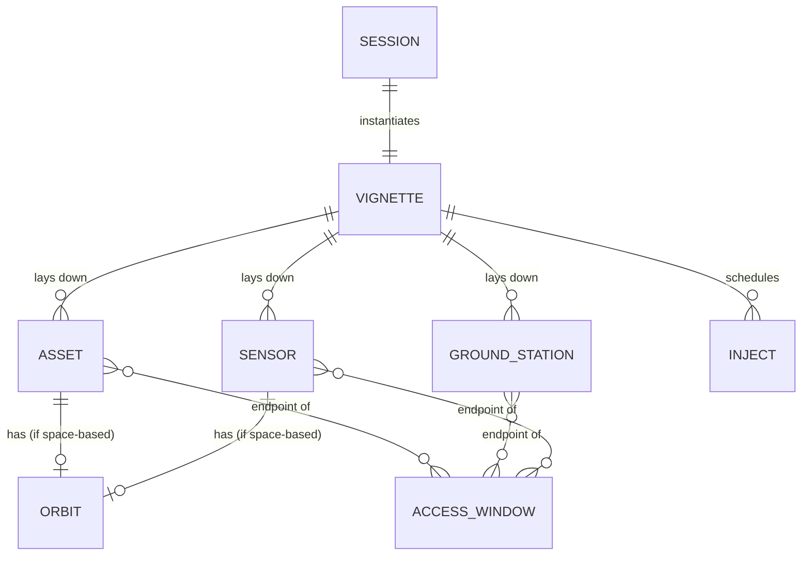
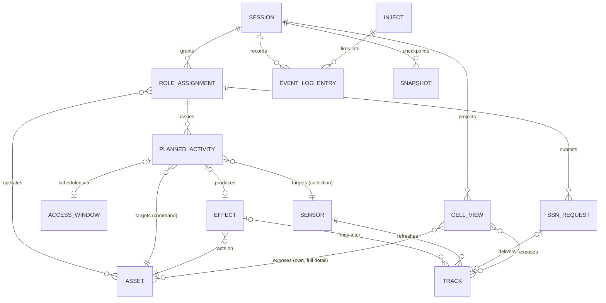

# GDS-04 — Domain Model

> **Document ID:** GDS-04
> **Version:** 1.3
> **Status:** ✅ Authored — merge gate closed (see "Merge gate" below)
> **Dependencies:** GDS-03
> **Referenced By:** GDS-05
> **Produces:** GDS-05
> **Feature Mapping:** N/A — program-level
> **Related Topics:** [`design/04-data-model.md`](../design/04-data-model.md) (merge source —
> entity/relationship portion only; the persistence-schema portion is GDS-07's merge target),
> [GDS-03](03-architecture.md), [GDS-02](02-system-context.md), [GDS-01](01-concept-of-operations.md),
> [`research/04-orbital-mechanics-primer.md`](../research/04-orbital-mechanics-primer.md),
> [`research/03-counterspace-taxonomy.md`](../research/03-counterspace-taxonomy.md),
> [`research/06-bus-and-payload-operations.md`](../research/06-bus-and-payload-operations.md),
> [`build-spec/08-ssn.md`](../build-spec/08-ssn.md) §17,
> [`reviews/architecture-review.md`](../reviews/architecture-review.md) (reconciled — see "Review
> reconciliation" below),
> [`research/encyclopedia/R313-maritime-operator-perspective.md`](../research/encyclopedia/R313-maritime-operator-perspective.md),
> [`research/encyclopedia/R314-land-operator-perspective.md`](../research/encyclopedia/R314-land-operator-perspective.md)
> (draft, citations unverified),
> [`research/encyclopedia/R315-air-operator-perspective.md`](../research/encyclopedia/R315-air-operator-perspective.md),
> [`research/encyclopedia/R316-joint-and-combined-operations.md`](../research/encyclopedia/R316-joint-and-combined-operations.md),
> [`research/encyclopedia/R317-space-operator-perspective.md`](../research/encyclopedia/R317-space-operator-perspective.md)
> (reconciled — see "Research integration (R313–R317)" below),
> [`reviews/r313-r317-gap-analysis.md`](../reviews/r313-r317-gap-analysis.md),
> [`reviews/strategic-review-2026-07.md`](../reviews/strategic-review-2026-07.md) (reconciled —
> see "Strategic review reconciliation" below), [`reviews/architecture-update.md`](../reviews/architecture-update.md)

[↑ Architecture index](INDEX.md) · [Docs index](../INDEX.md)

## Purpose

Name the core domain objects SpaceSim reasons about — what they *mean*, not how they are coded.
This document sits below GDS-03's subsystem boxes and above GDS-07's persistence schema: it answers
"what concepts does the Simulation Engine and Session Layer actually manipulate?" without
prescribing classes, fields, or storage formats. Conceptual entities and the invariants tying them
together only — the literal `pydantic` shapes belong to `design/04-data-model.md` today and to
GDS-07 once authored.

---

## 1. Core domain objects

### 1.1 Vignette

**Purpose.** The authored blueprint for one exercise — what GDS-01 §5 step 1 calls "set up."
Everything a Session instantiates traces back to a Vignette.

**Responsibilities.** Declares the mission, the roles a White Cell must staff, the starting force
laydown, tunable parameters/ROE dials, the inject library for this scenario, and the per-cell intro
brief and tutorial script (`CLAUDE.md` "Code map").

**Relationships.** Defines zero or more Assets, Ground Stations, and Sensors (the starting force
laydown); schedules zero or more Injects; is instantiated by exactly one Session at a time (though
the same Vignette file may be loaded into many separate Sessions over its lifetime).

**Lifecycle.** Authored (by hand or the in-app builder) → validated at load → instantiated into a
Session → (the Vignette itself does not change once a Session is running; edits create a new
version). `CLAUDE.md` invariant 6 — Vignettes are data, not code.

**Persistent state.** The entire object is persistent — it is, by definition, the on-disk content
artifact (`research/06`, GDS-02 §4 "Data sources").

**Transient state.** None; a Vignette carries no runtime state of its own.

**Constraints.** Must validate at load (`build-spec/01` "Error handling" — invalid scenario data
fails loudly); roles_needed must be satisfiable by the seats White Cell assigns; constellations are
capped at 3 satellites each, individually operated (`CLAUDE.md` "Key facts").

---

### 1.2 Asset

**Purpose.** Anything a cell owns and operates — satellite, ground station-adjacent terrestrial
force, jammer, interceptor, or cyber unit. The unit of ownership, command, and state-of-health
across the entire simulator.

**Responsibilities.** Carries identity, ownership (blue/red/neutral), a kind, current health, and
— for space-based assets — orbital state; for bus-capable assets, state-of-health across power/
attitude/thermal/propulsion/CDH/comms and an optional safe-mode condition; for payload-bearing
assets, a payload-type-specific operating state (`research/06-bus-and-payload-operations.md` §3).

**Relationships.** Owns zero or one Orbit (terrestrial assets have none); is the actor or target of
Planned Activities; is the actor or target of Effects; is the subject of Tracks held by *other*
cells once detected; is operated by one or more Role Assignments; reports state-of-health that
Access Windows gate visibility of.

**Lifecycle.** Instantiated from the Vignette's force laydown at Session start → operates
(nominal ⇄ degraded ⇄ safe-mode, per GDS-01 §7's bus-mode state machine) for the Session's
duration → may be destroyed by a kinetic Effect (terminal) or simply persists to Session end.

**Persistent state.** Identity, ownership, kind, template reference, resource levels (fuel/power/
ammo), posture toggles, current health, ground-segment/comms configuration, current bus/payload
state-of-health, cyber vulnerability list — all carried in `WorldState` and therefore in every
Snapshot.

**Transient state.** None that outlives a Snapshot; even "live" telemetry sampling
(`telemetry.py`) is a pure read-time computation over persistent state, not separately stored
state (GDS-03 §2.1).

**Constraints.** A satellite must have an Orbit; a terrestrial asset must have a location instead
(`design/04-data-model.md` §9); resource levels cannot go negative (e.g. `delta_v_ms`); an asset's
payload verbs are gated by its payload type and bus availability (`CLAUDE.md` "Code map" —
`buscommands.py`).

---

### 1.3 Orbit

**Purpose.** The geometric/kinematic state that determines when a space-based Asset can be
reached, observed, or can itself observe/reach something else — the physical substrate every
Access Window computation reads (`research/04-orbital-mechanics-primer.md`).

**Responsibilities.** Represents either a fictional Keplerian element set (moderate fidelity,
behind the `Propagator` seam, GDS-03 §2.1) or a real two-line element set; classifies into a
regime (LEO/LEO-SSO/MEO/GEO/HEO/cislunar).

**Relationships.** Belongs to exactly one Asset; is read by Access Window computation; is read by
Track's state estimate when another cell holds custody of this Asset.

**Lifecycle.** Set at Asset creation (from the Vignette, Space-Track import, or manual/Keplerian
entry) → propagated forward deterministically every sim-clock advance → changed discretely only by
a maneuver Planned Activity's execution; never read backward except via rewind.

**Persistent state.** The element set (Keplerian or TLE) and epoch; the derived regime
classification (cached).

**Transient state.** The instantaneous ECI position/velocity at "now" is a derived, recomputed
quantity, not separately stored — recomputing it from the persistent element set plus elapsed sim
time is how determinism is preserved (`CLAUDE.md` invariant 1).

**Constraints.** TLE-sourced orbits must parse at load or the Asset is rejected with a clear error
(`design/04-data-model.md` §9); a maneuver cannot exceed the owning Asset's remaining
delta-v budget.

---

### 1.4 Ground Station

**Purpose.** A terrestrial endpoint for command uplink and telemetry downlink — the other end of
the `command_uplink`/`telemetry_downlink` access channels (GDS-02 §1's six-channel model).

**Responsibilities.** Provides a fixed geographic point with an elevation mask, an owning cell, a
set of supported channels, and an operational status.

**Relationships.** Is one endpoint of zero or more Access Windows for the satellites it services;
referenced by an Asset's `ground_segment`; degraded/down status denies the windows it would
otherwise open.

**Lifecycle.** Instantiated from the Vignette at Session start → status may change at runtime
(an inject or effect can take it down) → persists for the Session's duration (no destruction
modeled in v1).

**Persistent state.** Identity, ownership, location, elevation mask, supported channels, status.

**Transient state.** None — status changes are themselves persistent state transitions, not
ephemeral.

**Constraints.** Elevation mask and location are fixed at load; no two stations are validated for
geographic conflict (an authoring concern, not an engine one).

---

### 1.5 Sensor

**Purpose.** A detection/tracking/characterization capability — ground-based, space-based, or a
modeled coalition feed — that produces or refreshes Tracks (`research/04`, `research/05-mission-types-and-counters.md`).

**Responsibilities.** Declares its kind, capabilities (detect/track/characterize), lighting/
weather sensitivity, field of view, and task capacity (how many simultaneous tasks it can serve —
the contention model).

**Relationships.** Is tasked by Planned Activities (collection-kind) and, for the mock SSN path,
by SSN Requests; is one endpoint of `sensor_observation` Access Windows; produces or updates
Tracks; a space-based Sensor owns an Orbit exactly like a satellite Asset does.

**Lifecycle.** Instantiated from the Vignette at Session start → accumulates/relinquishes tasked
collection load at runtime → persists for the Session's duration; status may degrade from effects
or environmental injects.

**Persistent state.** Identity, ownership, kind, location or Orbit reference, capabilities,
task capacity, status.

**Transient state.** The current list of active tasks against it is persistent queue state (it
must survive rewind identically), not ephemeral — there is no separately-volatile "busy" flag
outside that queue.

**Constraints.** Optical sensors require target sunlit + site darkness; weather-sensitive sensors
can be denied by environmental conditions; task capacity bounds how many concurrent requests a
Sensor will actually serve (excess requests queue or are declined, per the tasking contention
model, `design/11-command-planning-and-tasking.md` Part B).

---

### 1.6 Access Window

**Purpose.** The time-bounded opportunity for one of the six access channels
(`command_uplink`, `telemetry_downlink`, `sensor_observation`, `jam_footprint`,
`weapon_engagement`, `rpo_proximity`) to be exercised between two endpoints — the single concept
that makes "you can only act when geometry permits" concrete (GDS-01 invariant, `CLAUDE.md`
invariant 4-5).

**Responsibilities.** Bounds a start/end sim-time during which a specific channel between two
named endpoints is geometrically (and, for some channels, environmentally) open.

**Relationships.** Computed from one or two Assets'/Sensors'/Ground Stations' Orbits/locations;
gates whether a Planned Activity may execute; gates whether an Effect's access-constrained
category may be attempted; gates whether a Track-refreshing observation may occur.

**Lifecycle.** Computed on demand (and cached) by the engine as sim time advances → opens → closes
→ is never mutated once computed for a given time range, only recomputed if the underlying geometry
or asset status changes (e.g. a station goes down).

**Persistent state.** None of its own in the strict sense — it is a derived, deterministic function
of persistent Orbit/location/status state, cached for performance rather than stored as
independent truth.

**Transient state.** The cache itself is a performance optimization, not domain state; discarding
and recomputing it must reproduce identical windows (a determinism corollary, `CLAUDE.md`
invariant 1).

**Constraints.** Must never be skipped past by a clock step that is too large (`CLAUDE.md`
invariant 5 — sub-step to the next event); an unknown endpoint id degrades to "no access," not a
crash (GDS-03 §2.1).

---

### 1.7 Planned Activity (Order / Collection Task)

**Purpose.** An operator's scheduled intent — "command this Asset" or "task this Sensor" — the
single domain concept GDS-01 §10's "plan-first commanding" invariant is built on. Commands and
collection tasks are the same kind of object with two flavors, sharing one lifecycle
(`design/04-data-model.md` §6.5).

**Responsibilities.** Names an actor (Asset or Sensor), an intent (a command verb or a collection
intent), a delivery path (ground uplink / ISL relay / stored program / sensor collect) and, once
resolved, a scheduled Access Window; carries a priority and an optional dependency chain.

**Relationships.** Targets exactly one Asset or Sensor; is issued by exactly one cell (via a Role
Assignment); is scheduled against zero or one Access Window (cyber and stored-program activities
may have none); on execution, produces zero or one Effect (for command-kind activities that
resolve into a counterspace action) or updates a Track (for collection-kind activities); may be
cancelled by its issuing cell before execution.

**Lifecycle.** `DRAFT → PLANNED → ACTIVE → EXECUTED` (commands) or `→ REPORTED` (collection) →
terminal; or `→ CANCELLED` at any point before execution; or `→ FAILED` if re-validation at
execute time fails (ownership/window/resources/ROE/track gate) — restated verbatim from GDS-01 §7.

**Persistent state.** Every field above, plus its current lifecycle state and fail reason if any —
all of it is `EventLog`-significant and must survive rewind exactly.

**Transient state.** A live "dry run" preview (the read-only mirror the UI uses for "why can't I?"
affordances, GDS-03 §2.1) is computed on demand and never stored — it previews what *would* happen
without creating a Planned Activity.

**Constraints.** Validated at both accept-time and execute-time against ownership, a valid window/
delivery path, resources, ROE/authorities, and — for engagement intents — the weapons-quality Track
gate (`design/04-data-model.md` §6.5).

---

### 1.8 Effect

**Purpose.** A counterspace action actually applied to a target and its outcome — the mechanism
behind every deceive/disrupt/deny/degrade/destroy action and the cyber exception
(`research/03-counterspace-taxonomy.md`).

**Responsibilities.** Names the acting Asset, the target, the effect category/segment, whether it
is reversible/kinetic, its debris risk and attribution character, and the access channel that
gated it (none, for cyber); once resolved, records its achieved outcome and any side effects
(debris, resource consumption, custody change, attribution signal, political consequence).

**Relationships.** Produced by exactly one Planned Activity's execution; acts on exactly one
target Asset (or, for area effects, a notional area/target group); may change the target Asset's
health or bus/payload state; may change a Track's confidence (for the actor's or a third cell's
custody); is the thing AAR's branch-compare contrasts across two histories.

**Lifecycle.** Instantiated at the moment a gating Planned Activity executes → resolved
immediately into an outcome (effects do not have an independent multi-step lifecycle of their own,
unlike Planned Activities) → terminal; its consequences (debris, safe-mode entry, custody change)
persist and ripple into *other* entities' lifecycles rather than its own.

**Persistent state.** The full instance and outcome record, appended to the `EventLog` — needed
for AAR and rewind.

**Transient state.** None — an Effect, once resolved, is a historical fact, not a live object.

**Constraints.** Kinetic effects must declare debris risk and are blocked unless the Vignette's
ROE authorizes them; cyber effects are not window-gated but are resolved against
`{access_vector, success_prob, persistence, patchable}` instead (`CLAUDE.md` "Key facts").

---

### 1.9 Track

**Purpose.** One cell's evolving belief about an object's identity and state — the SDA domain's
central concept and the gate that everything kinetic/engagement-related ultimately checks
(`research/05-mission-types-and-counters.md`, GDS-01 §1).

**Responsibilities.** Holds an owning cell, the observed object, last-observation time, a
decaying confidence value, a characterized flag, a classification, a (possibly stale) state
estimate, and a growing uncertainty envelope.

**Relationships.** Is held per-cell — the same physical object may have a different Track (or no
Track at all) for Blue vs. Red, which is exactly the fog-of-war property a Cell View exposes; is
refreshed by Sensor observations and by SSN Request deliveries; is read by Planned Activities that
require a weapons-quality gate before an engagement.

**Lifecycle.** `UNKNOWN → (detection) → TRACKED(low confidence) → (characterization) →
CHARACTERIZED`; confidence decays continuously without fresh observation and may fall back below
the weapons-quality threshold without the Track itself disappearing — restated from GDS-01 §7.

**Persistent state.** Every field above, per cell, per tracked object.

**Transient state.** None stored separately; confidence decay is a pure function of elapsed sim
time since `last_observation`, recomputed on read rather than ticked and stored (consistent with
`CLAUDE.md` invariant 1).

**Constraints.** A "weapons-quality" Track requires `confidence ≥ threshold AND characterized`
simultaneously; Tracks belong to one cell — there is no shared/merged Track across cells in v1.

---

### 1.10 Role Assignment

**Purpose.** The binding of a human seat to the cell(s)/asset(s) they operate for a Session — the
domain object behind GDS-01 §2's "many-roles-few-humans" concurrency model and §8's hot-seat
handoff.

**Responsibilities.** Maps a seat to a role (bus, payload, or both) and to the specific Assets
that role operates.

**Relationships.** Belongs to exactly one Session; references one or more Assets; determines which
Planned Activities a given human — or AI-Red acting on Red's behalf through the same Role
Assignment (GDS-03 §2.2's `redai.py`) — may legally issue (checked by the Session layer's
permission logic, GDS-03 §2.2). AI-Red was previously absent from this entity's description even
though it exercises a Role Assignment exactly like a human would; clarified per the architecture
review (see "Review reconciliation" below).

**Lifecycle.** Created during the "assign seats" step (GDS-01 §5 step 2) → may be reassigned at
runtime via hot-seat handoff → ends with the Session.

**Persistent state.** The seat→role→asset mapping for the Session's duration.

**Transient state.** Which physical human is currently "in" a seat (hot-seat handoff) is presented
to the UI but is a thin, session-local notion — it does not change *what* the Role Assignment
permits, only who is presently exercising it.

**Constraints.** A Role Assignment can only reference Assets the Vignette's `roles_needed` made
available for that role; White Cell alone may create/modify Role Assignments.

---

### 1.11 Cell View

**Purpose.** The fog-of-war-filtered belief state a single cell is actually allowed to see — the
concrete artifact `CLAUDE.md` invariant 3 ("fog-of-war at the boundary") produces.

**Responsibilities.** Aggregates, for one cell: full detail on its own Assets, the Tracks it
holds, the Effects it can perceive/attribute, the upcoming Access Windows for its own Assets, and
any messages/injects addressed to it.

**Relationships.** Derived entirely from `WorldState` plus that cell's Tracks/Role Assignments by
the Session layer's `CellController` (GDS-03 §2.2); consumed exclusively by the Operator Console
(GDS-03 §2.4); White Cell's equivalent view is unfiltered god-view, not a Cell View. This
derivation is one-directional: Cell View reads Track state but never writes back to it — there is
no path by which rendering a Cell View alters the Track data it was derived from (clarified per
the architecture review — see "Review reconciliation" below).

**Lifecycle.** Computed fresh on every read; never persisted as its own object — recomputing it
identically from the same `WorldState`/Track inputs is the fog-of-war correctness property.

**Persistent state.** None — by construction, to guarantee it can never drift from what
`WorldState`/Track actually authorize.

**Transient state.** The entire object is, in a sense, transient/derived — it exists only as the
read-time projection a request produced.

**Constraints.** Must never expose another cell's Tracks, hidden parameters (e.g. `red_intent`),
or ground truth for non-owned objects; the no-cell god-view endpoints are a deliberate, documented
exception to this rule, not a Cell View at all (GDS-02 §8, `CLAUDE.md` "LAN trust model").

---

### 1.12 Inject

**Purpose.** A White-Cell-authored or White-Cell-fired scenario event that perturbs the running
exercise outside the normal cell-vs-cell action loop — the mechanism behind GDS-01 §6's "severe
space-weather advisory" example.

**Responsibilities.** Names a trigger (time-based or live-fired), one or more effects to apply
(e.g. reveal an asset to a cell, degrade a station), and whether it may repeat.

**Relationships.** Belongs to a Vignette (as a scheduled template) or is fired live by White Cell
during a Session; once fired, its effects may alter Assets, Ground Stations, Sensors, or Tracks
directly, bypassing the normal Planned-Activity → Access-Window → Effect path (injects are not
geometry-gated).

**Lifecycle.** Authored in the Vignette (or composed live from the inject-template library,
`CLAUDE.md` "Code map" — `inject_library.yaml`) → scheduled or fired → applied once (or repeatedly,
if marked repeatable) → recorded in the `EventLog`.

**Persistent state.** The template definition (in the Vignette) and, once fired, the fired record
in the `EventLog`.

**Transient state.** None — firing is itself a persistent, logged event.

**Constraints.** A non-repeatable Inject cannot fire twice; an Inject's effects bypass access-
window gating by design (it represents an externally-imposed event, not a cell action) but are
still subject to the same `WorldState` mutation rules as any other event.

---

### 1.13 SSN Request

**Purpose.** A sensor-tasking request against the mock Space Surveillance Network — the domain
object behind the "request and wait" texture GDS-03 §2.3 describes, simulated entirely inside the
process (`build-spec/08-ssn.md` §17).

**Responsibilities.** Names a requesting cell, a target, and a priority; is resolved against that
cell's `SSNNetwork` dispersion preset via hybrid-turnaround logic (earliest viable window inside
the priority SLA plus processing delay, weighted by coalition vs. national affiliation).

**Relationships.** Issued by a cell (via a Role Assignment); resolved against the per-cell
`SSNNetwork` (itself derived from Vignette content, §1.1); on delivery, updates or creates a Track
for the requesting cell.

**Lifecycle.** Submitted → staged (pending) → delivered into the requester's Track, or cancelled
before collection (tag-skipped, leaving no Track update) — both `ssn_collect`/`ssn_deliver` steps
are ordinary deterministic engine events (GDS-03 §2.3).

**Persistent state.** The staged-request record and, once resolved, the delivery event in the
`EventLog`.

**Transient state.** None beyond the staged record itself, which is persistent (survives rewind)
rather than a volatile in-flight flag.

**Constraints.** Resolution must respect the requester's priority SLA and the dispersion preset's
coverage; cancellation before collection must leave no Track side effect (clean tag-skip,
`CLAUDE.md` "Code map").

---

### 1.14 Session

**Purpose.** One running or completed instantiation of a Vignette — the binding context everything
above actually happens inside, and the unit GDS-01's exercise lifecycle (§7) describes.

**Responsibilities.** Owns the sim clock (and, for LAN play, the wall-clock anchor and lock that
make multiplayer authority work, GDS-03 §2.2); owns the current `WorldState`; owns the `EventLog`
and Snapshot history; owns the set of Role Assignments; brokers every Planned Activity, Effect,
Track update, Inject, and SSN Request that happens during its run.

**Relationships.** Instantiates exactly one Vignette; produces exactly one ordered `EventLog` and
a sequence of Snapshots; has one or more Role Assignments; is the context every other entity in
this document (except Vignette itself) exists inside.

**Lifecycle.** `SETUP → ASSIGNED(roles) → RUNNING ⇄ PAUSED → ENDED(log written)`, with
`RUNNING → (rewind) →` an earlier sim-time state, continuing deterministically — restated verbatim
from GDS-01 §7.

**Persistent state.** The current `WorldState`, the full `EventLog`, all Snapshots, and Role
Assignments — exactly what a save file captures (GDS-02 §7).

**Transient state.** The wall-clock anchor fields that translate real elapsed time into sim-time
advancement (`_wall_anchor`, `_sim_anchor`, `_rate`, `_clock_running`) are session-local,
non-deterministic-input state — they drive *when* the deterministic log is extended, but are
themselves never part of the deterministic state being reproduced (GDS-03 §2.2; `CLAUDE.md`
invariant 1 is about the log/seed/state triple, not the wall-clock driver).

**Constraints.** Exactly one Session owns clock authority over its own `WorldState` regardless of
how many browser clients are connected (`CLAUDE.md` invariant — single clock owner); only White
Cell may advance/pause/rewind/branch a Session's clock. Whether a Snapshot/save file produced by
one build of the engine is expected to load under a later build is not addressed by this document
or any reviewed document — flagged as a new Open Question below.

---

## 2. Entity-relationship diagrams

### 2.1 Content, force structure, and access

### 2.2 Runtime planning, execution, and belief

Three structural properties these diagrams encode, all carried from earlier ladder levels:

1. **Track and Cell View are per-cell**, not global — the same physical Asset can appear in zero,
   one, or two cells' Cell Views with entirely different Track data, by design (GDS-01 §1's
   custody invariant).
2. **Planned Activity is the single funnel** for both commands and collection tasks reaching an
   Asset or Sensor — there is no path from a Role Assignment to an Effect or Track update that
   skips it, except Injects and SSN delivery, which are the two documented bypass mechanisms
   (§1.12, §1.13).
3. **Event Log Entry and Snapshot are the only entities every other entity's history collapses
   into** — this is what makes rewind/AAR exact (`CLAUDE.md` invariant 1; GDS-03 §4).

---

## 3. Forward-looking domain concepts (research-grounded, not yet implemented)

**This section adds no entity to §1 and changes nothing in §2's diagrams.** It sketches, at the
conceptual level only (no fields, no schema, no persistence — that remains GDS-07's job), three
concepts the operator-perspective research repeatedly names as load-bearing for other domains and
which the simulator's current flat, single-domain model has no representation of. Per `R316` §3.1's
explicit caution, the existing model should not be read as a doctrinal claim that real command
structure is this flat — these concepts are recorded so a future feature that needs them starts
from a documented baseline instead of inventing one ad hoc.

- **Command Relationship.** Real joint/coalition forces distinguish who has full command authority
  over a unit (OPCON-equivalent) from who can only direct execution of an assigned task without
  reassigning the unit (TACON-equivalent) (`R313` §3.2/§3.7, `R314` §3.1, `R316` §3.1). Today, a
  Role Assignment (§1.10) is the only authority concept SpaceSim has, and it is uniform — every
  Blue operator's relationship to their assigned Asset is identical in kind. A future feature
  modeling internal Blue-side or coalition command tiers would need an explicit Command
  Relationship concept layered above Role Assignment, not an assumption that the existing model
  already represents one.
- **Intent.** Mission-command doctrine separates a commander's intent (the desired end state and
  the latitude subordinates have to achieve it) from the specific tasks issued to achieve it
  (`R313` §3.7, `R314` §3.1, `R315` §3.8, `R316` §3.5). SpaceSim's Vignette (§1.1) carries
  objectives and ROE but no separate Intent object distinct from the objectives themselves; AI-Red's
  doctrine presets (`redai.py`) are the closest existing analog, encoding a behavioral disposition
  rather than an explicit intent statement an operator could read.
- **Decision Cycle.** The generic observe/classify → decide → act → assess loop named across every
  domain's doctrine (`R313` §3.5/§3.6, `R315` §3.4/§3.5, `R316` §3.2, `R317` §3.3) is already
  instantiated once, concretely, by the existing Custody/Track (§1.9) confidence-decay chain feeding
  the weapons-quality gate before an Effect (§1.8). This is named here as a *pattern*, not a new
  entity — a future feature with its own decision-cycle shape (e.g. a sensor-tasking-contention
  workflow) should recognize it as an instance of this pattern rather than reinventing the
  vocabulary.

- **Commercial / Gray Actor.** Today ownership is binary — every Asset (§1.2) is `blue`/`red`/
  `neutral`, with no concept of a commercial operator whose services either cell might lease, or
  whose assets present a targeting/attribution dilemma distinct from a state actor's (`strategic-
  review-2026-07.md` §1.7, §6.2 R11). A future feature representing purchasable custody or
  commercial-augmentation vignettes would need this as an explicit ownership/relationship kind, not
  an assumption the existing `blue`/`red`/`neutral` enum already covers it.
- **Coalition Cell / Multi-Blue Structure.** The Session (§1.14) grants Role Assignments against
  exactly two cells (Blue, Red) plus White/Observer. Coalition operations need multiple Blue-side
  cells with distinct national ROE and releasability policies over the same fog-of-war boundary
  (`strategic-review-2026-07.md` §1.6, §4.7, §6.3 R14) — a generalization of Cell View (§1.11) and
  Role Assignment (§1.10), not a new kind of either.
- **Persistent Debris / Environment Object.** An Effect's (§1.8) debris risk is recorded as an
  outcome attribute today, not a separate, persistent world object; nothing in §1 represents debris
  as something that continues to exist and gate future Access Windows (§1.6) after the Effect that
  created it resolves (`strategic-review-2026-07.md` §6.3 R16, FC-08, GAP-02).
- **Campaign / Session-Persistence Container.** Session (§1.14) is the largest unit of persistent
  state and ends at `ENDED(log written)`; no entity represents state that survives *across* Sessions
  (custody decay over weeks, Δv burn over months) the way `strategic-review-2026-07.md` W7/§6.3 R15
  (FC-13) describes.

None of the concepts above is implemented, scheduled, or implied to be in scope by §1's entity
list — including the four added by the strategic review integration, which are exactly as
not-built as the three Command Relationship/Intent/Decision Cycle concepts already here.

---

## Open Questions

1. **Whether "Effect" should be split into EffectInstance/EffectOutcome at this level.**
   `design/04-data-model.md` §4 models the attempt and its result as two schema types. This
   document collapses them into one conceptual Effect entity (an attempt that resolves
   immediately into an outcome) because no domain-level concern was found that needs them treated
   as independently long-lived objects — the split in the source document reads as a
   schema/serialization convenience. Flagged here in case GDS-07 disagrees once it drafts the
   actual persistence schema.
2. **AccessWindow's status as a "real" entity vs. a pure derived value.** §1.6 treats it as a
   domain object because Planned Activities and Effects reference it directly, but it has no
   persistent identity of its own (it is cached, not stored truth). Whether GDS-07 models it as a
   first-class persisted record (for AAR display of "what window was this scheduled against") or
   purely recomputes it on demand is left to that level.
3. **SSN Request's relationship to Planned Activity.** Both represent "an operator asked for
   something and it arrived later," but the as-built system (`CLAUDE.md` "Code map") keeps SSN
   tasking on a separate path from the Planned-Activity/collection-task path used for ordinary
   sensor tasking. This document keeps them as two distinct entities, matching the as-built split,
   rather than unifying them — flagged as a possible future simplification, not resolved here. The
   architecture review (`reviews/architecture-review.md` §2 finding 1) suggests this is worth
   resolving by either naming the shared request/turnaround shape as an explicit supertype or
   recording why it should not be one — left as a question for whoever next revises this document,
   not resolved here.
4. **Save-file/Snapshot version compatibility across engine builds is unaddressed.** §1.14 Session
   names `Snapshot`/save files as persistent state, but no document in this corpus states whether a
   save file produced by one build of the engine is expected to load under a later build —
   distinct from the determinism guarantee, which is about replay *within* a build, not load
   compatibility *across* builds. Raised by the architecture review
   (`reviews/architecture-review.md` §8 finding 4, new); left open here since it requires a
   versioning-policy decision, not a documentation fix.
5. **SSN Request / Planned Activity supertype, corroborated cross-domain (appended).** `R313` §3.5's
   ASW classification chain and `R317` §3.2's SDA detect→track→characterize→attribute chain are
   additional cross-domain analogs for the same "operator asked for something, it arrived/resolved
   later" shape Open Question 3 already names — corroborating that this is a generic pattern, not a
   one-off. Does not change the disposition of Open Question 3, which remains unresolved.
6. **Whether §3's forward-looking concepts should ever become real §1 entities (new).** §3 is
   explicitly not-yet-implemented. No document states what would trigger promoting Command
   Relationship, Intent, or Decision Cycle from §3's conceptual sketch into a real, schema-backed
   §1 entity — presumably a concrete feature proposal and its own `ADS-xxx` (per `architecture/
   INDEX.md` §2), but this is not written down anywhere. Left open so §3 does not quietly ossify
   into unreviewed scope creep.

---

## Review reconciliation (architecture-review.md)

In response to `docs/reviews/architecture-review.md`, the following documentation-only
clarifications were made. No entity, relationship, or feature was added or removed — see
[`reviews/architecture-review-changelog.md`](../reviews/architecture-review-changelog.md) for the
consolidated, cross-document changelog.

- §1.10 Role Assignment — clarified that AI-Red exercises a Role Assignment the same way a human
  operator does, which this entity's description previously omitted (review §1 finding 4).
- §1.11 Cell View — made the read-only, one-directional relationship to Track explicit (review §5
  finding 2).
- §1.14 Session — added a forward pointer from Constraints to the new save-file-versioning Open
  Question (review §8 finding 4).
- Open Question 3 (SSN Request vs. Planned Activity) — appended the review's supertype-naming
  suggestion, left unresolved (review §2 finding 1).
- Added Open Question 4, save-file/Snapshot version compatibility across engine builds (review §8
  finding 4, new).
- Metadata — added a cross-reference to the architecture review; version bumped 1.0 → 1.1.
- **Terminology reviewed and left unchanged:** Title-Case formal entity names here (Track, Asset,
  Effect, Planned Activity) versus lowercase generic usage in GDS-01/GDS-02's operational prose is
  an intentional convention layering — formal naming at the architecture/domain-model altitude,
  descriptive prose at the ConOps/context altitude — not an inconsistency to fix.

## Research integration (R313–R317)

Synthesized per [`reviews/r313-r317-gap-analysis.md`](../reviews/r313-r317-gap-analysis.md) §5.
**Scope discipline:** the new §3 is explicitly conceptual and not-yet-implemented; it adds no
entity to §1 and changes neither §1's entity descriptions nor §2's diagrams. R314's content (draft,
citations unverified) is used here only for terminology/analogy, not as a verified factual source.

- Added new §3, "Forward-looking domain concepts" — Command Relationship, Intent, and Decision
  Cycle, each sketched conceptually and tied to a specific research citation, explicitly marked not
  implemented (gap-analysis finding 4.1).
- Open Question 3 (SSN Request vs. Planned Activity) — appended corroborating cross-domain analogs
  from `R313`/`R317` (gap-analysis finding 4.2); disposition unchanged, still unresolved.
- Added Open Question 5 (corroboration, see above) and Open Question 6, whether/when §3's concepts
  should be promoted to real §1 entities (gap-analysis finding 4.3). Both left open.
- Metadata — added cross-references to R313–R317 and the gap-analysis document; version bumped
  1.1 → 1.2. Status remains `✅ Authored — merge gate closed`; explicitly-instructed amendment, not
  a gate reopening, consistent with GDS-01–03's identical treatment.

## Strategic review reconciliation (strategic-review-2026-07.md)

In response to [`reviews/strategic-review-2026-07.md`](../reviews/strategic-review-2026-07.md), the
following changes were made. Full disposition of all 24 recommendations is in
[`reviews/architecture-update.md`](../reviews/architecture-update.md); this section records only
the changes landed in this document. **Scope discipline, matching the R313–R317 integration
above:** §3 is explicitly conceptual and not-yet-implemented; no entity in §1 or diagram in §2
changed.

- §3 — added four new forward-looking domain concepts (Commercial/Gray Actor, Coalition Cell/
  Multi-Blue Structure, Persistent Debris/Environment Object, Campaign/Session-Persistence
  Container), each tied to a specific `strategic-review-2026-07.md` recommendation/FC/GAP citation
  and explicitly marked not-implemented — mirroring GDS-03 §5's parallel integration of the same
  review.
- Metadata — added cross-references to the strategic review and its disposition document; version
  bumped 1.2 → 1.3. Status remains `✅ Authored — merge gate closed`; explicitly-instructed
  amendment, not a gate reopening, consistent with this document's own prior reconciliation
  sections.

## Merge gate (closed)

- [x] **Absorbed the entity/relationship content of [`design/04-data-model.md`](../design/04-data-model.md)**
  into this document, conceptually rather than schematically: §1 (identifiers/units) is reflected
  only where it shapes a relationship (e.g. an Asset "must have an Orbit"), not reproduced as a
  units table; §2 (Orbit/geometry) → §1.3; §3 (Assets, Ground Stations, Sensors) → §1.2/§1.4/§1.5;
  §4 (Effects) → §1.8; §5 (Tracks) → §1.9; §6 (Vignette/parameter/inject) → §1.1/§1.12; §6.5
  (Planned activities) → §1.7; §7 (Event log/Snapshot) → folded into §1.14's Session entity rather
  than split out as independent top-level entities, since neither has meaning outside a Session;
  §8 (Cell View) → §1.11; §9 (validation rules) → distributed into each relevant entity's
  Constraints subsection rather than kept as one combined list.
- [x] **Drew the GDS-04/GDS-07 split** the stub's merge gate asked for: this document keeps every
  field-level type, unit, and serialization shape (`OrbitState` YAML, `EventLogEntry` field list,
  etc.) out of scope, reserving them for GDS-07 — Domain Model answers "what concept and why,"
  GDS-07 will answer "what fields, what storage." Two entities not named as top-level objects in
  the source schema were added here because they are domain-meaningful even though
  `design/04-data-model.md` treats them as embedded fields rather than named types: **Role
  Assignment** (implicit in `roles_needed`/seat assignment across `build-spec/01`/GDS-01, never
  given its own schema block) and **Session** (the implicit context every schema in the source
  document assumes but never names as an entity in its own right).
- [x] **Checked for conflict with the build spec and GDS-03**: none found. Every entity here maps
  cleanly onto a GDS-03 subsystem's stated data ownership (§2.1-§2.5 of that document); no entity
  introduced here claims ownership GDS-03 assigned elsewhere.
- [x] **Decision recorded:** `design/04-data-model.md` **stays authoritative** for its stated
  purpose — the literal `pydantic`-shaped contract for state, including units, field names, and
  YAML shapes this document deliberately omits. `GDS-04` is a **conceptual extraction layered
  above it**, scoped to entities/relationships/invariants only; the schema portion of the same
  source file remains reserved for `GDS-07` as the stub anticipated. No source document is demoted
  to a pointer — this mirrors the resolution pattern used for GDS-00 through GDS-03.

## Next

`GDS-05` (Functional Requirements) may now begin.
