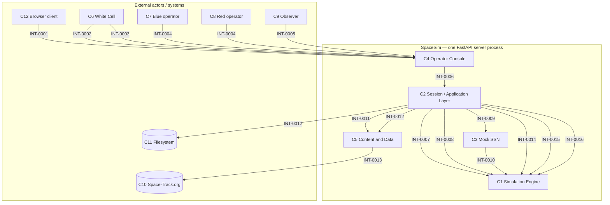
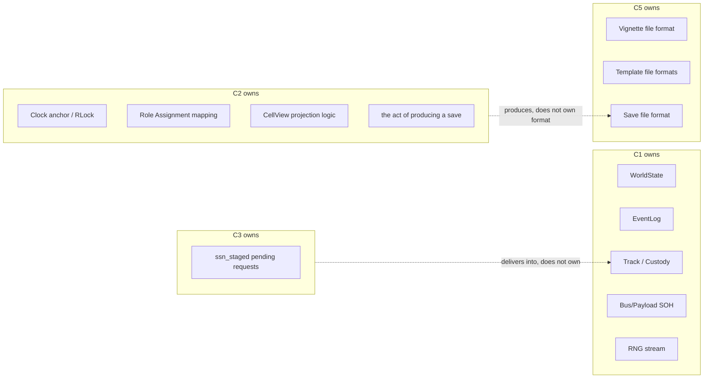

# Interface Control Document (ICD)

> **Status:** Draft — first issue; amended 2026-07 in two passes (see "ICD change log" below).
> **Inputs consumed (approved baseline only):**
> [`research/encyclopedia/INDEX.md`](../research/encyclopedia/INDEX.md) (Encyclopedia),
> [`architecture/01-concept-of-operations.md`](../architecture/01-concept-of-operations.md) (GDS-01,
> ConOps), [`architecture/02-system-context.md`](../architecture/02-system-context.md) (GDS-02,
> System Context), [`architecture/03-architecture.md`](../architecture/03-architecture.md) (GDS-03,
> System Architecture), [`architecture/04-domain-model.md`](../architecture/04-domain-model.md)
> (GDS-04, Domain Model), [`architecture/adr/INDEX.md`](../architecture/adr/INDEX.md) (ADR-0001
> through ADR-0031, all `Accepted`),
> [`reviews/strategic-review-2026-07.md`](../reviews/strategic-review-2026-07.md) (reconciled in two
> passes — see "ICD change log" below), [`reviews/architecture-update.md`](../reviews/architecture-update.md).
> **Inputs explicitly NOT treated as authoritative here** (see "ICD Issues Requiring Resolution"
> §1): `design/04-data-model.md` and `design/07-api-and-networking.md` — both are pre-GDS design
> documents that describe wire-level/schema detail at a finer grain than anything in the approved
> list above has yet baselined (their formal successors, **GDS-07 Data Model** and **GDS-09 API
> Specification**, are both `⛔ Planned (scaffold only)` per `architecture/INDEX.md`). Where this
> ICD cites them below, it is for descriptive context only, flagged inline, never as the source of
> a contract.

[↑ Design index](INDEX.md) · [Docs index](../INDEX.md)

## 1. Purpose

This document defines the **interfaces between SpaceSim's components** — what crosses each
component boundary, in which direction, under what conditions, and who owns the data on each side.
It is the contract layer that sits between GDS-03's subsystem decomposition ("what each subsystem
is for") and a future wire-level API specification ("what bytes go over the wire") — the latter is
explicitly out of scope here because GDS-09 (API Specification) has not yet been authored.

This ICD **does not redesign architecture**. Every component named in §4 and every interface named
in §5 already exists in the approved baseline (GDS-02's external boundary, GDS-03's subsystem
decomposition and dependency graph, GDS-04's entity relationships) or in an `Accepted` ADR. Where
the approved baseline leaves an interface's detail unstated, this document says so explicitly in
that interface's **Open questions** field and in §7, rather than inventing an answer.

## 2. Scope

**In scope:**
- Every cross-component data/control flow named or diagrammed in GDS-02 §1, §8, §9 and GDS-03 §1,
  §3, §4.
- The external boundary actors and systems GDS-02 §2–§4 names (White/Blue/Red/Observer humans,
  Space-Track.org, the local filesystem, browser clients).
- Data-ownership statements, restated from GDS-03's per-subsystem "Ownership of data" sections and
  GDS-04's per-entity "Persistent/Transient state" sections — an ICD's job is to make ownership
  explicit at the boundary, and GDS-03/04 already settled most of it.

**Out of scope:**
- Wire-level message shapes, HTTP verbs, JSON field names, or status codes (GDS-09's job, not yet
  authored). Where `design/07-api-and-networking.md`'s abstract `SessionAPI` method names are
  useful as a descriptive label for an interface, they are cited as illustrative, non-binding detail.
- Persistence schema field types/units (GDS-07's job, not yet authored; `design/04-data-model.md`
  is cited the same way as `design/07` above — descriptive, non-binding).
- Anything inside a single component (e.g. `EffectResolver → WorldState` is intra-Simulation-Engine,
  not a component interface — GDS-03 §2.1 already owns that boundary internally).
- Any of the GDS-03 §5 / GDS-02 "candidate future" systems (coalition C2 interface, external
  mission-planning feed, external SDA feed) — explicitly not built, not scheduled.

## 3. Interface principles

Restated from the `Accepted` ADRs that already govern every interface below — this ICD invents no
new principle, only applies these consistently:

1. **One seam out of the engine.** All non-engine access to simulation state and control goes
   through the Session Layer; the engine never imports UI or transport code (ADR-0002, ADR-0003,
   `CLAUDE.md` invariant 2).
2. **Fog-of-war is enforced at the boundary, not by the sender withholding data.** `CellController`
   filters every cell-scoped outbound interface; the documented no-cell god-view exception
   (`/godview`, `/eventlog`, `/save`, `/aar*`, `/objectives`-equivalent flows) is the only bypass,
   and it is by design, not omission (ADR-0004, ADR-0015).
3. **Plan-first, not instant-action.** Every command-kind interface into the engine is a *planned*
   activity validated against ownership/window/resources/ROE, never an instant mutation — except
   the cyber exception and the two documented bypass mechanisms, Inject application and Mock-SSN
   delivery (ADR-0005, ADR-0012, GDS-04 §2.2 structural property 2).
4. **One-directional dependency graph.** No interface listed below points from the Simulation
   Engine or Mock SSN back toward the Session Layer, Operator Console, or Content & Data as a
   *structural* (code-level) dependency; bidirectional arrows in §6's diagrams represent
   request/response traffic over an already one-directional call relationship, not a structural
   cycle (ADR-0023; see also §7.3 below).
5. **Content is data, consumed schema-first.** Content & Data has no code dependency on any other
   component; other components depend only on the data shapes it produces (ADR-0007).
6. **A single clock owner.** Only the White Cell-facing control interface can advance/pause/rewind
   sim time; every other interface is timestamped against the current sim time but never advances
   it (ADR-0016, GDS-02 §9 structural property 2).
7. **Offline-first.** Exactly one interface in this inventory (INT-0013) is permitted to be
   entirely absent without degrading the exercise (ADR-0018, GDS-02 §9 structural property 3).

## 4. System component list

Restated from GDS-03 §2 (internal subsystems) and GDS-02 §2–§4 (external actors/systems) — no
component is added or removed here.

| # | Component | Kind | Source |
|---|---|---|---|
| C1 | **Simulation Engine** (`spacesim/engine/`) | Internal subsystem | GDS-03 §2.1 |
| C2 | **Session / Application Layer** (`spacesim/session/`: `SessionManager`, `CellController`, `SessionAPI`, `scene.py`, `redai.py`, `aar.py`) | Internal subsystem | GDS-03 §2.2 |
| C3 | **Mock Space Surveillance Network (SSN)** | Internal subsystem (external-service *flavor*, fully internal per GDS-02 Open Question 1 / ADR-0010) | GDS-03 §2.3 |
| C4 | **Operator Console (Presentation)** (`spacesim/ui_web/`) | Internal subsystem | GDS-03 §2.4 |
| C5 | **Content & Data** (`spacesim/content/` + on-disk files) | Internal subsystem | GDS-03 §2.5 |
| C6 | **White Cell facilitator** | External actor (human) | GDS-02 §2 |
| C7 | **Blue Cell operator** | External actor (human) | GDS-02 §2 |
| C8 | **Red Cell operator** (or the internal AI-Red preset acting on Red's behalf — see INT-0015) | External actor (human) / internal feature | GDS-02 §2, ADR-0021 |
| C9 | **Observer** | External actor (human) | GDS-02 §2 |
| C10 | **Space-Track.org** | External system | GDS-02 §3 |
| C11 | **Local filesystem** (vignette/save files) | External resource | GDS-02 §4 |
| C12 | **Browser client** (the human's terminal, distinct from C4 which is server-side) | External resource | GDS-02 §1 |

## 5. Interface inventory

Sixteen interfaces, each traceable to a named arrow in GDS-02 §1/§9 or GDS-03 §1/§3, or to an
external-actor row in GDS-02 §2. Interfaces wholly internal to one component (e.g. `EffectResolver
→ WorldState`, both inside C1) are excluded per §2's scope statement.

---

### INT-0001 — Browser ↔ Operator Console (HTTP transport)

- **Name:** Browser/Operator Console HTTP boundary
- **Source Component:** C12 (Browser client)
- **Destination Component:** C4 (Operator Console)
- **Purpose:** Carry the human's rendered belief view and intents between the browser and the
  server process; the only interface where SpaceSim's process boundary meets a network socket
  (GDS-02 §1, §8 "Browser ↔ server").
- **Data exchanged:** Per-cell belief-state views (rendered scene, fleet SOH, telemetry, alarms,
  mission brief, AAR output); operator intents (command/sensor-tasking/clock/inject requests).
- **Message/data structure:** Not specified at this baseline level (GDS-09 unauthored). GDS-02 §1
  states the transport is HTTP and the pattern is polling, not a persistent socket.
- **Direction:** Bidirectional.
- **Frequency/timing:** Continuous during a running exercise; client-driven polling cadence, not
  push (GDS-02 §1; a WebSocket push model is a documented future migration, not built — see §7.4).
- **Preconditions:** A session exists and the browser has loaded its URL (including pop-out/layout
  tokens for multi-monitor use).
- **Postconditions:** The browser's rendered view reflects the server's last response; no state
  changes happen client-side that the server doesn't already know about.
- **Error handling:** Not specified at this baseline level — left to GDS-09.
- **Dependencies:** A standards-compliant web browser (GDS-02 §3); the server process (C4) running.
- **Related architecture components:** GDS-03 §2.4.
- **Related ADRs:** ADR-0008 (FastAPI + browser over PyQt).
- **Open questions:** Wire protocol, schema, and authentication are unspecified at this baseline
  (no GDS-09 yet). Multiple concurrent browser clients are supported per GDS-02 §1, but no
  per-connection authentication exists today (ADR-0015) — see §7.2.

---

### INT-0002 — White Cell Facilitator ↔ Operator Console (exercise control)

- **Name:** White Cell control interface
- **Source/Destination Component:** C6 (White Cell facilitator) ↔ C4 (Operator Console)
- **Purpose:** Load/build a vignette, assign seats, control the clock, fire/schedule injects,
  re-tune live parameters, force-add TLEs at runtime, adjudicate, save/resume (GDS-02 §2 row 1,
  §6–§7).
- **Data exchanged:** Vignette selection/identifier; seat assignments; clock commands (start/pause/
  resume/rewind/branch/time-multiplier); inject definitions (scheduled or live-fired); parameter
  values; TLE data for force-add; save/load requests.
- **Message/data structure:** Not specified at this baseline (GDS-09 unauthored).
- **Direction:** Bidirectional (commands in; god-view + AAR + acknowledgements out, GDS-02 §2).
- **Frequency/timing:** Episodic at session start/end (load, seat assignment, save); continuous
  during the run (clock control, injects, parameter tuning).
- **Preconditions:** White Cell holds the only clock-authority role for the session (ADR-0016).
- **Postconditions:** Session state (clock, `WorldState`, `EventLog`) reflects the control action;
  an Inject application's effects bypass the normal Planned-Activity path by design (GDS-04 §1.12).
- **Error handling:** Invalid scenario data fails loudly at load (`build-spec/01` "Error handling",
  cited in GDS-04 §1.1 Constraints); no other error-handling detail is specified at this baseline.
- **Dependencies:** A loaded/loadable Vignette (INT-0011); exactly one White Cell seat with clock
  authority per session (ADR-0016).
- **Related architecture components:** GDS-03 §2.2 (`SessionManager`, White Cell controls), §2.4.
- **Related ADRs:** ADR-0005 (plan-first — injects are the named exception), ADR-0016, ADR-0017
  (manual adjudication — no automated scoring).
- **Open questions:** None beyond INT-0001's wire-level gap.

---

### INT-0003 — White Cell Facilitator ↔ Operator Console (in-app scenario builder)

- **Name:** Scenario-authoring interface
- **Source/Destination Component:** C6 ↔ C4
- **Purpose:** A distinct, multi-step, stateful authoring interaction — composing a vignette
  (force lay-down, parameters, injects, intro briefs) across several round trips before a single
  save/build action emits the vignette file — recognized as architecturally separate from INT-0002's
  one-shot vignette-file-load (GDS-02 §2 row 2, §8, ADR-0027).
- **Data exchanged:** Incremental, partial vignette-definition state (accumulated across the
  authoring session); a final save/build action that emits a complete vignette file.
- **Message/data structure:** Not specified at this baseline (GDS-09 unauthored).
- **Direction:** Bidirectional, iterative.
- **Frequency/timing:** Episodic, pre-session — not during a running exercise.
- **Preconditions:** White Cell role; no running session is required to author a vignette.
- **Postconditions:** A complete vignette definition file is written to C11 (filesystem) via C5
  (Content & Data) once the authoring session is saved/built.
- **Error handling:** Not specified at this baseline.
- **Dependencies:** C5's vignette schema (INT-0011's destination format).
- **Related architecture components:** GDS-03 §2.5 (vignette schema), §2.4.
- **Related ADRs:** ADR-0027.
- **Open questions:** Where partial, unsaved authoring state lives (server session vs. browser
  local state) is not stated by GDS-02/03/04 — flagged in §7.1.

---

### INT-0004 — Blue/Red Cell Operator ↔ Operator Console

- **Name:** Cell operator interface
- **Source/Destination Component:** C7 (Blue) / C8 (Red) ↔ C4
- **Purpose:** Plan bus/payload commands, task sensors, submit Mock-SSN requests, read SOH/
  telemetry/belief view, scoped strictly to the operator's own cell (GDS-02 §2 rows 3–4).
- **Data exchanged:** Planned Activities (command-kind or collection-kind, GDS-04 §1.7); Mock-SSN
  requests (GDS-04 §1.13); reads of the operator's own `CellView` (GDS-04 §1.11).
- **Message/data structure:** Not specified at this baseline (GDS-09 unauthored); the conceptual
  shape is GDS-04 §1.7's Planned Activity and §1.13's SSN Request.
- **Direction:** Bidirectional, scoped to the operator's own `CellView` (GDS-02 §2).
- **Frequency/timing:** Continuous during the run, gated by access-window availability for
  command-kind activities (GDS-04 §1.6).
- **Preconditions:** A valid Role Assignment binding the operator's seat to the targeted Asset/
  Sensor (GDS-04 §1.10); for engagement intents, a weapons-quality Track (GDS-04 §1.9).
- **Postconditions:** A Planned Activity is created in `DRAFT`/`PLANNED` state (GDS-04 §1.7
  lifecycle); execution and its resulting Effect/Track update happen later, gated by the window.
- **Error handling:** Rejections (ownership/window/resources/ROE/track-gate failures) are returned
  as normal feedback, not exceptions — restated from `design/07-api-and-networking.md` §6 as
  descriptive, non-binding context; the approved baseline (GDS-04 §1.7 Constraints) confirms
  validation happens at both accept-time and execute-time but does not itself specify the error
  channel's shape.
- **Dependencies:** A running Session (INT-0002); the operator's Role Assignment; for collection
  via Mock SSN, INT-0006.
- **Related architecture components:** GDS-03 §2.2 (`CellController`, plan-first via `OrderSystem`
  through the seam), §2.1 (`OrderSystem`).
- **Related ADRs:** ADR-0004, ADR-0005.
- **Open questions:** None beyond INT-0001's wire-level gap.

---

### INT-0005 — Observer ↔ Operator Console

- **Name:** Observer read-only interface
- **Source/Destination Component:** C9 (Observer) ↔ C4
- **Purpose:** Read-only consumption of either god-view or a designated cell's `CellView`
  (GDS-02 §2 row 5).
- **Data exchanged:** A view (god-view or one cell's `CellView`), outbound only.
- **Message/data structure:** Not specified at this baseline.
- **Direction:** Outbound only (system → Observer).
- **Frequency/timing:** Continuous during the run, on the same polling cadence as INT-0001.
- **Preconditions:** A running Session; the Observer's designated view assignment.
- **Postconditions:** None — no state-mutating effect of this interface exists.
- **Error handling:** Not specified at this baseline.
- **Dependencies:** A running Session.
- **Related architecture components:** GDS-03 §2.2 (`CellController`/god-view path), §2.4.
- **Related ADRs:** ADR-0004 (the no-cell god-view exception, if the Observer is assigned god-view).
- **Open questions:** None beyond INT-0001's wire-level gap.

---

### INT-0006 — Operator Console → Session Layer (`SessionAPI`, the single seam)

- **Name:** Presentation/Session seam
- **Source Component:** C4 (Operator Console)
- **Destination Component:** C2 (Session / Application Layer)
- **Purpose:** The one and only path by which the Operator Console reaches simulation state or
  control — GDS-03 §2.2/§2.4 names this the seam that keeps presentation swappable and the engine
  UI-agnostic.
- **Data exchanged:** Operator/White-Cell intents in (everything named in INT-0002–0005); `CellView`/
  god-view/AAR/Ack responses out.
- **Message/data structure:** In-process Python calls today (GDS-03 §2.2 "Interfaces"); the abstract
  shape `design/07-api-and-networking.md` §2 sketches (`SessionAPI` Protocol with methods like
  `issue_order`, `get_view`, `play`/`pause`, `fire_inject`, `save`) is cited here as descriptive,
  non-binding illustration only — it is a pre-GDS design document, not the approved contract.
- **Direction:** Bidirectional (call/response).
- **Frequency/timing:** Every operator/White-Cell action and every view read goes through this seam.
- **Preconditions:** None beyond a constructed Session object.
- **Postconditions:** Every mutating call is logged to the `EventLog` (C1); every read is
  fog-of-war-filtered for cell-scoped calls, unfiltered for the documented no-cell god-view
  exception (ADR-0004, ADR-0015).
- **Error handling:** Not specified at the wire level (GDS-09 unauthored); the approved baseline's
  only stated rule is that mutations are validated, not blindly applied (ADR-0005).
- **Dependencies:** C1 (Simulation Engine) for all physics/state; C5 (Content & Data) for vignette/
  save formats; C3 (Mock SSN) as a request target for sensor tasking (GDS-03 §2.2 "Dependencies").
- **Related architecture components:** GDS-03 §2.2, §2.4; this is the arrow GDS-03 §1's diagram
  draws as `UI <--> SM`, `UI <--> CC`, `UI <--> AAR`.
- **Related ADRs:** ADR-0002, ADR-0003, ADR-0004.
- **Open questions:** No network transport has been formally specified — GDS-03 §2.2 confirms this
  seam is "already realized as the FastAPI binding," but the formal wire contract remains GDS-09's
  unauthored job (see §7.5).

---

### INT-0007 — Session Layer (`CellController`) → Simulation Engine (Custody/`TrackCatalog`)

- **Name:** Fog-of-war read interface
- **Source Component:** C2 (`CellController`)
- **Destination Component:** C1 (Simulation Engine — Custody/`Track`/`TrackCatalog`)
- **Purpose:** Derive a cell's `CellView` from ground-truth custody state, never the reverse
  (GDS-03 §1 diagram `CC --> CUST`; GDS-04 §1.11 "one-directional... never writes back").
- **Data exchanged:** Read: per-cell `Track` records, Asset state, upcoming Access Windows. No
  write in this direction.
- **Message/data structure:** In-process read of `WorldState`-derived structures; no schema baseline
  beyond GDS-04 §1.9/§1.11's conceptual fields.
- **Direction:** One-directional (C2 reads from C1 only).
- **Frequency/timing:** Computed fresh on every `CellView` read — never cached as an independent
  object (GDS-04 §1.11 "Lifecycle").
- **Preconditions:** A `WorldState` exists with at least the requesting cell's Track data populated.
- **Postconditions:** None — by construction, this read can never alter Track/`WorldState` data
  (GDS-04 §1.11 "Persistent state": none, by design).
- **Error handling:** Not specified; an unrecognized cell/asset id is not addressed in the approved
  baseline.
- **Dependencies:** C1's Custody/Track machinery must be current for the requested sim time.
- **Related architecture components:** GDS-03 §2.1, §2.2, §4 ("Fog-of-war" cross-cutting concern).
- **Related ADRs:** ADR-0004, ADR-0013 (weapons-quality gate reads the same Track data).
- **Open questions:** None.

---

### INT-0008 — Session Layer (`SessionManager`) → Simulation Engine (Clock/Scheduler/EventLog/`OrderSystem`)

- **Name:** Session control/command interface
- **Source Component:** C2 (`SessionManager`)
- **Destination Component:** C1 (Simulation Engine)
- **Purpose:** The path by which every clock advance, Planned Activity, Effect resolution, and
  Inject application actually happens — GDS-03 §1 diagram's `SM --> CLK`, `SM --> EL` arrows, and
  the implicit path every `issue()`/`dry_run()` call takes (GDS-03 §2.1 "Interfaces").
- **Data exchanged:** Clock-advance requests; Planned Activities (`Order`s) for validation/
  scheduling/execution; dry-run preview requests (read-only mirror); Inject application requests.
- **Message/data structure:** In-process Python calls (`Simulation.step()`/`replay()`, `Order`/
  `OrderSystem.issue()`/`dry_run()` — GDS-03 §2.1 "Interfaces", cited as the approved baseline's own
  description, not a design-doc citation).
- **Direction:** Bidirectional (commands in; updated `WorldState`/`EventLog` entries/computed
  windows/custody/effect outcomes out — GDS-03 §2.1 "Outputs").
- **Frequency/timing:** Every sim-clock advance is sub-stepped to the next scheduled event, never
  skipping past one (ADR-0006, `CLAUDE.md` invariant 5).
- **Preconditions:** A seeded RNG and an ordered `EventLog` to replay against (GDS-03 §2.1
  "Inputs"); the only randomness source in the engine is this seeded RNG (ADR-0002).
- **Postconditions:** `(initial_state, ordered eventlog, seed) → byte-identical state` — the
  determinism property test gates this interface forever (ADR-0002, `CLAUDE.md` invariant 1).
- **Error handling:** Validation failures (ownership/window/resources/ROE/track-gate) produce a
  `FAILED` Planned Activity state with a fail reason, not an exception (GDS-04 §1.7 lifecycle).
- **Dependencies:** None on C2/C3/C4/C5 *code* — only on the data shapes C5 provides (ADR-0007,
  ADR-0023).
- **Related architecture components:** GDS-03 §2.1, §2.2.
- **Related ADRs:** ADR-0002, ADR-0005, ADR-0006, ADR-0011, ADR-0012, ADR-0013, ADR-0023.
- **Open questions:** None — this is the most fully specified interface in the inventory because
  GDS-03 §2.1 already states its inputs/outputs/interfaces explicitly.

---

### INT-0009 — Session Layer (`CellController`/`SessionAPI`) → Mock SSN

- **Name:** Sensor-tasking request interface
- **Source Component:** C2
- **Destination Component:** C3 (Mock SSN)
- **Purpose:** Submit a sensor-tasking request against a cell's `SSNNetwork` — the "request and
  wait" texture (GDS-03 §1 diagram `CC -->|sensor task request| SSNN`; GDS-04 §1.13).
- **Data exchanged:** An SSN Request (requesting cell, target, priority).
- **Message/data structure:** Not specified beyond GDS-04 §1.13's conceptual fields; described as
  "surfaced to operators through the same `CellController`/`SessionAPI` path as other sensor
  tasking" with no separate transport (GDS-03 §2.3 "Interfaces").
- **Direction:** One-directional, request only (response arrives later via INT-0010, not
  synchronously on this call).
- **Frequency/timing:** Episodic, operator-initiated; resolved against the priority SLA plus
  processing delay, not immediately (GDS-04 §1.13).
- **Preconditions:** A valid Role Assignment for the requesting cell; the per-cell dispersion
  preset must already be instantiated from Vignette content (GDS-03 §2.3 "Inputs").
- **Postconditions:** The request is staged (`world.ssn_staged`) — pending, not yet delivered
  (GDS-04 §1.13 "Lifecycle").
- **Error handling:** Not specified at this baseline.
- **Dependencies:** C1's Scheduler/EventLog substrate (the Mock SSN has no independent clock or
  store, GDS-03 §2.3 "Dependencies"); C5 for the dispersion-preset parameters.
- **Related architecture components:** GDS-03 §2.3.
- **Related ADRs:** ADR-0010.
- **Open questions:** GDS-04 Open Question 3 — whether SSN Request and Planned Activity should be
  unified under a shared supertype is explicitly left open; this ICD keeps them as two distinct
  interfaces (INT-0008 for Planned Activities, INT-0009/0010 for SSN Requests), matching the
  as-built split, not resolving the question (see §7.6).

---

### INT-0010 — Mock SSN → Simulation Engine (Scheduler/EventLog/Custody — delivery)

- **Name:** Sensor-tasking delivery interface
- **Source Component:** C3 (Mock SSN)
- **Destination Component:** C1 (Simulation Engine — Custody/`TrackCatalog`)
- **Purpose:** Deliver a resolved SSN Request's result into the requesting cell's `TrackCatalog`
  via two deterministic event handlers (GDS-03 §1 diagram `SSNN -->|delivers tracks| CUST`;
  GDS-04 §1.13 "Lifecycle").
- **Data exchanged:** A Track update/creation for the requesting cell's object of interest.
- **Message/data structure:** Two replay-safe deterministic engine event handlers
  (`ssn_collect`/`ssn_deliver`, GDS-03 §2.3 "Responsibilities" — cited as the approved baseline's
  own description).
- **Direction:** One-directional (C3 → C1).
- **Frequency/timing:** Fires as an ordinary scheduled event once the hybrid-turnaround resolution
  completes (GDS-03 §2.3).
- **Preconditions:** A staged, not-yet-cancelled SSN Request (from INT-0009).
- **Postconditions:** The requester's Track is updated; cancellation before collection
  tag-skips both handlers, leaving no Track side effect (GDS-04 §1.13 "Constraints").
- **Error handling:** Not specified beyond the cancel-before-collect tag-skip path.
- **Dependencies:** C1's Scheduler/EventLog/Custody machinery (no independent SSN clock, GDS-03
  §2.3).
- **Related architecture components:** GDS-03 §2.1, §2.3.
- **Related ADRs:** ADR-0010.
- **Open questions:** Same as INT-0009 (GDS-04 Open Question 3).

---

### INT-0011 — Session Layer (`SessionManager`) → Content & Data (vignette/template load)

- **Name:** Vignette/template load interface
- **Source Component:** C2
- **Destination Component:** C5 (Content & Data)
- **Purpose:** Load a Vignette's mission, roles, force lay-down, parameters, injects, briefs into a
  `WorldState` (GDS-03 §1 diagram `SM -->|load| VIG`, `SM -->|load| TLE`; GDS-04 §1.1).
- **Data exchanged:** A parsed Vignette object; asset/effect/sensor template data the engine
  consults when constructing the initial force lay-down.
- **Message/data structure:** Not specified beyond GDS-04 §1.1's conceptual fields; on-disk format
  is YAML/JSON (GDS-03 §2.5 "Likely implementation technologies" — descriptive, not a contract
  this ICD baselines, since GDS-07 is unauthored).
- **Direction:** One-directional (C5 → C2, at load time).
- **Frequency/timing:** Once per Session at load/start (GDS-04 §1.1 "Lifecycle": "Authored →
  validated at load → instantiated into a Session").
- **Preconditions:** The Vignette file validates against its schema.
- **Postconditions:** A `WorldState` is built; the Vignette itself does not change once the Session
  is running (GDS-04 §1.1 "Lifecycle").
- **Error handling:** Invalid scenario data fails loudly at load (GDS-04 §1.1 "Constraints").
- **Dependencies:** None on C1/C2/C4 *code*, only on the data shapes they expect (ADR-0007).
- **Related architecture components:** GDS-03 §2.1 ("`WorldState` -.uses.-> TPL"), §2.5.
- **Related ADRs:** ADR-0007.
- **Open questions:** GDS-02 Open Question 3 — whether real-world ground-station coordinates baked
  into vignette content constitute a distinct "data source" from the vignette file itself is
  unsettled, flagged as borderline there; restated here as still open.

---

### INT-0012 — Session Layer (`SessionManager`) → Content & Data / Filesystem (save round trip)

- **Name:** Save-file interface
- **Source Component:** C2 (act of producing a save) / **Destination Component:** C5 (on-disk
  format ownership) and C11 (filesystem, the physical write target)
- **Purpose:** Persist a complete, deterministic session snapshot for resume (GDS-03 §1 diagram
  `SM -->|read-write| SAVE`; GDS-04 §1.14 "Persistent state").
- **Data exchanged:** The current `WorldState`, full `EventLog`, all Snapshots, Role Assignments
  (GDS-04 §1.14).
- **Message/data structure:** Not specified beyond the entity list above; the on-disk format is
  C5's to own once written.
- **Direction:** Bidirectional (write on save; read on resume).
- **Frequency/timing:** On demand or at session end (GDS-03 §2.2 "Outputs": "save-file snapshots").
- **Preconditions:** A running or completed Session.
- **Postconditions:** A save file on disk that a later Session can load to reproduce the exact
  state (subject to §7.7's open versioning question).
- **Error handling:** Not specified at this baseline.
- **Dependencies:** C5's save-file format definition.
- **Related architecture components:** GDS-03 §2.2 ("Ownership of data," save-file ownership
  split), §2.5 (same split, content side).
- **Related ADRs:** ADR-0022 (save-file ownership split: C2 owns the *act* of producing/writing a
  save; C5 owns the resulting on-disk *format*, once written — neither owns the other's half).
- **Open questions:** GDS-04 Open Question 4 — whether a save file produced by one engine build is
  expected to load under a later build is unaddressed by any approved document; left open (§7.7).

---

### INT-0013 — Content & Data → Space-Track.org (TLE import)

- **Name:** TLE import interface
- **Source Component:** C5 (Content & Data)
- **Destination Component:** C10 (Space-Track.org)
- **Purpose:** Optionally pull real two-line element sets for force-added named satellites, at
  scenario-build time only (GDS-02 §3, §4, §9 sequence diagram; `build-spec/01` Decision D2).
- **Data exchanged:** A TLE request out; TLE data (or a failure) back.
- **Message/data structure:** Not specified at this baseline; Space-Track's own external API,
  not a SpaceSim-defined contract.
- **Direction:** Bidirectional, but entirely build-time (never during a running exercise).
- **Frequency/timing:** Optional, scenario-build time only (GDS-02 §4, §9 structural property 3 —
  the only interface in this inventory that may be entirely absent without degrading the exercise).
- **Preconditions:** Network connectivity to Space-Track.org; valid credentials (assumed, not
  specified by any approved document).
- **Postconditions:** A real-TLE-seeded Asset orbit, or a fallback to manual/Keplerian entry on
  failure/absence (GDS-02 §4, "Manual TLE / Keplerian entry" row).
- **Error handling:** TLE-sourced orbits must parse at load or the Asset is rejected with a clear
  error (GDS-04 §1.3 "Constraints"); Space-Track unavailability itself is handled by falling back
  to manual entry, not treated as a system error (GDS-02 §4).
- **Dependencies:** Space-Track.org's continued availability and API stability — external, outside
  SpaceSim's control.
- **Related architecture components:** GDS-03 §2.5.
- **Related ADRs:** ADR-0018 (offline-first; this is the one named exception, build-time only).
- **Open questions:** Credential/authentication handling for the Space-Track call is not specified
  by any approved document (§7.8).

---

### INT-0014 — Session Layer (AAR/Replay) → Simulation Engine (EventLog/WorldState)

- **Name:** AAR replay/scrub interface
- **Source Component:** C2 (`aar.py`)
- **Destination Component:** C1 (`EventLog`, `WorldState`)
- **Purpose:** Replay/scrub to any `EventLog` point and branch-compare, read-only against the
  engine, never the live session (GDS-03 §1 diagram `AAR --> EL`, `AAR --> WS`; GDS-03 §2.2
  "Responsibilities").
- **Data exchanged:** Read: historical `EventLog` entries and reconstructed `WorldState` snapshots
  at a given point. No write.
- **Message/data structure:** Not specified beyond GDS-03 §2.2's description (`snapshot_at`).
- **Direction:** One-directional (C2 reads from C1 only).
- **Frequency/timing:** Post-session or mid-session, on White Cell/Observer demand.
- **Preconditions:** A non-empty `EventLog` to replay against.
- **Postconditions:** None on C1's live state — this interface is explicitly read-only against the
  engine (GDS-03 §2.2).
- **Error handling:** Not specified at this baseline.
- **Dependencies:** C1's `EventLog`/Snapshot machinery.
- **Related architecture components:** GDS-03 §2.1, §2.2.
- **Related ADRs:** ADR-0002 (determinism is what makes replay exact).
- **Open questions:** None beyond GDS-04 Open Question 4 (save/Snapshot version compatibility,
  §7.7), which also bears on AAR's ability to replay historical saves.

---

### INT-0015 — Session Layer (AI-Red / `redai.py`) → Simulation Engine (`WorldState`, direct read)

- **Name:** AI-Red ground-truth read interface (flagged deviation)
- **Source Component:** C2 (`redai.py`)
- **Destination Component:** C1 (`WorldState`, ground truth)
- **Purpose:** Generate orders on Red's behalf per a doctrine preset (`russia_ew_first`,
  `china_integrated`, `generic`) when AI-Red substitutes for a human Red operator (GDS-02 §2 row 4;
  GDS-03 §2.2 "Responsibilities").
- **Data exchanged:** Read: `WorldState` directly (`_blue_satellites`/`_red_assets`/
  `_first_vulnerable` per GDS-03 §2.2). Write: Planned Activities issued on Red's behalf, through
  the normal INT-0008 path.
- **Message/data structure:** Not specified beyond GDS-03 §2.2's description.
- **Direction:** Read: one-directional, C2 → C1 ground truth (not fog-of-war filtered). Write: via
  INT-0008, same as a human Red operator's Planned Activities.
- **Frequency/timing:** Per Red decision cycle, doctrine-preset-driven.
- **Preconditions:** Red's seat is configured to use an AI-Red preset rather than a human operator.
  This precondition is mutually exclusive with a human operator concurrently occupying the same
  Role Assignment for Red: AI-Red substitutes for an unseated Red, it does not run as a parallel,
  simultaneous ground-truth-read source alongside a human-seated Red. Switching a seat's
  configuration between AI-Red and human is a White-Cell-driven reconfiguration between sessions
  or hot-seat hand-offs, not a concurrent dual-source arrangement (mirrors `requirements/01`
  FR-9110 Preconditions).
- **Postconditions:** Red Planned Activities are created exactly as if a human had issued them
  (GDS-03 §2.2 — AI-Red exercises a Role Assignment "exactly like a human would," GDS-04 §1.10).
- **Error handling:** Not specified.
- **Dependencies:** A configured doctrine preset; C1's `WorldState`.
- **Related architecture components:** GDS-03 §2.2.
- **Related ADRs:** ADR-0021 (AI-Red is a session-layer feature), ADR-0024 (permanently internal;
  the ground-truth-read gap is explicitly tracked as future work, not an open boundary question).
- **Open questions:** This interface is a **named, accepted deviation** from the fog-of-war
  principle (§3 principle 2) that every other cell-facing read obeys — AI-Red reads `world`
  directly instead of through a `CellView` like a human Red operator would. ADR-0024 locks in that
  this will not be reclassified as an external-actor boundary question, but the read-path parity
  gap itself remains open, tracked in `FUTURE-WORK.md` §1 "AI-Red fog-of-war parity." Restated here
  because an ICD is exactly the place a structural exception like this belongs to be visible
  (see §7.9).

---

### INT-0016 — White Cell Inject Application → Simulation Engine (`WorldState`, direct mutation bypass)

- **Name:** Inject application interface (bypass path)
- **Source Component:** C2 (on behalf of C6, White Cell)
- **Destination Component:** C1 (`WorldState`)
- **Purpose:** Apply a White-Cell-authored or live-fired Inject's effects (reveal an asset, degrade
  a station, etc.) outside the normal Planned-Activity → Access-Window → Effect path — injects are
  not geometry-gated (GDS-04 §1.12 "Relationships").
- **Data exchanged:** The Inject's named effects, applied directly to Assets/Ground Stations/
  Sensors/Tracks.
- **Message/data structure:** Not specified beyond GDS-04 §1.12's conceptual fields; templates
  exist in `inject_library.yaml` (GDS-03 §2.1 "Vignette.coaching"/inject library reference —
  descriptive, non-binding).
- **Direction:** One-directional (C2 → C1, on application).
- **Frequency/timing:** At the Inject's scheduled time, or immediately on live-fire.
- **Preconditions:** A non-repeatable Inject must not have already fired (GDS-04 §1.12
  "Constraints").
- **Postconditions:** The effect is applied and recorded in the `EventLog`, subject to the same
  `WorldState` mutation rules as any other event (GDS-04 §1.12 "Constraints").
- **Error handling:** Not specified.
- **Dependencies:** None beyond a loaded Vignette's inject library or a live-composed inject.
- **Related architecture components:** GDS-03 §2.1, §2.2; GDS-04 §2.2 structural property 2 names
  this as one of exactly two documented bypass mechanisms (the other being INT-0010/Mock-SSN
  delivery).
- **Related ADRs:** ADR-0005 (plan-first — this is the named, accepted exception alongside cyber).
- **Open questions:** None beyond what GDS-04 already states.

---

## 6. Interface relationship diagrams

### 6.1 Component-level interface map



### 6.2 Representative sequence: a Blue operator command

```mermaid
sequenceDiagram
    participant BO as C7 Blue operator
    participant C4 as Operator Console
    participant C2 as Session Layer
    participant C1 as Simulation Engine

    BO->>C4: plan command (INT-0004)
    C4->>C2: issue_order-equivalent call (INT-0006)
    C2->>C1: validate + schedule against window (INT-0008)
    C1-->>C2: Ack / scheduled window or fail reason
    C2-->>C4: Ack (INT-0006)
    C4-->>BO: queued / rejected feedback (INT-0004)
    Note over C1,C2: time passes; window opens; event fires
    C1-->>C2: EventLog entry (Effect/Track update)
    C2->>C1: fog-of-war filtered read (INT-0007)
    C2-->>C4: CellView (INT-0006)
    C4-->>BO: updated belief view (INT-0004)
```

### 6.3 Data ownership at the boundary



**C4 (Operator Console) owns no persistent data** and is deliberately absent from the diagram above
— not an omission. Per GDS-03 §2.4, C4 is a stateless presentation layer: every interface it
participates in (INT-0001–0006) either renders a `CellView`/god-view it just read through INT-0006
or forwards an intent it did not itself originate. Stated explicitly here so a reviewer scanning §6.3
for every component's ownership box does not read C4's absence as a gap.

## 7. ICD Issues Requiring Resolution

These are **identified, not resolved**, per this task's instruction. Several restate an Open
Question already on record in GDS-02/03/04 (cited inline); a few are new, surfaced only by
assembling the interface-level view this document provides. None of the following has been acted
on — they are listed so a reviewer can triage them, not as a backlog this document is committing to.

1. **No baselined wire-level contract for any interface.** Every interface above that crosses a
   process/component boundary (INT-0001, INT-0006 most acutely) cites `design/07-api-and-networking.md`
   only as descriptive, non-binding illustration, because GDS-09 (API Specification) and GDS-07
   (Data Model) are both `⛔ Planned (scaffold only)`. This ICD can name *what* crosses each
   boundary but not yet *how it is shaped on the wire*. **Missing interface detail**, not a missing
   interface.
2. **INT-0001's authentication gap.** Multiple browser clients can connect concurrently (GDS-02 §1),
   but there is no per-connection authentication — the cell selector is client-side trust per
   ADR-0015. This is a documented, accepted v1 trust boundary, not an oversight, but it is worth
   flagging again at the interface level since INT-0001 and INT-0005 (Observer) both inherit it.
   `strategic-review-2026-07.md` §4.2.3/§6.3 recommendation R19 corroborates this from a different
   angle: it recommends documenting a distributed-use security growth path (threat model, token
   design sketch, which endpoints would need binding) *before* the first multi-site/coalition
   request, rather than making ad-hoc security decisions under delivery pressure when that request
   arrives. Not actioned here — the growth-path document itself does not yet exist — but named so a
   future reader of this gap knows the recommended next step and where it is tracked
   (`FUTURE-WORK.md`, [architecture-update.md](../reviews/architecture-update.md) R19 disposition).
3. **Bidirectional arrows vs. structural cycles.** §3 principle 4 states the dependency graph is
   one-directional (ADR-0023) and that bidirectional arrows in §6.1/§6.2 represent request/response
   traffic, not code-level circularity. Reviewed against GDS-03 §3's explicit dependency-graph
   diagram: confirmed no contradiction — every bidirectional interface above (INT-0001, INT-0002,
   INT-0004–0006, INT-0012) has its *destination* component as the one in possession of the data
   being requested back, never a case where two components each structurally depend on the other's
   *code*. No circular dependency found; recorded here as a checked-and-cleared item, not a defect.
4. **Ambiguous ownership: the save-file round trip (INT-0012).** Already split by ADR-0022 (C2 owns
   the act of producing/writing; C5 owns the resulting on-disk format), but the split is genuinely
   easy to misread at a glance — flagged here so a future reader of this ICD does not see "C2 → C5
   / C2 → C11" on the same interface and assume one component owns the whole round trip.
5. **Unclear ownership: Access Window.** GDS-04 Open Question 2 — whether `AccessWindow` is a "real"
   persisted entity or a pure derived/cached value is unresolved at the domain-model level, which
   means this ICD cannot state with confidence whether a future AAR-display interface needs to read
   a *stored* Access Window record or *recompute* one. Carried forward unresolved.
6. **Unclear ownership/possible missing supertype: SSN Request vs. Planned Activity (INT-0008 vs.
   INT-0009/0010).** GDS-04 Open Question 3, restated at the interface level: both represent
   "an operator asked for something and it arrived later," but they are two separate interfaces
   into C1 with no shared supertype today. Not resolved here.
7. **Missing detail: save-file/Snapshot version compatibility (INT-0012, INT-0014).** GDS-04 Open
   Question 4 — whether a save produced by one engine build loads under a later build is
   unaddressed by any approved document. This bears directly on INT-0012 (save) and INT-0014 (AAR
   replay of a loaded save), both of which silently assume compatibility. Not resolved here.
8. **Missing detail: Space-Track credential/auth handling (INT-0013).** No approved document states
   how Space-Track.org authentication is configured or stored. Flagged as a gap, not resolved.
9. **Named structural exception: AI-Red's direct ground-truth read (INT-0015).** This is the one
   interface in the inventory that does not obey §3 principle 2 (fog-of-war at the boundary).
   ADR-0024 already accepts this as a tracked future-work gap rather than a defect requiring
   immediate fix — restated here because an ICD reviewer scanning interfaces by principle-compliance
   would otherwise flag it as a new finding; it is not new, but it is real and still open.
10. **Possible missing interface: partial scenario-authoring state (INT-0003).** Where in-progress,
    unsaved vignette-builder state lives between round trips (server-session-scoped vs.
    browser-local) is not stated by GDS-02 §8/ADR-0027 or any other approved document. This may
    indicate a missing interface (e.g. an explicit "draft vignette" object with its own ownership)
    rather than merely missing detail on an existing one — flagged for a reviewer to determine which.
11. **Possible missing interface: push-based state delivery.** GDS-02/03 describe INT-0001 as
    HTTP-polling-based. `design/07-api-and-networking.md` §3 (non-binding) describes a documented-
    but-not-built future WebSocket push migration. Whether this future capability should be named as
    its own forward-looking interface entry now (as GDS-03 §5 does for forward-looking subsystems)
    or left entirely out of an ICD scoped to the as-built system is left to the reviewer — this
    document took the latter position (excluded it from §5) but flags the choice explicitly.
12. **Distributed simulation / exercise-interoperability federation not examined (new).**
    `strategic-review-2026-07.md` GAP-11 asks what a future federation standard (HLA/DIS/SISO) or
    LVC integration would demand of INT-0006 (`SessionAPI`, the single seam), and whether an
    eventlog-bridge federation model is compatible with determinism (invariant 1) — a question the
    review explicitly recommends examining *before* any transport rework, not after. No interface
    above addresses federation; this ICD's inventory is scoped entirely to the current single-server,
    HTTP-polling, LAN-cooperative boundary (GDS-02 §1). Flagged as a gap for a future ICD reviewer,
    not resolved here — see `reviews/architecture-update.md`'s disposition of R19/GAP-11.
13. **Missing interface: research-export boundary (`FS-301`, shipped ✅) (new).**
    [`features/FS-301-research-analytics.md`](../features/FS-301-research-analytics.md) — a shipped
    feature, not a candidate future one — states in its own "Interfaces Used" and "Related
    Interfaces" sections that no ICD interface names the boundary it crosses: a batch-orchestration
    path that drives the engine through many seeded runs, and an outbound path carrying structured
    per-run export records to the researcher's own analysis tooling. Neither destination matches an
    existing external actor (C6–C12) or an existing interface's stated direction.
    `strategic-review-2026-07.md` W2/GAP-07 names the assessment/research tier as the project's
    least mature; this is that finding's concrete interface-level symptom — the tier's own shipped
    export feature has no named boundary in this inventory. Not resolved here (naming one would
    require inventing detail FS-301 itself declines to specify); flagged as a likely missing
    interface (candidate `INT-0017`) for a future ICD revision.
14. **Missing interface: competency-assessment longitudinal report boundary (`FS-201`, shipped ✅)
    (new).** Similarly self-flagged in
    [`features/FS-201-competency-assessment.md`](../features/FS-201-competency-assessment.md): the
    rubric-tier scoring computation itself is a read against existing engine/session state, and
    `ADR-0029` already settles that raw AAR/event-log access (i.e. INT-0014) is sufficient for the
    assessment-designer stakeholder — no new interface needed for *that* half. What ADR-0029 does
    **not** address, and what FS-201 itself still flags open, is the **cross-session longitudinal
    record** the per-trainee report aggregates from — a persistent structure with no home in the
    current save-file entity list (GDS-04) and no read/write path named among INT-0001–0016.
    Flagged as a likely missing interface (candidate `INT-0018`), narrower than item 13's — the gap
    here is specifically the longitudinal store, not the per-exercise scoring computation.
15. **Data ownership: exported research/assessment data has no assigned owner (new).** Once either
    item 13's per-run export record or item 14's cross-session trainee record leaves the Session
    Layer's live state, no approved document assigns ownership, retention, or access-control
    responsibility for it. This is distinct from the already-resolved save-file split (ADR-0022,
    item 4): a save file's consumer is the Session Layer itself, on resume; an export/longitudinal
    record's consumer is a researcher or instructor — an actor `GDS-02 §2` does not currently
    enumerate at all. `strategic-review-2026-07.md` §4.2 finding 4 corroborates independently ("no
    baseline document states who owns exercise-performance data, consent posture, or retention"),
    and `FS-301`'s own Security Considerations section flags the same gap from the feature side. Not
    resolved here.
16. **Missing interfaces: stakeholder seats named by the Strategic Review have no corresponding
    actor/interface entry (new).** `strategic-review-2026-07.md` §4.4 names several stakeholder
    types absent from this inventory's C6–C12 actor list: a **Legal advisor (LEGAD)** seat for
    ROE/attribution decisions, an **Intelligence cell** distinct from C7/C8 operators for
    SSN+telemetry fusion, and **the accreditor** who would certify training validity (this last one
    ties to item 13's gap — an accreditor is exactly who a named research-export interface would
    serve). A fourth candidate, the **live OR-analyst** (the review's IN-09), is checked and found
    *not* to be a gap: INT-0005 (Observer) already provides continuous, on-demand read access to
    god-view or a cell's `CellView` during a running exercise, which appears to satisfy IN-09's
    stated need. The first three have no existing seat, degraded or otherwise, and no approved
    document (GDS-02 §2) names them even as future candidates. Not resolved here — adding these
    actors is a GDS-02 question; this ICD could only add their interfaces after that.
17. **Circular dependencies: re-checked against this pass's findings — none found (checked-and-cleared,
    mirrors item 3).** Both candidate interfaces surfaced in items 13/14 are, by their own source
    features' explicit statements, read-only against engine/session state (`FS-301`: "no state is
    mutated... each run starts from a clean seeded initial state"; `FS-201`: "provably read-only...
    consistent with the replay-safety principle"). Neither would introduce a structural dependency
    running back from C1/C2 toward a new consumer's *code* — the same one-directional shape §3
    principle 4 already requires of every existing interface. This finding is provisional: neither
    candidate is a formally specified interface yet, so it should be re-verified if/when either is
    actually named and built.

---

## ICD change log

Running log of every change made to this document in response to review activity, in response to
[`reviews/strategic-review-2026-07.md`](../reviews/strategic-review-2026-07.md) (SRB-2026-07). Full
disposition of all 24 of that review's recommendations across all six scoped architecture documents
is in [`reviews/architecture-update.md`](../reviews/architecture-update.md); this log records only
the changes landed in *this* document, across both passes.

| Pass | Triggered by | Section(s) changed | Change |
|---|---|---|---|
| 1 | R19 (via `reviews/architecture-update.md`) | §7 item 2 | Appended a cross-reference to recommendation R19 (document a distributed-use security growth path before the first multi-site request). |
| 1 | GAP-11 (via `reviews/architecture-update.md`) | §7 item 12 (new) | Flagged distributed simulation/exercise-interoperability federation as not examined against any interface in this inventory. |
| 1 | — | Header metadata | Added cross-references to the strategic review and its disposition document; ADR count updated ADR-0029 → ADR-0031 (ADR-0030/0031 are new from that review). |
| 2 (this pass) | W2/GAP-07, corroborated by `features/FS-301-research-analytics.md`'s own self-flagged gap | §7 item 13 (new) | Flagged the research-export boundary (`FS-301`, shipped) as a likely missing interface — candidate `INT-0017`. |
| 2 | W2, corroborated by `features/FS-201-competency-assessment.md`'s own self-flagged gap; cross-checked against `ADR-0029` | §7 item 14 (new) | Flagged the competency-assessment **longitudinal** report boundary (`FS-201`, shipped) as a likely missing interface — candidate `INT-0018` — narrower than item 13 since ADR-0029 already resolves the scoring-computation half. |
| 2 | §4.2 finding 4; `FS-301`'s own Security Considerations | §7 item 15 (new) | Flagged that exported research/assessment data has no assigned owner, distinct from the already-resolved save-file ownership split (item 4 / ADR-0022). |
| 2 | §4.4 (missing stakeholders) | §7 item 16 (new) | Flagged three stakeholder seats (LEGAD, Intelligence cell, Accreditor) with no actor/interface entry; recorded IN-09 (live OR-analyst) as already served by INT-0005 — checked, not a gap. |
| 2 | Internal re-check prompted by items 13/14 | §7 item 17 (new) | Re-verified §3 principle 4 (one-directional dependency graph) against the two newly-flagged candidate interfaces — no circular dependency found; recorded as checked-and-cleared. |
| 2 | Internal ownership review | §6.3 | Added an explicit statement that C4 (Operator Console) owns no persistent data — the ownership diagram previously omitted C4 entirely, which could otherwise be misread as an oversight rather than the deliberate "stateless presentation layer" fact GDS-03 §2.4 already establishes. |
| 2 | — | Header metadata, this section | Status line and section header updated to reflect two amendment passes; no ADR/GDS document was touched in pass 2 (see scope note below). |

**Scope note (pass 2):** this pass reviewed the Strategic Review specifically for interface
concerns — interface ownership, missing interfaces, data ownership, interface contracts, and
circular dependencies — narrower than `architecture-update.md`'s six-document disposition of all 24
recommendations, which already covered this document's two pass-1 items (R19/GAP-11). No
architecture document was modified in this pass; only this ICD. Where a finding pointed toward a
genuine gap outside this document's authority (e.g. item 16's missing actors, which is a GDS-02
question), it is recorded in §7 as **identified, not resolved**, per this document's own established
convention — closing it belongs to `architecture-design-synthesis` (for a GDS-02 actor addition) or
to the relevant `FS-201`/`FS-301` Implementation Package (for the interfaces items 13/14 candidate),
not to this ICD. This ICD's own merge gate was already open before this amendment and remains open —
both passes add to that open list rather than closing it.

## Merge gate

- [ ] Reviewer disposition recorded for each of §7's seventeen items (accept as-is / assign an owner /
  fold into a future ADR or GDS revision).
- [ ] Confirmed against GDS-07/GDS-09 once either is authored — at that point several of §5's
  "Open questions" fields above should collapse into citations of the new baseline instead of
  "not specified."

## Next

This document is a leaf reference, not a ladder rung — it does not produce or gate any other GDS
document. Re-issue it once GDS-07 (Data Model) or GDS-09 (API Specification) is authored, since
several interfaces above are currently described only at the conceptual/architectural grain those
two documents will eventually supersede.
