# Feature Dependency Graph

Analysis of all 36 Features' `Dependencies`/`Dependent Features` fields from
`03-feature-catalog.md`, cross-checked bidirectionally (every edge appears on both the depending
and depended-upon Feature's entry).

## Circular dependencies found (Critical — reported, not silently resolved)

Two 2-node cycles exist in the **raw FR-level citations** in
`docs/requirements/01-functional-requirements.md`, both following the same pattern: a leaf FR in
one category cites a sibling *category* ID (e.g. `FR-4300`, `FR-7100`) as a Dependency, while the
specific leaf inside that category cites back to the first leaf directly.

1. **`FEAT-1100 → FEAT-4300 → FEAT-1100`**
   - FR-1110 ("Single authoritative simulation clock") states `Dependencies: FR-4300`.
   - FR-4310 ("Exclusive White Cell clock control," the sole leaf under category FR-4300) states
     `Dependencies: FR-1110`.
   - **Recommendation:** FR-1110's citation of FR-4300 reads as an *authority/access-control*
     relationship (only White Cell may advance the clock) rather than a *build-order* dependency
     (the clock mechanism does not require clock-control authority to exist first — it can tick
     with no external controller at all). This graph drops the `FEAT-1100 → FEAT-4300` edge and
     keeps only `FEAT-4300 → FEAT-1100` (clock control needs a clock to control). The requirements
     owner may want to tighten FR-1110's Dependencies field so it no longer reads as a cycle.
2. **`FEAT-1100 → FEAT-7100 → FEAT-1100`**
   - FR-1120 ("Deterministic replay") states `Dependencies: FR-1110, FR-7100`.
   - FR-7110 ("Ordered, timestamped event log," the sole leaf under category FR-7100) states
     `Dependencies: FR-1120`.
   - **Recommendation:** An append-only event log (FEAT-7100) does not itself require a proven
     determinism guarantee to exist — it is the more primitive Feature. FR-7110's back-citation of
     FR-1120 reads as a documentation cross-reference (the event log's *purpose* is described in
     terms of the replay it enables) rather than a genuine build-order requirement. This graph
     drops `FEAT-7100 → FEAT-1100` and keeps `FEAT-1100 → FEAT-7100` (determinism/replay is
     verified *over* an existing event log).

Both cycles share one root cause (category-ID vs. specific-leaf-ID citation looseness in two
places in the same requirements document) and both are resolved the same direction (the "core
engine" Feature depends on the cited Feature; the reverse citation is treated as
definitional/authority language, not a build dependency). The diagram below reflects these two
resolutions; the raw citations that would otherwise cycle are not deleted from the source
documents — only excluded from this planning graph, with the reasoning stated here per this
skill's own rule against silently breaking a cycle.

## Critical path

**FEAT-7100 → FEAT-1100 → FEAT-6300 → FEAT-6400 → FEAT-6600** (4 edges, 5 Features) is the longest
dependency chain in the catalog: the Event Log must exist before the deterministic clock can be
verified, before the multiplayer lazy-clock/locking transport can be built on it, before hot-seat/
LAN session-sharing can unify on that transport, before the hot-seat hand-off screen-blank menu
(the single most acute fog-of-war-adjacent gap this catalog identifies) can be built on *that*.
Features on this path are schedule-determining for FEAT-6600 specifically.

A second, shorter chain worth noting: **FEAT-1200 → FEAT-3100 → FEAT-3400 → FEAT-9100** (3 edges) —
AI-Red's dependency depth is driven entirely by reusing the human command path, not by any AI-Red-
specific prerequisite.

**Added 2026-07:** **FEAT-3400 → FEAT-10100 → FEAT-10200** (2 edges, via FEAT-1500/FEAT-7300 →
FEAT-10100 as well) ties the critical path at depth 4 (`FEAT-7100 → FEAT-7300 → FEAT-10100 →
FEAT-10200`) without exceeding it — Assessment & Research Instrumentation is co-critical with the
existing FEAT-6600 chain, not schedule-extending.

## Blocking Features (highest fan-out)

| Feature | Direct dependents | Why it's high-leverage |
|---|---|---|
| **FEAT-1200** Orbital Propagation & Access-Window Geometry | 7 (FEAT-1300, 1400, 1500, 2300, 3100, 3200, 5200) | The geometric substrate nearly every other Feature schedules against — the single highest-leverage early-build target in the catalog. |
| **FEAT-7100** Ordered Event Log | 3 direct (FEAT-1100, 7200, 7300), plus everything downstream of FEAT-1100 | Foundational to determinism itself, not merely a logging convenience — its position at the head of the critical path is not an accident of citation, it reflects real structural precedence. |
| **FEAT-1100** Deterministic, Sub-Stepped Simulation Clock | 3 (FEAT-4300, 4400, 6300) | Gates all White-Cell time authority and the entire multiplayer transport. |
| **FEAT-2100** Bus Subsystem SOH Modeling | 3 (FEAT-2200, 2300, 2500) | Gates the whole bus/payload Epic's remaining Features. |
| **FEAT-3100** Plan-First Command Authoring | 3 (FEAT-3300, 3400, 9100) | Gates the shared scheduler, execute-time re-validation, and AI-Red. |
| **FEAT-6200** Fog-of-War Filtering at the Session Boundary | 2 (FEAT-4600, 6500) | Gates both White Cell's god-view/view-as and Observer access. |

## Parallel development opportunities

Once **FEAT-1200** (Orbital Propagation & Access) and **FEAT-7100** (Event Log) exist, the
following Epics have no further cross-Epic dependencies on each other and are safe to build
concurrently:

- **EP-2000** (Bus & Payload Operations) — depends only on EP-1000's FEAT-1200.
- **EP-5000** (Scenario / Vignette Authoring) — FEAT-5200 depends only on FEAT-1200; FEAT-5100 and
  FEAT-5300 have no Feature-level dependencies at all.
- **EP-8000** (Operator Console Presentation) — FEAT-8100 has zero Feature-level dependencies;
  fully parallel-buildable from day one.
- **FEAT-3500** (Role-Scoped Command Catalog) and **FEAT-4700** (Manual Adjudication & Live
  Parameter Adjustment) — both have zero Feature-level dependencies.

EP-6000 (Session/Multiplayer/Fog-of-War) and EP-7000 (Logging/Replay/AAR) are the least
parallelizable Epics — EP-6000 because it sits on the critical path (FEAT-6600 is the deepest
node in the catalog), EP-7000 because FEAT-7100 is a prerequisite for FEAT-1100.

## Dependency diagram — whole catalog (inter-Feature edges, cross-Epic)

```mermaid
graph TD
    subgraph EP1["EP-1000 Simulation Engine Core"]
        F1100["FEAT-1100 Clock/Determinism"]
        F1200["FEAT-1200 Propagation/Access"]
        F1300["FEAT-1300 Maneuver/Δv"]
        F1400["FEAT-1400 Effect Resolution"]
        F1500["FEAT-1500 Custody/Weapons-Quality"]
    end
    subgraph EP2["EP-2000 Bus & Payload"]
        F2100["FEAT-2100 Bus SOH"]
        F2200["FEAT-2200 Bus-Gates-Payload"]
        F2300["FEAT-2300 Pass-Gated Telemetry"]
        F2400["FEAT-2400 Payload-Type Actions"]
        F2500["FEAT-2500 Safe-Mode Loop"]
    end
    subgraph EP3["EP-3000 Command Planning"]
        F3100["FEAT-3100 Plan-First Commands"]
        F3200["FEAT-3200 SSN Tasking"]
        F3300["FEAT-3300 Unified Scheduler"]
        F3400["FEAT-3400 Execute-Time Re-Validation"]
        F3500["FEAT-3500 Role-Scoped Catalog"]
    end
    subgraph EP4["EP-4000 White Cell Control"]
        F4100["FEAT-4100 Vignette Selection"]
        F4200["FEAT-4200 Seat Assignment"]
        F4300["FEAT-4300 Clock Control Authority"]
        F4400["FEAT-4400 Inject Authoring/Firing"]
        F4500["FEAT-4500 Classification Banner"]
        F4600["FEAT-4600 God-View/View-As"]
        F4700["FEAT-4700 Manual Adjudication"]
    end
    subgraph EP5["EP-5000 Scenario Authoring"]
        F5100["FEAT-5100 In-App Vignette Builder"]
        F5200["FEAT-5200 TLE Import"]
        F5300["FEAT-5300 Vignette Validation"]
    end
    subgraph EP6["EP-6000 Session/Multiplayer/Fog"]
        F6100["FEAT-6100 SessionAPI Seam"]
        F6200["FEAT-6200 Fog-of-War Filter"]
        F6300["FEAT-6300 Lazy Clock/Locking"]
        F6400["FEAT-6400 Hot-Seat/LAN Sharing"]
        F6500["FEAT-6500 Observer Access"]
        F6600["FEAT-6600 Hot-Seat Hand-Off"]
    end
    subgraph EP7["EP-7000 Logging/Replay/AAR"]
        F7100["FEAT-7100 Event Log"]
        F7200["FEAT-7200 Save/Resume"]
        F7300["FEAT-7300 AAR Replay/Scrub"]
    end
    subgraph EP8["EP-8000 Presentation"]
        F8100["FEAT-8100 Browser Console"]
    end
    subgraph EP9["EP-9000 AI-Red"]
        F9100["FEAT-9100 AI-Red Automation"]
    end
    subgraph EP10["EP-10000 Assessment & Research (new 2026-07)"]
        F10100["FEAT-10100 Competency Rubric Computation"]
        F10200["FEAT-10200 Research Data Export"]
    end

    F7100 --> F1100
    F1200 --> F1300
    F1200 --> F1400
    F1200 --> F1500
    F2100 --> F2200
    F1200 --> F2300
    F2100 --> F2300
    F2200 --> F2400
    F2100 --> F2500
    F2200 --> F2500
    F1200 --> F3100
    F1200 --> F3200
    F3100 --> F3300
    F3200 --> F3300
    F3100 --> F3400
    F1300 --> F3400
    F1500 --> F3400
    F5300 --> F4100
    F4100 --> F4200
    F1100 --> F4300
    F1100 --> F4400
    F5100 --> F4500
    F6200 --> F4600
    F1200 --> F5200
    F6100 --> F6200
    F1500 --> F6200
    F1100 --> F6300
    F6300 --> F6400
    F6200 --> F6500
    F6400 --> F6600
    F7100 --> F7200
    F7100 --> F7300
    F3100 --> F9100
    F3400 --> F9100
    F1500 --> F10100
    F3400 --> F10100
    F7300 --> F10100
    F10100 --> F10200
    F1100 --> F10200
```

*(Edges are drawn `prerequisite --> dependent`, i.e. arrow points from the Feature that must exist
first to the Feature that depends on it. The two resolved circular edges — `FEAT-1100 → FEAT-4300`
and `FEAT-7100`'s reverse edge from `FEAT-1100` — are intentionally omitted per the resolution
above.)*
