[← Training index](INDEX.md) · [↑ Docs index](../INDEX.md)

> **Reference companion.** This module is a narrative tour. For a complete enumeration of every
> control, dropdown, slider, and keyboard shortcut — with annotated screenshots — see
> [`10-ui-reference.md`](10-ui-reference.md).

## 3. The interface at a glance

The tool is built around three **cells**, selected with the buttons at the top:

- **White** — the facilitator. Sees **ground truth** (both sides), controls time, fires injects.
- **Blue** / **Red** — the players. Each sees only **its own assets** and whatever its sensors
  have detected (*fog-of-war*).

The header carries a **time block** with two rows (UTC + selectable local timezone). The
three accessibility toggles (**color-blind safe**, **high contrast**, **large text**) live
in the **View ▾** menu — see §3.8 below.

### The scenario picker

White Cell starts by choosing a scenario from the **vignette library** (19 are bundled — the
canonical 8 numbered scenarios plus a training onboarding scenario and four expansion tracks;
see [§7 the vignette library](06-the-vignette-library.md)):

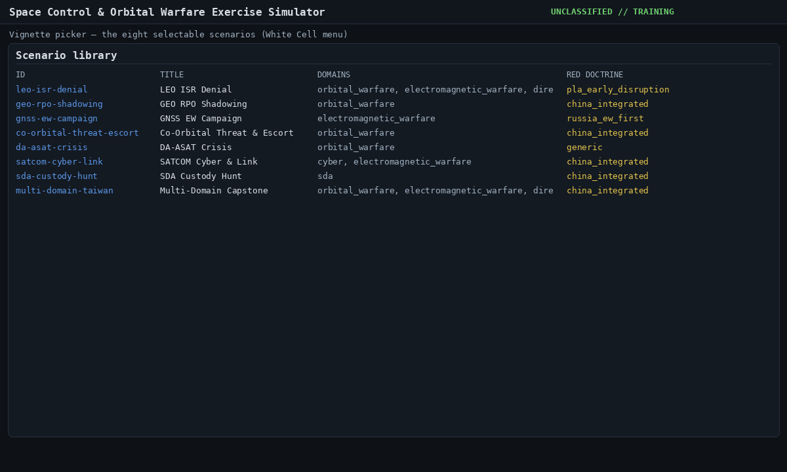

### Mission brief — read this first

Every vignette ships a per-cell **`intro_brief`** block that surfaces on session load in the
**Mission brief panel** (top of the main column). It auto-opens the first time you load a
session, then remembers your collapse state per session in `localStorage`.

The brief carries: situation · mission · friendly forces · threat picture · deadline · rules of
engagement · success criteria · tool tips — plus live objective rows with countdown and ROE
chips. Open it again any time from **View ▾ → Mission brief**.

White Cell sees both Blue and Red briefs side-by-side. Blue and Red see only their own brief —
fog-of-war is honoured at authoring time: Blue's brief doesn't reveal Red's hidden dispositions
and vice versa.

### White Cell god-view

After **Load** → **Start**, White Cell sees the full picture: every asset on both sides, the
objectives, and the belief map.

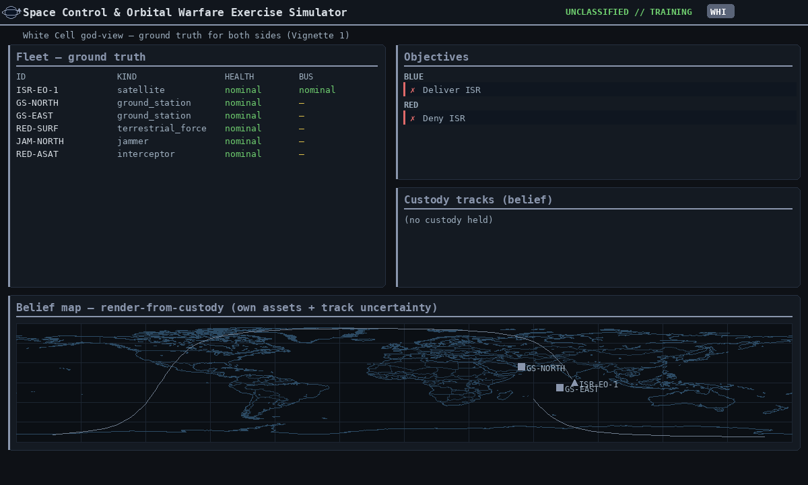

### A player cell (fog-of-war)

Switch to **Blue**: the fleet list now shows **only Blue's assets**, and tracks show only what
Blue's sensors have found. Switch to **Red** and you'll see Red's assets — **never** Blue's.

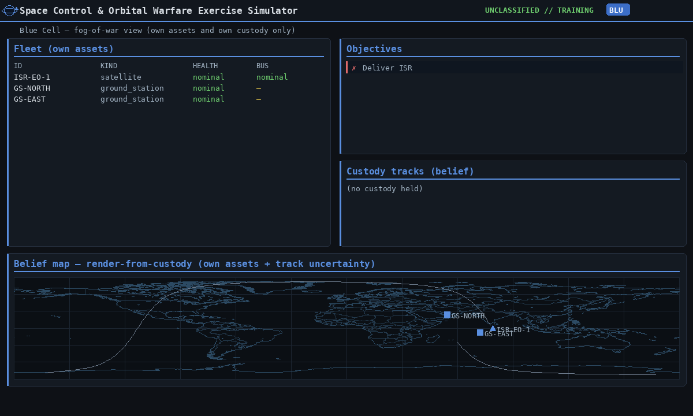
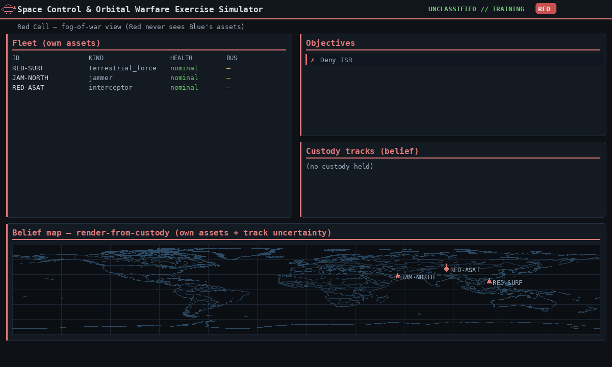

### Viewers — 2D map and 3D globe

Two synchronized viewers render *render-from-custody* (own assets at true positions; other-side
objects only as **tracks** with an uncertainty volume that grows between looks):

- the **3D globe** — drag to **rotate**, **tilt** slider, **zoom** (wheel or `+/-`), **zoom-to** an
  asset, **spin**, and **reset**;
- the **2D belief map** — **zoom**, **pan** (drag), **center** on an asset, and **layer** toggles
  (tracks / grid).

Both viewers draw a low-resolution **country map** (coastlines + country borders, tied to lat/long)
behind the picture so positions read against real geography; toggle it with the **map** control.

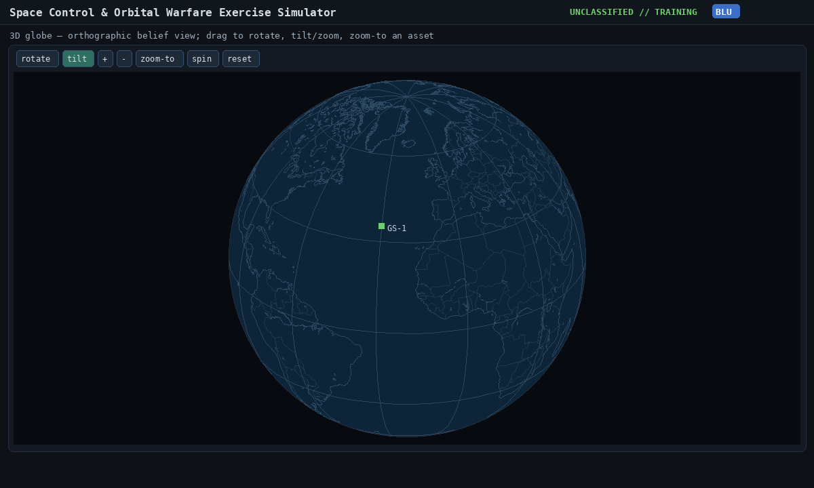

### Commanding & White Cell menus

The **command panel** is a menu: choose an **Actor** and the **Action** list filters to that
asset's legal actions, with a pre-filled parameter template (see §5). White Cell tunes the
scenario through the toolbar menus (**📋 Session ▾** to pick the vignette and parameter
dials, **time controls** on the header, and the **Injects (White Cell)** panel for inject
scheduling and firing):

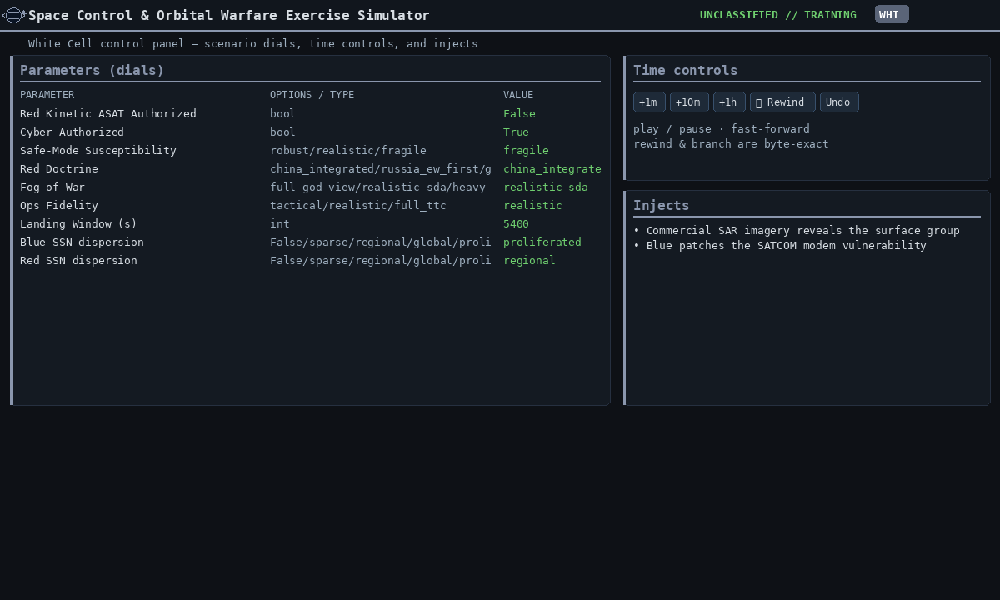

### Order-composition assistants

Three actions open a **mode-specific assistant** with a live preview *before* the order is issued:

- **`maneuver`** → six entry modes (ECI / LVLH / finite-burn / target-COE / Hohmann / plane-change)
  with live Δv cost, new-orbit elements, and a second-burn line when applicable.
- **`observe`** (ISR) → beam-mode picker (wide_area / stripmap / spotlight / scan / fine /
  polarimetric / SDA fine), 0–45° look-angle slider, and a per-pass duration. Shows expected swath,
  resolution, power draw, and effective gain.
- **`jam`** → modulation picker (barrage / spot / sweep / deceptive), transmit power, bandwidth,
  and victim bandwidth. Computes effective denial radius and renders an orange dashed footprint
  on the 2-D map.

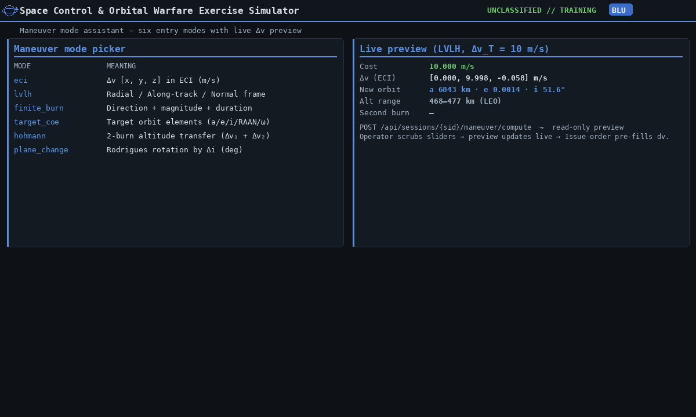
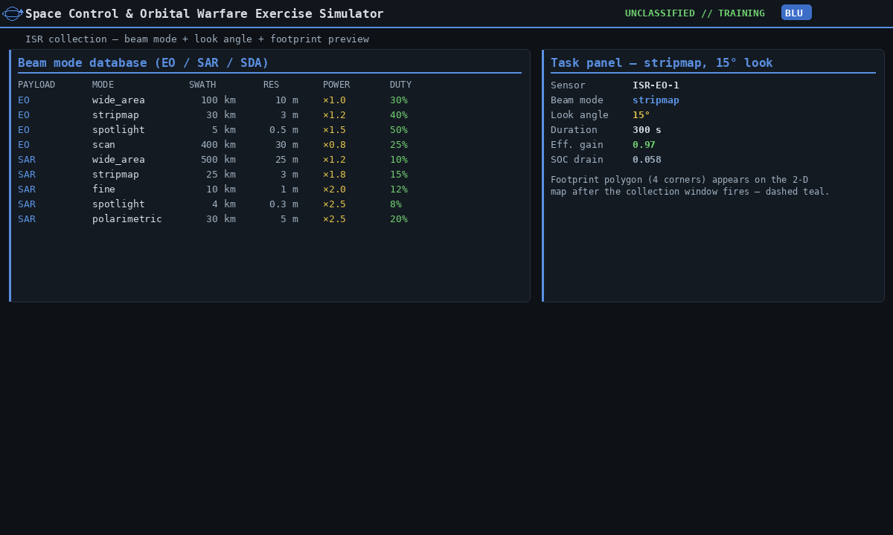
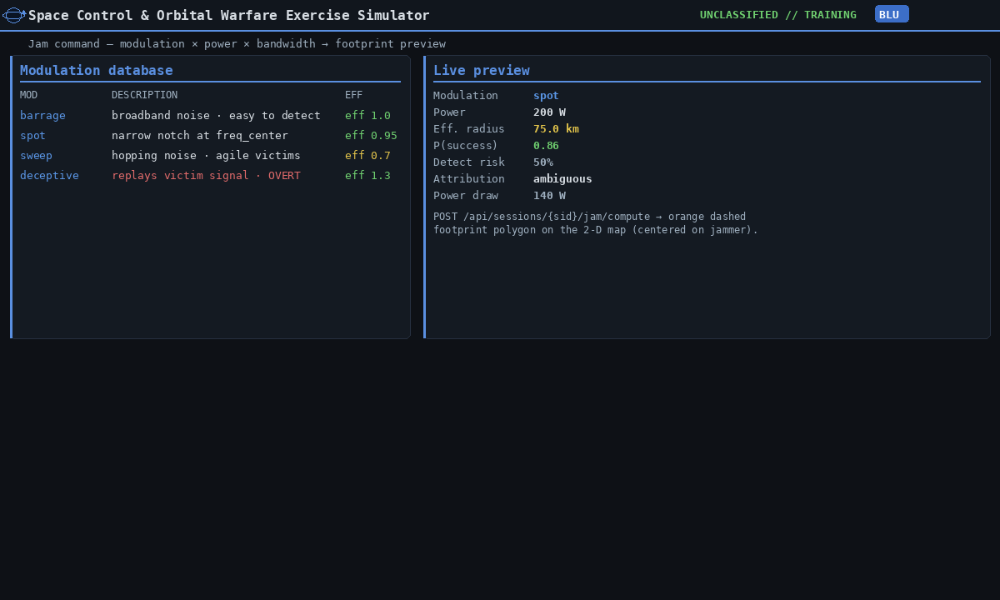

### Per-cell activity timeline (Gantt)

A full-width Gantt panel between the viewers and the AAR shows **past, present, and scheduled**
activity for the current cell. The fog-of-war contract is enforced server-side:

- **White Cell** sees three lanes — BLUE, RED, NEUTRAL — every order, every active effect,
  every scheduled inject across the exercise.
- **Blue / Red** see only their own lane — own orders and effects on own assets.

Bars are colour-coded per cell and status-coded by style:

- ▮ solid filled — executed (past)
- ▮ solid + green outline — active (window straddles NOW)
- ▮ dashed outline — queued / scheduled (future)
- ▮ grey strikethrough — cancelled
- ✗ red marker — rejected at issue
- ▮ dashed neutral — scheduled inject (from the white-cell builder)

Click any bar to print `cell · actor · action · status · window · delivery_path` in the detail
line below the canvas. Past- and future-window selectors let you zoom from 10 min back to 6 h
ahead. See [`10-ui-reference.md §10.15`](10-ui-reference.md#1015-cell-activity-timeline-per-cell-gantt--past--present--scheduled)
for the full control table.

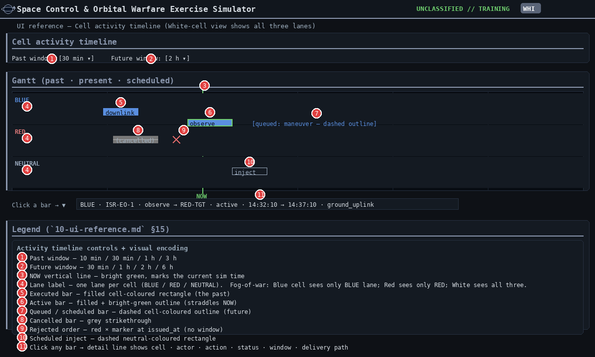

### Consequence preview & conjunction screening

Every order body is dry-run through `POST /preview/consequence` as the operator types: a single
line under the compose form shows severity / escalation weight / reversibility / debris risk /
attribution. Civilian-target denial automatically bumps severity by one tier.

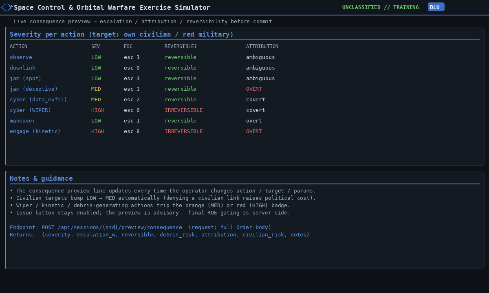

Below the message log a **Conjunctions** sidebar lists upcoming close approaches; each row carries
an **Evade** button that fires `prop.collision_avoid` on the own asset (data source:
`world.conjunctions`, populated by `conjunction_warning` injects or screening).

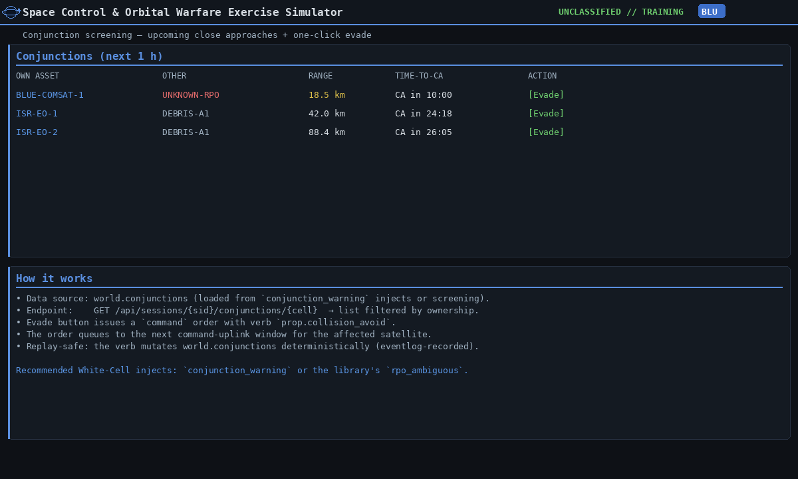

### White-Cell inject builder

The **Injects** panel keeps the legacy one-click "fire vignette inject" row and adds a
**Build / schedule inject** disclosure with a five-template library
(`debris_field_500km`, `gnss_jam_regional`, `rpo_ambiguous`, `gs_outage_diego_garcia`,
`space_weather_severe`), a JSON editor for the effects, and three scheduling modes:
**Now** (immediate), **+ seconds from now**, and **Absolute UTC** (paste from the UTC clock).

Future-dated injects are scheduled through the deterministic event log so they replay byte-identical
on save/resume and through AAR scrub. See §7 for facilitation patterns.

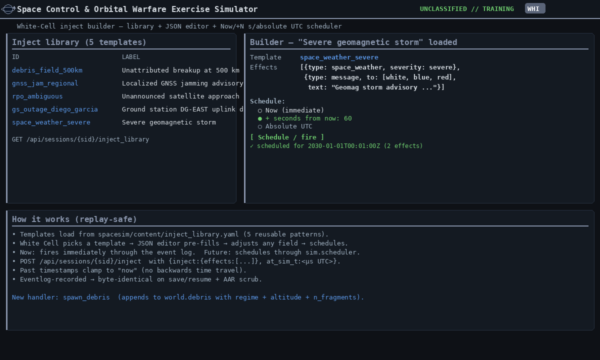

### Local time + accessibility toggles

The header time block keeps **UTC** as the canonical clock (everything the engine touches is UTC
microseconds) and adds a second row with a selectable **local timezone** — Eastern (default),
Central, Mountain, Pacific, London, Paris/Berlin, Tokyo, or UTC-only. Switching zones is an
instant client-side re-render.

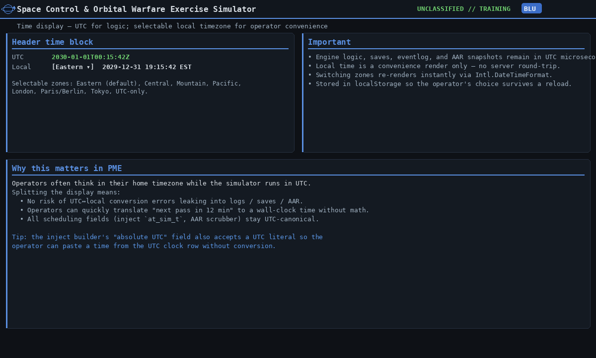

Three accessibility toggles (also reachable from the `⌘K` command palette) persist in
`localStorage`:

- **cb-safe** — Okabe-Ito colorblind-safe palette
- **hi-contrast** — WCAG-AAA contrast (black bg, white borders, yellow/cyan accents)
- **large-text** — 17 px base + larger button hit areas

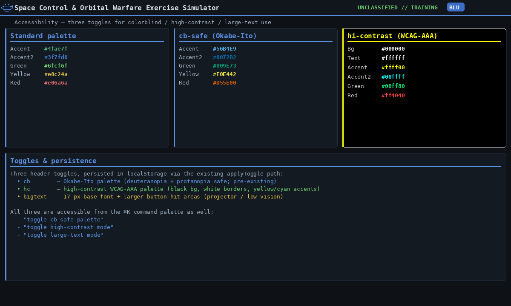

---
