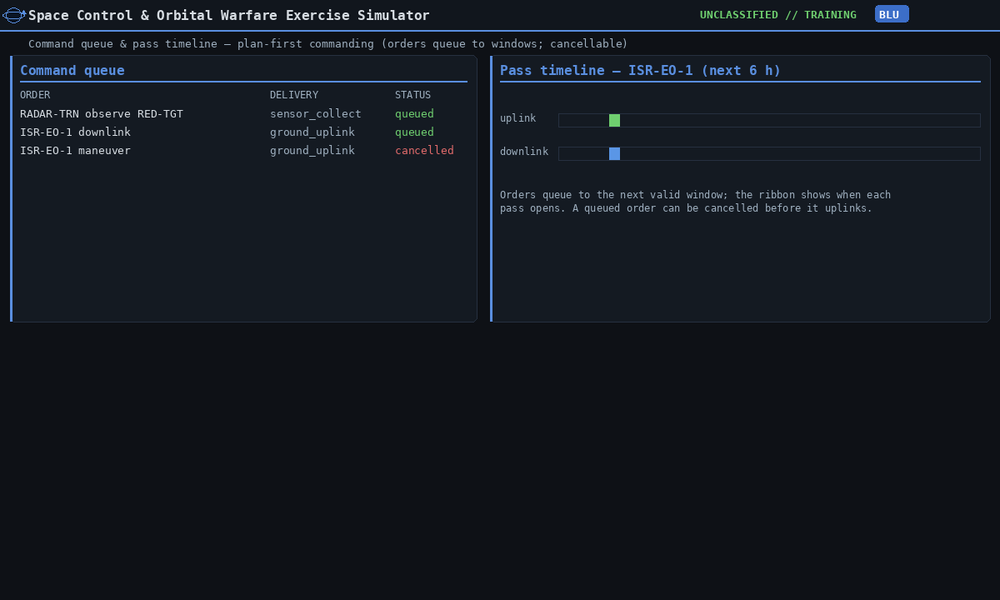
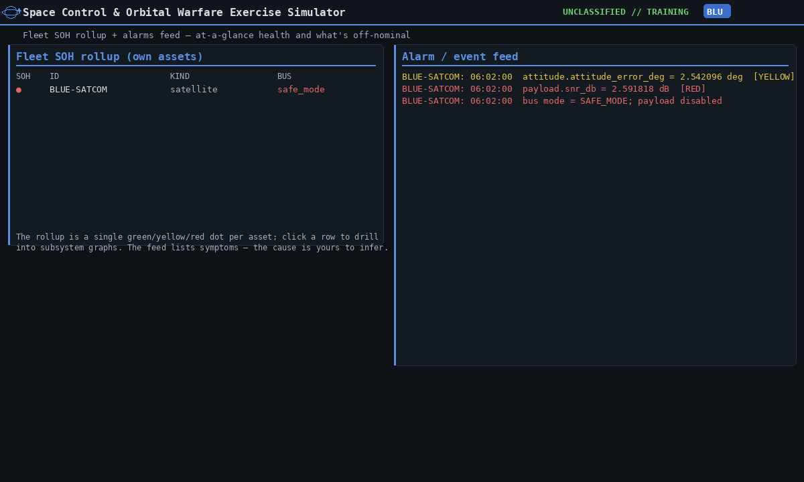
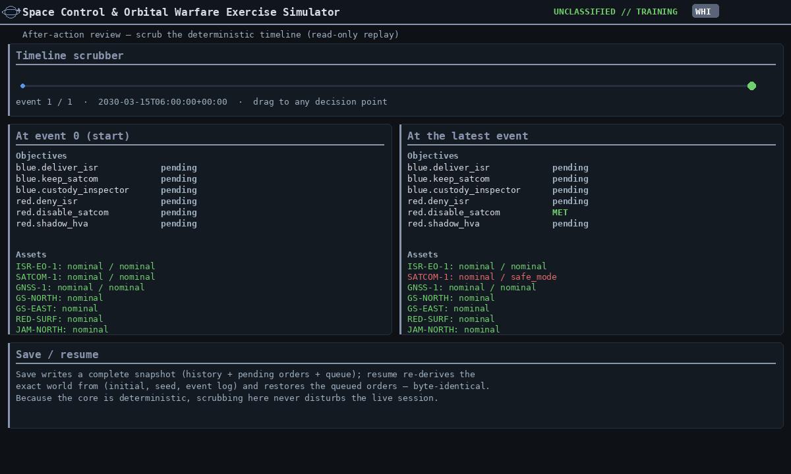

[← Training index](INDEX.md) · [↑ Docs index](../INDEX.md)

## 6. Core concepts & features

### Plan-first commanding & delivery paths
You **plan** a command; the engine schedules it to the earliest valid window. A command can reach
a satellite three ways and the tool picks the soonest: a **ground-station uplink**, an
**inter-satellite link (ISL) relay** via a crosslink-capable peer, or a **stored program**
(pre-loaded to run onboard). ISL can beat a distant ground pass by hours:


Every issued order lands in the **command queue** with its scheduled window and delivery path, and
a queued order is **cancellable** until it uplinks. The per-asset **pass-timeline ribbon** now shows
three lanes (**cmd** / **tlm** / **obs**) so you can also see when sensor-observation windows open
against the same satellites you're trying to track:



### Live previews before commit (consequence + verb assistants)

Three patterns let you see what an order will do *before* you fire it:

1. **Dry-run validity preview** — the existing green ✓ / red ✗ line under the compose form
   ("will queue · ground_uplink · window 14:32:10").
2. **Live consequence preview** — a second line showing **severity** (LOW/MED/HIGH), escalation
   weight, reversibility, debris risk, and attribution. Tries to translate "what happens
   politically" into one glance.
3. **Verb-specific assistants** with full numeric previews — see §3.7 in the interface module.

For maneuvers, the assistant accepts six entry modes; for ISR, a beam mode plus look angle; for
jamming, a modulation/power/bandwidth set with an on-map footprint preview.


### SDA sensor tasking → custody → unlock
You don't know the sky for free — you **task scarce sensors** to detect, track, and characterize
objects. A good report raises a track's confidence and shrinks its uncertainty; once a track is
**weapons-quality** (characterized + confident), it **unlocks** actions that were blocked:


Sensors do **one thing at a time** — task two collections at once and the second is pushed to a
later pass (contention). Custody **decays** between looks; the belief map shows the uncertainty
volume blooming until you re-task:


### Bus state-of-health & safe mode
Every satellite has a live **bus** (power/eclipse, attitude, thermal, propulsion, storage, comms),
each limit-checked **green/yellow/red**. The bus **gates the payload**: no power or a safe-mode
event means no mission. A cyber or EW attack can drive a satellite into **safe mode** — and you
often only discover it at the next telemetry contact:


The fleet view is an **at-a-glance rollup** — one green/yellow/red dot per asset (worst subsystem;
red if safed) — beside an **alarms/event feed** of off-nominal readings. Like the graphs, the feed
reports *symptoms*, not the cause:



### Safe-mode recovery
Recovery is a **multi-pass procedure**, not a button. If the root cause persists (e.g. an
unpatched modem vulnerability), the satellite is **re-safed** — you must remove the cause (patch
the vulnerability, kill the jammer) before recovery sticks:


### Diagnosing attacks from telemetry
Click any fleet row to open the **subsystem drill-down**: a parameter list (colored against its
soft/hard limits), a **graph** of each parameter's recent history (realistic baseline + repeatable
seeded noise), and a **symptom log**. The graphs are deliberately honest — they show *physics*, not
a verdict. **The tool never tells you "you are being jammed";** you read the signature and infer the
cause. Each attack vector leaves at least one sign:

| If you see… | Likely cause | Mitigation |
|---|---|---|
| `comms.rx_power_dbm` HIGH, `cn0_dbhz` collapses, `ber` spikes, lock intermittent | EW jamming | re-plan frequency/beam; geolocate the jammer |
| `cdh.fsw_error_count` / `cmd_reject_count` climbing, `cpu_load` high, FSW→safe | Cyber / command-path intrusion | patch the vulnerability; reset FSW |
| `payload.snr_db` drops, `thermal.optics_temp_c` rises during a pass | Directed-energy / dazzle | re-task off the threat geometry |
| A hostile **track closing** on the 2D/3D view (± wheel/Δv if you evade) | RPO / co-orbital | maneuver-to-evade; task SDA to characterize |
| `power.battery_soc` + `bus_voltage_v` sag | eclipse / power fault | shed loads; check the power timeline |
| All telemetry **ceases** (loss of signal) | kinetic kill | — (irreversible) |

Two worked examples — note the cause is **not** named anywhere on screen:


### Cyber — the off-pass exception
Cyber effects are **not** gated by orbital passes: with a modeled access vector they can act any
time, subject to the defender's posture and whether the vulnerability is patched. This is the
SATCOM/Viasat-style lesson and the wildcard in the game.

### Adding real satellites by TLE
White Cell can drop a **real named satellite** into a scenario by pasting its two-line element set
(TLE). It is validated and then propagates with sgp4 alongside the fictional assets:


```bash
curl -X POST http://127.0.0.1:8000/api/sessions/<SID>/force/tle -H 'Content-Type: application/json' \
  -d '{"id":"ISS","owner":"blue",
       "line1":"1 25544U 98067A   08264.51782528 -.00002182  00000-0 -11606-4 0  2927",
       "line2":"2 25544  51.6416 247.4627 0006703 130.5360 325.0288 15.72125391563537"}'
```

### Red doctrine & After-Action Review
An AI-Red preset can play a doctrinally-flavored campaign (`russia_ew_first`, `china_integrated`,
`generic`). Afterward, White Cell can **replay** the whole exercise read-only, scrub to any
decision, and **compare two branches** to show how a choice changed the outcome:


```bash
curl -X POST http://127.0.0.1:8000/api/sessions/<SID>/red_step     # AI-Red issues one round of orders
curl      http://127.0.0.1:8000/api/sessions/<SID>/aar             # decision timeline + final objectives
```

The AAR **scrubber** lets you drag along the event log and read the exact world at any decision
point (objectives, asset states, debris) — read-only, so it never disturbs the live session:



### Conjunctions & collision avoidance

`world.conjunctions` lists upcoming close approaches (range / time-to-CA) — populated either by a
`conjunction_warning` inject (White Cell) or by future on-demand screening. The **Conjunctions**
sidebar shows them with a per-row **Evade** button that fires the `prop.collision_avoid` verb on
your own asset; the verb consumes a small Δv budget and queues to the next command-uplink window.


### Realism extras (`engine/perturbations.py`, `engine/sun.py`)

The deterministic core ships pure-function building blocks that future or experimental
propagators can compose on top of the moderate (Kepler+J2) baseline:

- **Atmospheric drag** — `atmospheric_density()` (12-row exponential 0–1000 km),
  `drag_acceleration()` with a rotating-atmosphere relative velocity, `secular_drag_decay()`
  for multi-day altitude-loss estimates.
- **Higher zonals + 3rd-body** — `j3_acceleration()`, `j4_acceleration()`,
  `third_body_acceleration()` with `MU_SUN` / `MU_MOON` constants.
- **Solar radiation pressure** — `srp_acceleration()` takes per-asset area, mass, reflectivity,
  and an **eclipse fraction** so SRP fades smoothly through the penumbra.
- **Penumbra / Earth shadow** — `sun.eclipse_fraction()` returns `[0, 1]` with linear
  umbra↔penumbra interpolation; the legacy binary `is_sunlit()` is retained.
- **Thermal model** — `ThermalState` carries `temp_c`, `temp_low_c/high_c`, `heater_watts`,
  `radiator_capacity_w`, `survival_trigger_minutes` so future bus models can drive temperature
  off real heating/cooling inputs.

All of these are read-only helpers today; they make the high-fidelity propagator seam
(`HighFidelityPropagator` stub) cheap to fill in later.

### Save & resume
**Save** (toolbar) writes a complete snapshot — history, the order queue, and pending events — to a
JSON file; **Load** resumes it. Because the core is deterministic, resume re-derives the exact world
from `(initial state, seed, event log)` and restores queued orders byte-for-byte.

```bash
curl http://127.0.0.1:8000/api/sessions/<SID>/save > save.json        # download a session
curl -X POST http://127.0.0.1:8000/api/sessions/load_save -d @save.json -H 'Content-Type: application/json'
```

---
