[← Training index](INDEX.md) · [↑ Docs index](../INDEX.md)

## 10. UI reference — every control, dropdown, and input

Exhaustive, scannable list of every interactive element in the web UI. Each section maps 1-for-1
to an annotated screenshot in [`../manual/`](../manual/INDEX.md) — the callout numbers on the
screenshot match the row numbers in each table.

For *narrative* introductions to the same features (when to use them, why they exist), read
[`02-interface.md`](02-interface.md) and [`05-core-concepts.md`](05-core-concepts.md). This
module is the reference.

| Section | Panel | Annotated screenshot |
|---|---|---|
| §10.1 | Header / toolbar | [`ref-01-header.png`](../manual/ref-01-header.png) |
| §10.2 | Cell & Time sidebar | [`ref-02-cell-time.png`](../manual/ref-02-cell-time.png) |
| §10.3 | Injects (White Cell) + builder | [`ref-03-injects.png`](../manual/ref-03-injects.png) |
| §10.4 | Fleet rail | [`ref-04-fleet.png`](../manual/ref-04-fleet.png) |
| §10.5 | Tasking (sensor) | [`ref-05-tasking.png`](../manual/ref-05-tasking.png) |
| §10.6 | Satellite command (compose) | [`ref-06-compose.png`](../manual/ref-06-compose.png) |
| §10.7 | Maneuver assistant | [`ref-07-maneuver.png`](../manual/ref-07-maneuver.png) |
| §10.8 | Jam assistant | [`ref-08-jam.png`](../manual/ref-08-jam.png) |
| §10.9 | Batch bar + fleet-subset helpers | [`ref-09-batch.png`](../manual/ref-09-batch.png) |
| §10.10 | 3D globe viewer | [`ref-10-globe.png`](../manual/ref-10-globe.png) |
| §10.11 | 2D belief map viewer | [`ref-11-map.png`](../manual/ref-11-map.png) |
| §10.12 | After-action review (AAR) | [`ref-12-aar.png`](../manual/ref-12-aar.png) |
| §10.13 | Subsystem drill-down | [`ref-13-drill.png`](../manual/ref-13-drill.png) |
| §10.14 | Modals, keyboard & mouse | [`ref-14-modals-keys.png`](../manual/ref-14-modals-keys.png) |

---

### 10.1 Header / toolbar — always visible

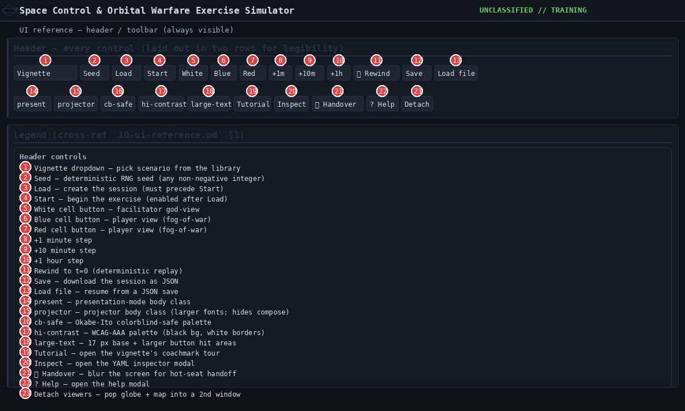

| # | Control | Type | Effect / valid values |
|---|---|---|---|
| 1 | Vignette | dropdown | Pick a scenario from the library before Load. |
| 2 | Seed | number | Deterministic RNG seed (any non-negative integer; default 1). |
| 3 | Load | button | `POST /api/sessions` → creates the session id. Must precede Start. |
| 4 | Start | button | `POST /api/sessions/{sid}/start`. Disabled until Load. |
| 5 | White | button | Switch to facilitator god-view (sees ground truth). |
| 6 | Blue | button | Switch to Blue cell (fog-of-war: own assets + own custody only). |
| 7 | Red | button | Switch to Red cell (fog-of-war: own assets + own custody only). |
| 8 | +1m | button | `POST /step` with `dt_sim_s=60`. |
| 9 | +10m | button | `POST /step` with `dt_sim_s=600`. |
| 10 | +1h | button | `POST /step` with `dt_sim_s=3600`. |
| 11 | ⟲ Rewind | button | `POST /rewind` to t=0. Deterministic replay re-derives state. |
| 12 | Save | button | `GET /save` → download session JSON. |
| 13 | Load file | button + file input | `POST /load_save` from a saved JSON. |
| 14 | present | checkbox | Body class `present` (presentation mode, persisted). |
| 15 | projector | checkbox | Body class `projector` (larger fonts, hides compose form). |
| 16 | cb-safe | checkbox | Body class `cb` (Okabe-Ito colorblind-safe palette). |
| 17 | hi-contrast | checkbox | Body class `hi-contrast` (WCAG-AAA palette: black bg, white borders). |
| 18 | large-text | checkbox | Body class `large-text` (17 px base + larger button hit areas). |
| 19 | Tutorial | button | Open the vignette's tutorial coachmark panel. |
| 20 | Inspect | button | Open the vignette YAML inspector modal. |
| 21 | ⏸ Handover | button | Blur the screen + show handoff overlay (hot-seat switching). |
| 22 | ? Help | button | Open the help modal (shortcuts + glossary + workflow tips). |
| 23 | Detach viewers | button | Pop the 3D globe + 2D map into a separate window. |

---

### 10.2 Cell & Time — sidebar panel (top)

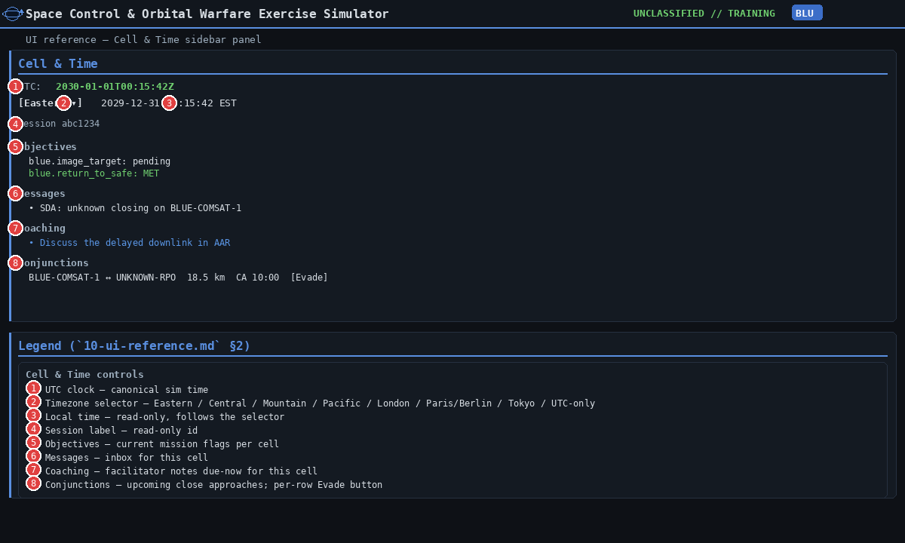

| # | Control | Type | Effect / valid values |
|---|---|---|---|
| 1 | UTC | read-only | Canonical sim time (`iso(NOW)` from the engine, always UTC). |
| 2 | Timezone selector | dropdown | Eastern (default) / Central / Mountain / Pacific / London / Paris/Berlin / Tokyo / UTC-only. |
| 3 | Local time | read-only | Renders NOW in the selected zone via `Intl.DateTimeFormat`. |
| 4 | Session label | read-only | The active session id. |
| 5 | Objectives | read-only `<pre>` | Per-cell mission flags + MET/pending status. |
| 6 | Messages | read-only `<ul>` | Inbox for this cell (sorted newest first). |
| 7 | Coaching | read-only list | `GET /coaching/{cell}` — facilitator notes due-now for this cell. |
| 8 | Conjunctions | list + Evade buttons | `GET /conjunctions/{cell}` — each row carries a per-asset Evade button. |

The **Evade** button on a conjunction row issues a `command` order with `verb: prop.collision_avoid`
on the own asset, queued to the next command-uplink window.

---

### 10.3 Injects (White Cell) + Build / schedule inject

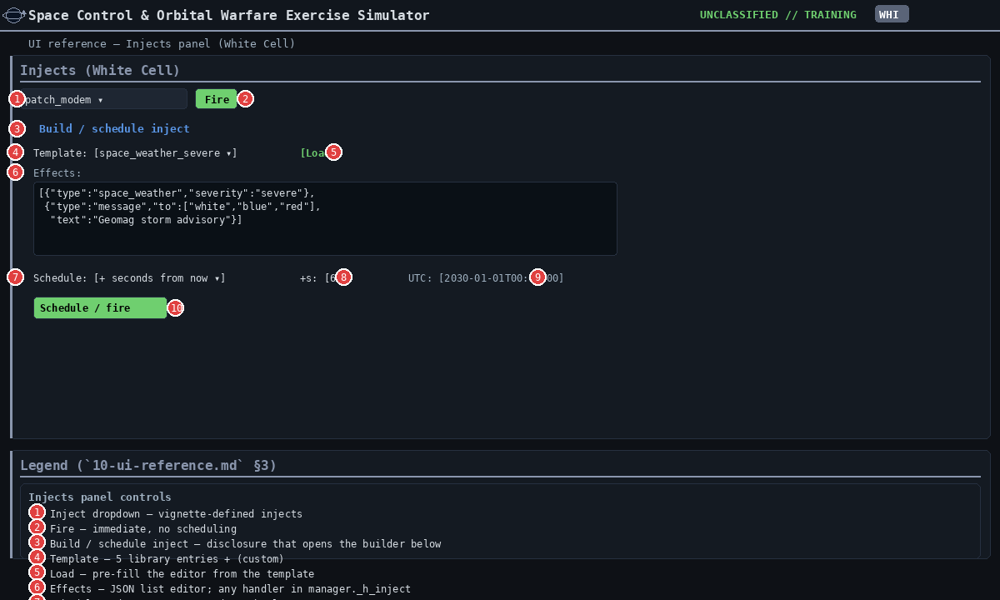

| # | Control | Type | Effect / valid values |
|---|---|---|---|
| 1 | Inject dropdown | dropdown | Vignette-defined injects from `GET /injects`. |
| 2 | Fire | button | `POST /inject` with `{inject: <id>}` — fires immediately. |
| 3 | Build / schedule inject | `
` toggle | Expands the builder panel below. |
| 4 | Template | dropdown | 5 library entries from `GET /inject_library` + `(custom)`. |
| 5 | Load | button | Pre-fills the JSON editor with the selected template's effects. |
| 6 | Effects | textarea | JSON list. Any `type` recognised by `manager._h_inject` (see below). |
| 7 | Schedule | dropdown | **Now** (immediate) / **+ seconds from now** / **Absolute UTC**. |
| 8 | + seconds from now | number | Visible only when Schedule=+s. Offset in seconds. |
| 9 | Absolute UTC | datetime-local | Visible only when Schedule=absolute. UTC literal (paste from the UTC clock). |
| 10 | Schedule / fire | button | `POST /inject` with `{inject:{effects:[…]}, at_sim_t:<µs>}`. Past timestamps clamp to "now". |

**Supported effect types in the editor:** `message`, `reveal_asset`, `political_consequence`,
`patch_cyber_vuln`, `gs_outage`, `space_weather`, `conjunction_warning`, `spawn_debris`.
See [`07-white-cell-facilitation.md`](07-white-cell-facilitation.md) for example payloads.

---

### 10.4 Fleet rail

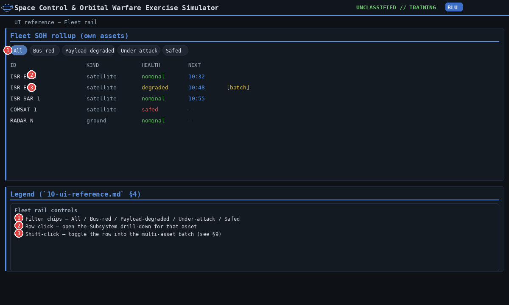

| # | Control | Type | Effect / valid values |
|---|---|---|---|
| 1 | Filter chips | 5 chips | **All** / **Bus-red** / **Payload-degraded** / **Under-attack** / **Safed** — filters the table client-side. |
| 2 | Row click | mouse | Opens the Subsystem drill-down for that asset. |
| 3 | Row shift+click | mouse | Toggles the row into the multi-asset batch (see §10.9). |

The next-contact countdown column is **read-only** (data from `GET /next_contacts/{cell}`).

---

### 10.5 Tasking (sensor)

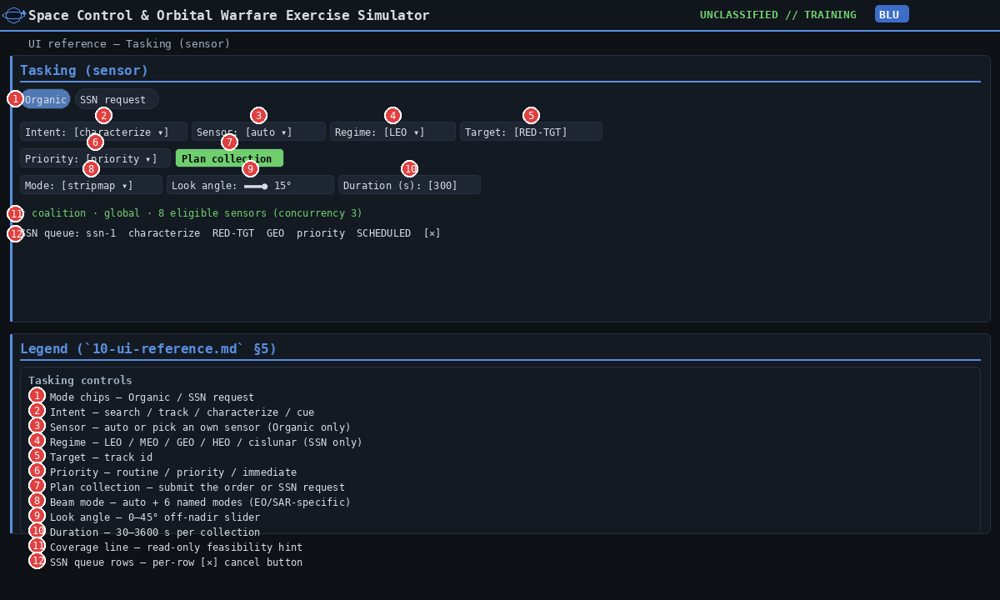

| # | Control | Type | Effect / valid values |
|---|---|---|---|
| 1 | Mode chips | 2 chips | **Organic** (own sensor) / **SSN request** (national/coalition SSN). |
| 2 | Intent | dropdown | **search** / **track** / **characterize** / **cue**. |
| 3 | Sensor | dropdown | Organic mode only. `auto` lets the engine pick the earliest viable own sensor. |
| 4 | Regime | dropdown | SSN mode only. **LEO** / **MEO** / **GEO** / **HEO** / **cislunar**. |
| 5 | Target | text | Track id (e.g. `RED-TGT`). |
| 6 | Priority | dropdown | **routine** / **priority** / **immediate** (drives SSN SLA + organic queue order). |
| 7 | Plan collection | button | Organic: `POST /order` with `action: observe`. SSN: `POST /ssn/{cell}/request`. |
| 8 | Beam mode | dropdown | `auto` + **wide_area / stripmap / spotlight / scan / fine / polarimetric** (see `engine/isr.py`). |
| 9 | Look angle | range slider | 0–45° off-nadir. Cosine roll-off applies to gain + swath width. |
| 10 | Duration (s) | number | 30–3600 s. Drives the SOC drain `base × power_factor × duration / 300`. |
| 11 | Coverage line | read-only | SSN mode: `GET /ssn/{cell}/coverage?regime=` — feasibility hint. |
| 12 | SSN queue rows | per-row [✕] cancel | `POST /ssn/{cell}/cancel`. |

---

### 10.6 Satellite command (compose form)

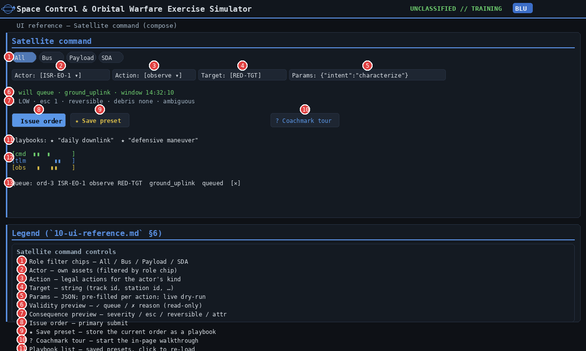

| # | Control | Type | Effect / valid values |
|---|---|---|---|
| 1 | Role filter chips | 4 chips | **All** / **Bus** / **Payload** / **SDA** — filters the Actor dropdown. |
| 2 | Actor | dropdown | Own assets (filtered by role chip + current cell). |
| 3 | Action | dropdown | Legal actions for the actor's `kind`: e.g. satellite ⇒ `downlink/maneuver/command`, jammer ⇒ `jam`. |
| 4 | Target | text | Optional. Track id, station id, or asset id depending on action. |
| 5 | Params | JSON text | Pre-filled per action (see PARAM_TEMPLATE in `app.js`). Live dry-run on every keystroke. |
| 6 | Validity preview | read-only | ✓ queue · delivery_path · window OR ✗ reason (from `POST /order/validate`). |
| 7 | Consequence preview | read-only | severity / esc / reversible / debris / attribution (from `POST /preview/consequence`). |
| 8 | Issue order | primary button | `POST /order`. Disabled while validity preview is ✗. |
| 9 | ★ Save preset | button | Save the current order as a named playbook (`localStorage`, per vignette). |
| 10 | ? Coachmark tour | button | Start the in-page coachmark tour over compose form. |
| 11 | Playbook list | clickable rows | Click to load a saved preset back into the form. |
| 12 | Pass-timeline ribbon | read-only canvas | Three lanes (**cmd / tlm / obs**) for the selected actor, next 6 h. Hourly tick marks. |
| 13 | Queue rows | per-row [✕] cancel | `POST /cancel` (replay-safe — Scheduler skips the cancelled event). |

When **Action** is set to `maneuver` or `jam`, an additional assistant panel appears below
Params — see §10.7 / §10.8.

---

### 10.7 Maneuver assistant (Action = maneuver)

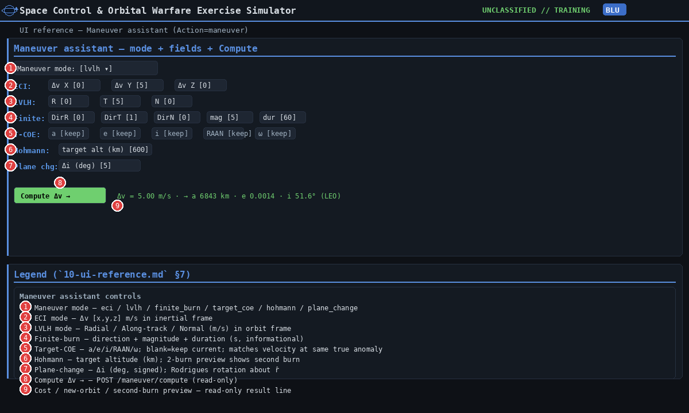

| # | Control | Type | Effect / valid values |
|---|---|---|---|
| 1 | Maneuver mode | dropdown | **eci / lvlh / finite_burn / target_coe / hohmann / plane_change**. Switches the field set. |
| 2 | ECI Δv X / Y / Z | numbers | (mode=eci) m/s in the inertial frame. |
| 3 | LVLH R / T / N | numbers | (mode=lvlh) Radial / Along-track / Normal m/s in the orbit frame. |
| 4 | Finite-burn DirR/T/N + mag + dur | numbers | (mode=finite_burn) direction (normalised LVLH) + magnitude (m/s) + duration (s; informational). |
| 5 | Target-COE a / e / i / RAAN / ω | numbers | (mode=target_coe) blank = keep current. Matches velocity at same true anomaly. |
| 6 | Hohmann target altitude | number | (mode=hohmann) km. Two-burn transfer; second-burn line appears in result. |
| 7 | Plane-change Δi | number | (mode=plane_change) signed degrees. Rodrigues rotation about r̂. |
| 8 | Compute Δv → | button | `POST /maneuver/compute` — read-only preview. |
| 9 | Cost / new-orbit line | read-only | `Δv = <m/s>` · `new_orbit a/e/i…` · optional `second_burn`. Result also fills `o-params`. |

Click **Compute** then **Issue order** to queue the maneuver; the engine consumes Δv from the
asset's `resources.delta_v_ms` when the order executes at its window.

---

### 10.8 Jam assistant (Action = jam)

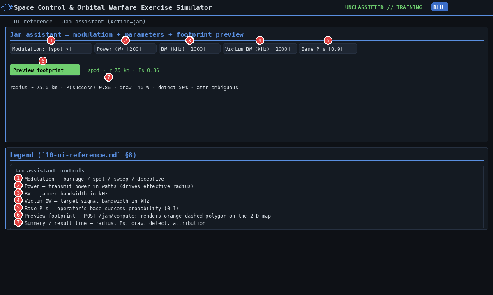

| # | Control | Type | Effect / valid values |
|---|---|---|---|
| 1 | Modulation | dropdown | **barrage / spot / sweep / deceptive**. `deceptive` auto-overrides attribution to `overt`. |
| 2 | Power (W) | number | Transmit power. Drives the effective denial radius (`R ∝ √P`). |
| 3 | BW (kHz) | number | Jammer bandwidth. |
| 4 | Victim BW (kHz) | number | Target signal bandwidth (drives coverage weighting for sweep/spot). |
| 5 | Base P_s | number | Operator's base success probability (0–1). |
| 6 | Preview footprint | button | `POST /jam/compute`. Renders an orange dashed polygon on the 2-D map. |
| 7 | Summary / result line | read-only | `radius ≈ <km> · P(success) 
 · draw <W> · detect <%> · attr <bias>`. |

The preview polygon stays on the map until the operator changes the Action away from `jam`.

---

### 10.9 Batch bar + fleet-subset helpers

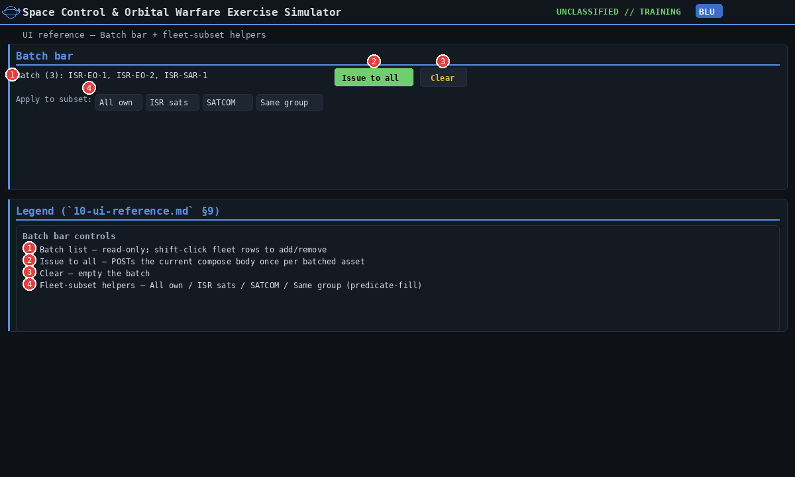

| # | Control | Type | Effect / valid values |
|---|---|---|---|
| 1 | Batch list | read-only | Comma-separated asset ids currently in the batch. |
| 2 | Issue to all | button | POSTs the current compose body once per batched asset. |
| 3 | Clear | button | Empty the batch. |
| 4 | Fleet-subset helpers | 4 buttons | **All own / ISR sats / SATCOM / Same group** — predicate-fill the batch. |

The **Same group** helper requires an Actor already selected and uses its `group` field.

---

### 10.10 3D globe viewer

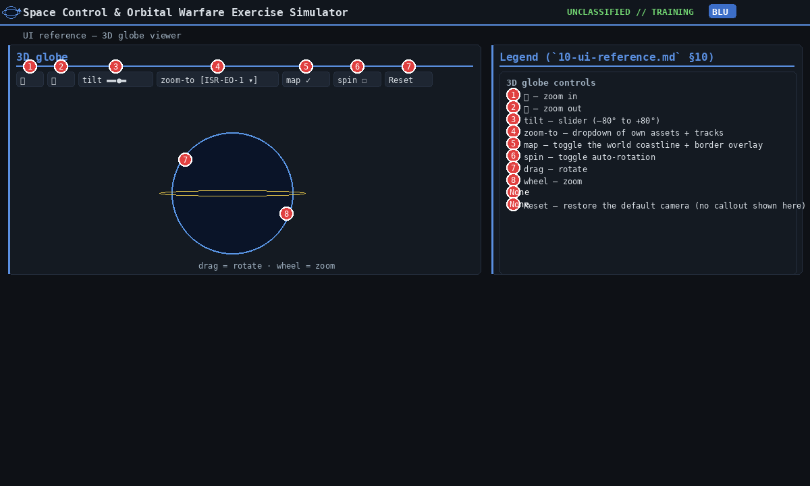

| # | Control | Type | Effect / valid values |
|---|---|---|---|
| 1 | ＋ | button | Zoom in. |
| 2 | － | button | Zoom out. |
| 3 | tilt | range slider | –80° to +80°. |
| 4 | zoom-to | dropdown | Own assets + tracks; selecting an entry centres the camera. |
| 5 | map | checkbox | Toggle world coastlines + country borders. |
| 6 | spin | checkbox | Auto-rotate. |
| 7 | Canvas drag | mouse | Rotate the globe. |
| 8 | Canvas wheel | mouse | Zoom in/out. |
| — | Reset | button | Restore the default camera (no callout shown). |

---

### 10.11 2D belief map viewer

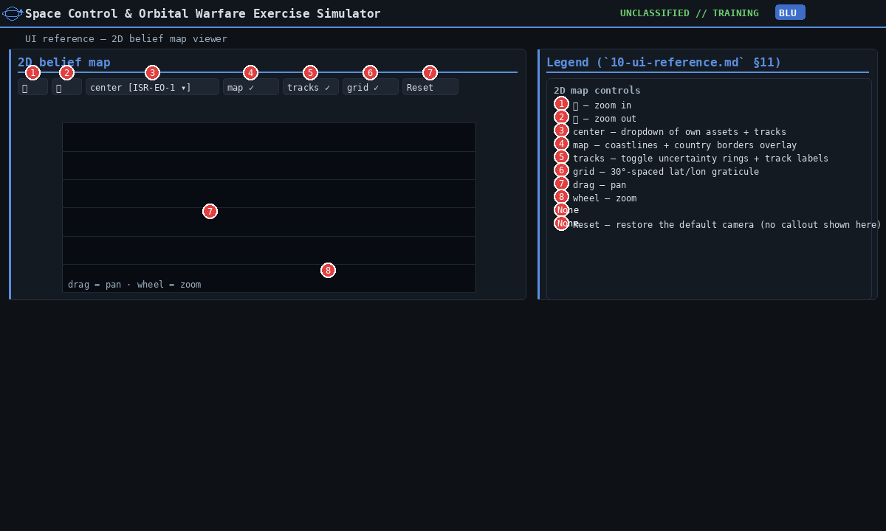

| # | Control | Type | Effect / valid values |
|---|---|---|---|
| 1 | ＋ | button | Zoom in. |
| 2 | － | button | Zoom out. |
| 3 | center | dropdown | Own assets + tracks; selecting centres the map on the asset. |
| 4 | map | checkbox | Toggle world coastlines + country borders. |
| 5 | tracks | checkbox | Toggle uncertainty rings + track labels. |
| 6 | grid | checkbox | Toggle the 30°-spaced lat/lon graticule. |
| 7 | Canvas drag | mouse | Pan the map (lat/lon offset). |
| 8 | Canvas wheel | mouse | Zoom in/out. |
| — | Reset | button | Restore the default camera (no callout shown). |

---

### 10.12 After-action review (AAR)

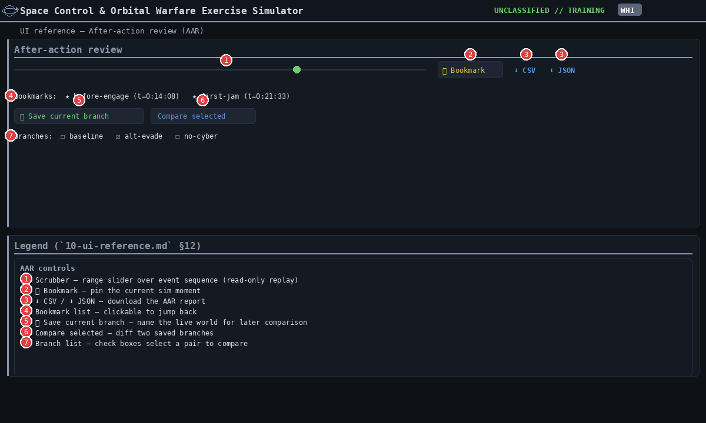

| # | Control | Type | Effect / valid values |
|---|---|---|---|
| 1 | Scrubber | range slider | 0 → `n_events`. Read-only replay; never disturbs the live session. |
| 2 | 📌 Bookmark | button | Pin the current sim moment to revisit later. |
| 3 | ⬇ CSV / ⬇ JSON | download links | `GET /aar/export.csv` / `GET /aar/export.json`. |
| 4 | Bookmark list | clickable rows | Click to jump the scrubber back to the bookmarked moment. |
| 5 | ＋ Save current branch | button | Name the live world for later comparison. |
| 6 | Compare selected | button | Diff two saved branches (objectives + assets). |
| 7 | Branch list | checkbox rows | Select up to two branches for the compare. |

---

### 10.13 Subsystem drill-down

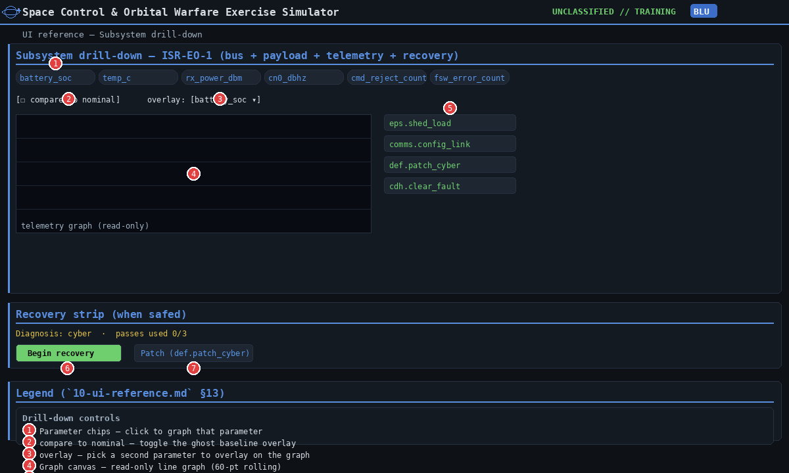

| # | Control | Type | Effect / valid values |
|---|---|---|---|
| 1 | Parameter chips | clickable chips | Click to graph that telemetry parameter. |
| 2 | compare to nominal | checkbox | Overlay the clean baseline (`?nominal=1`). |
| 3 | overlay | dropdown | Pick a second parameter to overlay on the graph. |
| 4 | Graph canvas | read-only | 60-pt rolling line graph from `GET /telemetry/{cell}/{asset}/{param}`. |
| 5 | Verb buttons | per-subsystem cards | One-click load the command verb into the compose form. |
| 6 | Begin recovery | button | (Recovery strip) `POST /recovery/{cell}/{asset}` — start the multi-pass chain. |
| 7 | Patch (def.patch_cyber) | button | (Recovery strip) Load the patch-cyber command pre-filled with the first unpatched vector. |

The recovery strip appears only when the selected asset's bus is in safe mode. The subsystem
log under the graph is read-only.

---

### 10.14 Modals, overlays, keyboard & mouse

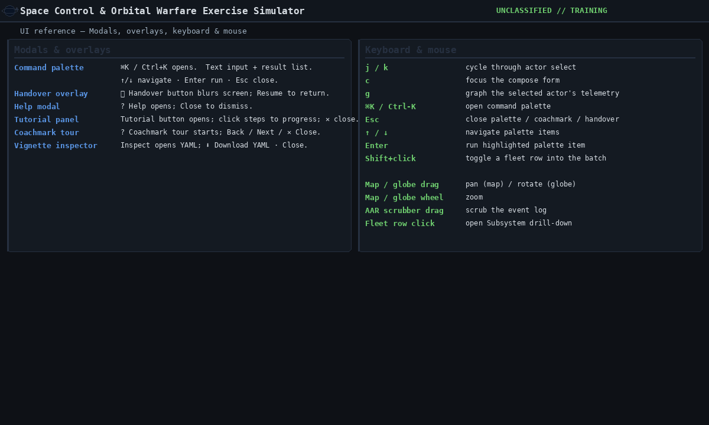

#### Modals & overlays

| Modal | Trigger | Controls |
|---|---|---|
| Command palette | `⌘K` / `Ctrl+K` | text input · result list · `↑/↓` navigate · `Enter` run · `Esc` close |
| Handover | ⏸ Handover button | **Resume** button |
| Help | ? Help button | **Close** button |
| Tutorial | Tutorial button | **✕** close · clickable steps |
| Coachmark tour | ? Coachmark tour button | **← Back** · **Next →** · **✕ Close** |
| Vignette inspector | Inspect button | **⬇ Download YAML** · **Close** |

#### Keyboard shortcuts (global)

| Key | Effect |
|---|---|
| `j` / `k` | Cycle through actor select |
| `c` | Focus the compose form |
| `g` | Open Subsystem drill-down for the selected actor |
| `⌘K` / `Ctrl+K` | Open the command palette |
| `Esc` | Close palette / coachmark / handover |
| `↑` / `↓` | Navigate palette items |
| `Enter` | Run the highlighted palette item |
| `Shift+click` on fleet row | Toggle the row into the batch |

#### Mouse / canvas interactions

| Where | Action |
|---|---|
| 2D map canvas | Drag = pan · wheel = zoom |
| 3D globe canvas | Drag = rotate · wheel = zoom |
| AAR scrubber | Drag the slider thumb to scrub event-by-event |
| Fleet row | Click = open drill-down · shift+click = batch toggle |

---

### Cross-references

- **HTTP endpoints behind each control:** [`08-http-api-reference.md`](08-http-api-reference.md).
- **Why each panel exists (narrative):** [`02-interface.md`](02-interface.md), [`05-core-concepts.md`](05-core-concepts.md).
- **White-Cell facilitation patterns:** [`07-white-cell-facilitation.md`](07-white-cell-facilitation.md).
- **Build-spec operator-console contract:** [`../build-spec/07-operator-console.md`](../build-spec/07-operator-console.md).

---
